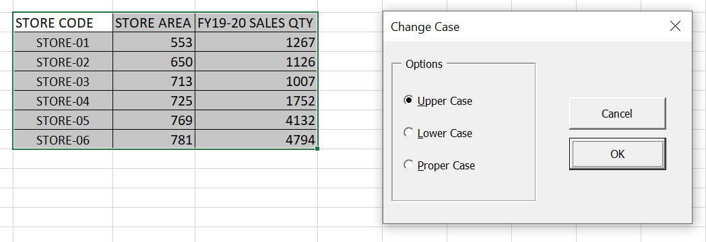

In VBA, the official name for a dialog box is a UserForm. But a UserForm is really an object that contains what’s commonly known as a _dialog box_. This distinction is not really important, so you’ll often hear these terms used interchangeably.

We can display a UserForm by using the UserForm’s ~~Show~~ method in a VBA procedure.

> Remember that the macro that displays the UserForm must be in a VBA module - not in the code window of the UserForm.

The following procedure displays the dialog box named ~~UserForm1~~.

```vb {numberLines}
Sub ShowDialogBox()

UserForm1.Show

' Other statements go here

End Sub
```

Most of the time, you won’t have any more code in the procedures, because you put your event-handler procedures in the code window of the UserForm. These procedures kick in when the user works with the controls on the UserForm.
