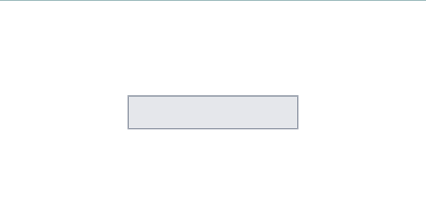

Let's say we have an absolutely positioned div, as shown below:

```js {numberLines, 5-5}
import React from "react"

const Box = () => {
  return (
    <div className="absolute top-0 right-0 w-60 h-12 bg-gray-200 border-2 border-gray-400"></div>
  )
}

export default Box
```


### Center Horizontally

To horizontally center the div, apply the classes: ~~absolute left-0 right-0 m-auto~~.

```js {numberLines, 5-5}
import React from "react"

const Box = () => {
  return (
    <div className="absolute left-0 right-0 m-auto w-60 h-12 bg-gray-200 border-2 border-gray-400"></div>
  )
}

export default Box
```


### Center Vertically

To vertically center the div, apply the classes: ~~absolute top-0 bottom-0 m-auto~~.

```js {numberLines, 5-5}
import React from "react"

const Box = () => {
  return (
    <div className="absolute top-0 bottom-0 m-auto w-60 h-12 bg-gray-200 border-2 border-gray-400"></div>
  )
}

export default Box
```


### Center Both Horizontally & Vertically

To center the div both horizontally & vertically, apply the classes: ~~absolute top-0 right-0 bottom-o left-0 m-auto~~.

```js {numberLines, 5-5}
import React from "react"

const Box = () => {
  return (
    <div className="absolute top-0 right-0 bottom-0 left-0 m-auto w-60 h-12 bg-gray-200 border-2 border-gray-400"></div>
  )
}

export default Box
```


