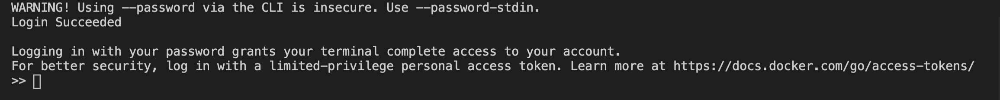

To be able to push a Docker image to Docker Hub, we need to log in to our account with the Docker CLI.

> You’ll need a Docker Hub account for this - if you don’t have one, browse to ~~https://hub.docker.com~~ and follow the link to sign up for an account.

```sh {numberLines}
docker login -u <username> -p <password>
```

Enter your Docker Hub username & password.



We have successfully logged in.

I have an image called ~~node-server~~ in my system. I can’t push this image to Docker Hub because this image reference doesn’t have an account name. So, I have to create a new reference for ~~node-server~~. Note that one image can have multiple references.

```sh {numberLines}
docker image tag node-server sundaray/node-server:v1
```

~~sundaray~~ is my Docker Hub username. Also, I have tagged the image reference as version 1.

Now, we can push our image.

```sh {numberLines}
docker image push <Docker Hub username>/node-server:v1
```


For each image we push to Docker Hub, Docker Hub will automatically create a repository. And by default, the repository will have public read rights. Now anyone can find, pull and use the ~~node-server:v1~~ application.

If I log in to my Docker Hub account, I can see the image.


