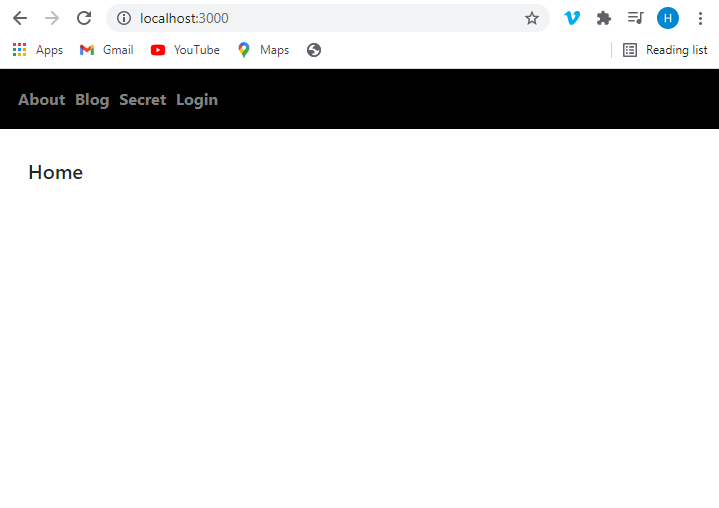
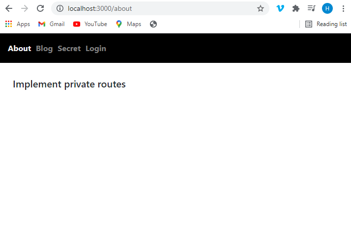
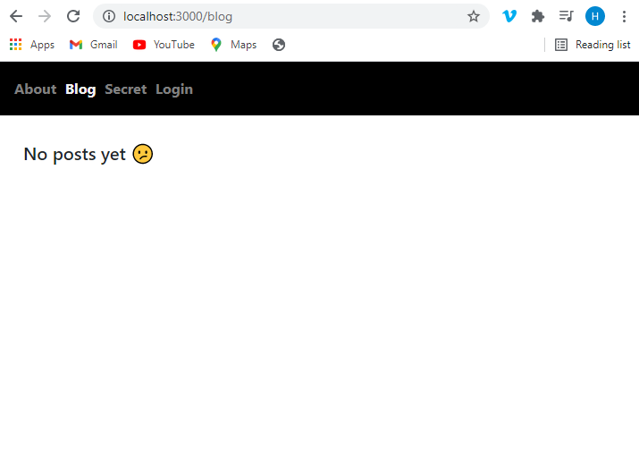
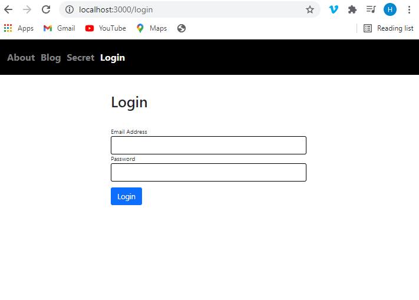
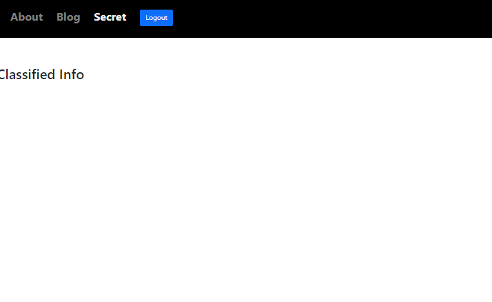
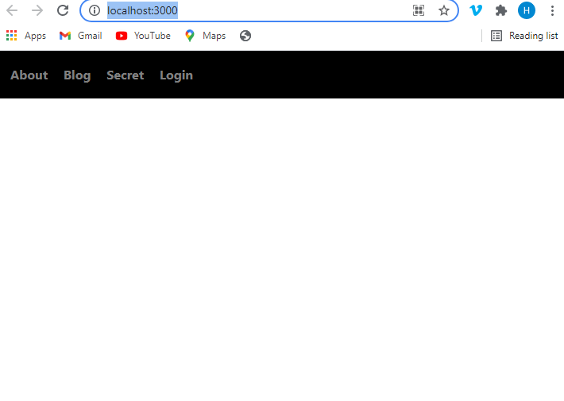

```toc

```

###### Learn how to protect routes in React Router v6 in my blog post [here](https://hemanta.io/how-to-create-protected-routes-in-react-router-v6/).

**Before we start, please note that the post below uses React Router v5. If you are using React Router v6 (the latest version), check out my blog post in the aforementioned link. The process of protecting routes in React Router v6 is relatively simpler**.

We will learn how to protect routes based on the login status of a user by building a simple application.

First, let's do a quick walk-through of the application.

### Home page

This is the home page of the application.

The header with navigation links is common across all pages.



### About page

Clicking on the ~~About~~ link takes us to the About page.



### Blog page

Clicking on the ~~Blog~~ link takes us to the Blog page.



### Secret page

The secret page is protected, accessible only to logged in users. Therefore, when we click on the ~~Secret~~ link, we are redirected to the Login page.



Once we successfully log in, we get access to the Secret page.

We log out of the application by clicking on the ~~Logout~~ link.



### Login page

We can also log in to the application using the ~~Login~~ link. On successful login, we are redirected to the home page.


Now that we understand the key features of the application, let's go ahead and build it.

Create a folder named ~~react-private-routes~~ on your desktop. Open the folder in VS Code or any other code editor of your choice.

We will create a React project inside the folder using the following command:

```sh
PS C:\Users\Delhivery\Desktop\react-private-routes> npx create-react-app .
```

Then, we install the following packages.

```sh
PS C:\Users\Delhivery\Desktop\react-private-routes> npm i react-router-dom formik yup bootstrap @reduxjs/toolkit react-redux
```

**react-router-dom**: We will use the package for client-side routing.

**formik**: We will build the login form using Formik.

**yup**: We will use Yup for schema validation.

**bootstrap**: We will use Bootstrap classes for styling - primarily for the styling of the login form.

**@reduxjs/toolkit**: We will use Redux Toolkit for global state management.

**react-redux**: We will use this package so that our React components can talk to the Redux store.

We have installed all the packages we need.

Next, we will import the Bootstrap minified CSS **above the ~~index.css~~ import** in the ~~index.js~~ file.

```jsx:title=src/index.js {numberLines, 3}
import React from "react";
import ReactDOM from "react-dom";
import "bootstrap/dist/css/bootstrap.min.css";
import "./index.css";
import App from "./App";

ReactDOM.render(
  <React.StrictMode>
    <App />
  </React.StrictMode>,
  document.getElementById("root")
);
```

### The Header component

First, we will build the header component.

Inside the ~~src~~ folder, create a folder named ~~components~~ and inside the ~~components~~ folder create a file named ~~Header.js~~.

```jsx:title=src/components/Header.js {numberLines}
import React from "react";
import { NavLink } from "react-router-dom";

const Header = () => {
  return (
    <header>
      <nav>
        <NavLink to="/about" activeStyle={{ color: "#F2F2F2" }}>
          About
        </NavLink>
        <NavLink to="/blog" activeStyle={{ color: "#F2F2F2" }}>
          Blog
        </NavLink>
        <NavLink to="/secret" activeStyle={{ color: "#F2F2F2" }}>
          Secret
        </NavLink>
        <NavLink to="/login" activeStyle={{ color: "#F2F2F2" }}>
          Login
        </NavLink>
      </nav>
    </header>
  );
};

export default Header;
```

Delete all the CSS rules inside the ~~index.css~~ file and add the following CSS.

```css:title=src/index.css {numberLines}
* {
  padding: 0;
  margin: 0;
  box-sizing: border-box;
}

html {
  font-size: 62.5%;
  font-family: sans-serif;
}

/* | Header Styling */

header {
  width: 100%;
  height: 6rem;
  background-color: black;
  color: lightgray;
  display: flex;
  align-items: center;
  font-size: 1.6rem;
  font-weight: 700;
  padding: 2rem;
}

/* | End of Header Styling */

/* | Link Styling */

a {
  text-decoration: none;
  outline: none;
}

a:not(:last-child) {
  margin-right: 2rem;
}

a:link,
a:visited {
  color: gray;
}

a:hover {
  color: white;
}

a:active {
  color: limegreen;
}

/* | End of Link Styling */
```

The header is ready. Next, we will wrap the top level ~~App~~ component with the ~~Router~~ component from ~~react-router-dom~~ and render the ~~Header~~ component inside the ~~App~~ component.

```jsx:title=src/index.js {numberLines, 6-6, 9-9, 11-11}
import React from "react";
import ReactDOM from "react-dom";
import "bootstrap/dist/css/bootstrap.min.css";
import "./index.css";
import App from "./App";
import { BrowserRouter as Router } from "react-router-dom";

ReactDOM.render(
  <Router>
    <App />
  </Router>,
  document.getElementById("root")
);
```

```jsx:title=src/App.js {numberLines}
import React from "react";
import Header from "./components/Header";

const App = () => {
  return (
    <>
      <Header />
    </>
  );
};

export default App;
```

Start the application by running the following command:

```sh
C:\Users\Delhivery\Desktop\react-private-routes npm start
```

Go to ~~http://localhost:3000/~~ and you should see the header.



Next, we need to create individual pages for each navigation link in the header.

Inside the ~~components~~ folder, create five files - ~~About.js~~, ~~Blog.js~~, ~~Secret.js~~, ~~Login.js~~ & ~~Home.js~~- as follows:

```jsx:title=src/components/About.js {numberLines}
import React from "react";

const About = () => {
  return <h2>Implement private routes</h2>;
};

export default About;
```

```jsx:title=src/components/Blog.js {numberLines}
import React from "react";

const Blog = () => {
  return <h2>No posts yet &#128533;</h2>;
};

export default Blog;
```

```jsx:title=src/components/Secret.js {numberLines}
import React from "react";

const Secret = () => {
  return <h2>Classified Info</h2>;
};

export default Secret;
```

```jsx:title=src/components/Login.js {numberLines}
import React from "react";
import { useFormik } from "formik";
import * as Yup from "yup";

const LoginForm = () => {

  const formik = useFormik({
    initialValues: {
      email: "",
      password: "",
    },
    validationSchema: Yup.object({
      email: Yup.string()
        .email("Invalid email address")
        .required("Please enter your email address"),
      password: Yup.string().required("Please enter your password"),
    }),
    onSubmit: (values) => {
      console.log(values);
    },
  });

  return (
    <div className="login-form-wrapper">
      <div className="col-10 col-sm-6 col-md-5 mx-auto">
        <h1 className="font-weight-bold">Login</h1>
      </div>
      <form onSubmit={formik.handleSubmit}>
        <div className="form-group col-10 col-sm-6 col-md-5 mx-auto mt-5">
          <label htmlFor="email">Email Address</label>
          <input
            className="form-control form-control-lg"
            id="email"
            name="email"
            type="email"
            onChange={formik.handleChange}
            onBlur={formik.handleBlur}
            value={formik.values.email}
          />
          {formik.touched.email && formik.errors.email ? (
            <small className="form-text text-danger">
              {formik.errors.email}
            </small>
          ) : null}
        </div>
        <div className="form-group col-10 col-sm-6 col-md-5 mx-auto">
          <label htmlFor="password">Password</label>
          <input
            className="form-control form-control-lg"
            id="password"
            name="password"
            type="password"
            onChange={formik.handleChange}
            onBlur={formik.handleBlur}
            value={formik.values.password}
          />
          {formik.touched.password && formik.errors.password ? (
            <small className="form-text text-danger">
              {formik.errors.password}
            </small>
          ) : null}
        </div>

        <div className="col-10 col-sm-6 col-md-5 mx-auto">
          <button
            type="submit"
            className="btn btn-lg btn-primary btn-block my-3"
          >
            Login
          </button>
        </div>
      </form>
    </div>
  );
};

export default LoginForm;
```

```jsx:title=src/components/Home.js {numberLines}
import React from "react";

const Home = () => {
  return <h2>Home</h2>;
};

export default Home;
```

Add the highlighted CSS in index.css file.

```css:title=src/index.css {numberLines, 54-69}
* {
  padding: 0;
  margin: 0;
  box-sizing: border-box;
}

html {
  font-size: 62.5%;
  font-family: sans-serif;
}

/* | Header Styling */

header {
  width: 100%;
  height: 6rem;
  background-color: black;
  color: lightgray;
  display: flex;
  align-items: center;
  font-size: 1.6rem;
  font-weight: 700;
  padding: 2rem;
}

/* | End of Header Styling */

/* | Link Styling */

a {
  text-decoration: none;
  outline: none;
}

a:not(:last-child) {
  margin-right: 2rem;
}

a:link,
a:visited {
  color: gray;
}

a:hover {
  color: white;
}

a:active {
  color: limegreen;
}

/* | End of Link Styling */

main {
  max-width: 80rem;
  margin: 4rem auto 0rem auto;
}

/* | End of Main Content */

/* | Form Input Styling */
.form-control {
  border: 0.1rem solid black;
}
/* | End of Form Input Styling */

h2 {
  font-size: 2rem;
}
```

The next step is to set up client-side routes for each of the five pages we created above, so that when we click on any of the links, we are taken to the linked page for that particular link.

Update the ~~App.js~~ file as shown below:

```jsx:title=src/App.js {numberLines, 2-5, 7-8, 14-23}
import React from "react";
import About from "./components/About";
import Blog from "./components/Blog";
import Login from "./components/Login";
import Secret from "./components/Secret";
import Header from "./components/Header";
import Home from "./components/Home";
import { Switch, Route, Redirect } from "react-router-dom";

const App = () => {
  return (
    <>
      <Header />
      <main>
        <Switch>
          <Route path="/blog" component={Blog} />
          <Route path="/about" component={About} />
          <Route path="/login" component={Login} />
          <Route path="/secret" component={Secret} />
          <Route path="/" component={Home} />
          <Redirect to="/" />
        </Switch>
      </main>
    </>
  );
};

export default App;
```

When we click on the navigation links, we are now able to access the contents of the pages. However, the secret page contains classified information, which we want to make accessible only to logged in users. Therefore, we must protect the page by converting the ~~/secret~~ route from a public route to a private route.

### Redux store

Before we proceed with the implementation of private routes, we will create a Redux store in order to keep track of the login status of the user. We will use Redux Toolkit, which is the preferred way of writing Redux logic. If you are still using Redux for global state management in React apps, I highly highly recommend you to use Redux Toolkit (RTK). RTK drastically reduces the boilerplate code and let's you focus on writing the business logic of your application.

Having said that, the state management library that you use is not important here. The idea is to be able to track the login status of a user from a central location that can easily be accessed by the components, no matter how deep they are nested inside the React component tree.

In the ~~src~~ folder, create a file named ~~store.js~~.

```js:title=src/store.js {numberLines}
import { configureStore } from "@reduxjs/toolkit";

export default configureStore({
  reducer: {},
});
```

In the ~~components~~ folder, create a folder named ~~global-state~~ and inside the ~~global-state~~ folder, create a file named ~~userStateSlice.js~~.

```js:title=src/components/global-state/userStateSlice.js {numberLines}
import { createSlice } from "@reduxjs/toolkit";

const initialState = {
  userLoggedIn: false,
};

export const userStateSlice = createSlice({
  name: "userState",
  initialState,
  reducers: {
    updateUserStatus(state, action) {
      state.userLoggedIn = action.payload;
    },
  },
});

export const { updateUserStatus } = userStateSlice.actions;

export default userStateSlice.reducer;
```

We will track the login status of a user through the value of the ~~userLoggedIn~~ key inside the ~~initialState~~ object. We have set the value of ~~userLoggedIn~~ to ~~false~~. Meaning, the user is not logged in. Only after the user successfully logs in, we change the value of the ~~userLoggedIn~~ key from ~~false~~ to ~~true~~.

Next, we import the reducer in the ~~store.js~~ file and add it to the ~~reducer~~ object.

```js:title=src/store.js {numberLines, 2-2, 6-6}
import { configureStore } from "@reduxjs/toolkit"
import userStateReducer from "./components/global-state/userStateSlice"

export default configureStore({
  reducer: {
    userState: userStateReducer,
  },
})
```

We have to make sure all our React components can access the global store. Update the ~~index.js~~ file as follows:

```jsx:title=src/index.js {numberLines, 7-7, 11-11, 15-15}
import React from "react";
import ReactDOM from "react-dom";
import "bootstrap/dist/css/bootstrap.min.css";
import "./index.css";
import App from "./App";
import store from "./store";
import { Provider } from "react-redux";
import { BrowserRouter as Router } from "react-router-dom";

ReactDOM.render(
  <Provider store={store}>
    <Router>
      <App />
    </Router>
  </Provider>,
  document.getElementById("root")
);
```

Now that we have set up our Redux store, we will convert the ~~/secret~~ route from a public route to a private route..

### Create a PrivateRoute component

Create a file named ~~PrivateRoute.js~~ inside the ~~components~~ folder.

```js:title=src/components/PrivateRoute.js {numberLines}
import React from "react";
import { Route, Redirect } from "react-router-dom";
import { useSelector } from "react-redux";

const PrivateRoute = ({ children, ...rest }) => {
  const { userLoggedIn } = useSelector((state) => state.userState);
  return (
    <Route
      {...rest}
      render={({ location }) =>
        userLoggedIn ? (
          children
        ) : (
          <Redirect to={{ pathname: "/login", state: { from: location } }} />
        )
      }
    />
  );
};

export default PrivateRoute;
```

We access the ~~userLoggedIn~~ key from the Redux store using the ~~useSelector~~ hook.

The logic inside the ~~PrivateRoute~~ component goes like this: if the value of ~~userLoggedIn~~ is ~~true~~(_meaning the user is logged in_), the user can access the component wrapped by the ~~PrivateRoute~~ component. Otherwise, we direct the user to the ~~/login~~ route, where we show a login form.

The ~~state: {from:location}~~ portion of the code on line 14 is important to understand.

Remember that there are two ways a user can log in to our application. (1) A user clicks on the login link in the header, fills up the login form using his/her login credentials. (2) A user can click on the ~~Secret~~ link in the header. Because the ~~Secret~~ page is private, i.e., the page is only accessible to logged in users, we redirect the user to the ~~/login~~ route and ask the user to log in.

Now, the question is: where do we rediect the user to after the user successfully logs in to our application?

In scenario 1, wherein the user logs in by directly clicking on the login link in the header, we will direct the user to the home page. In scenario 2, where the user logs in to our application by first trying to access the Secret page by clicking on the ~~Secret~~ link in the header, we should redirect the user to the Secret page, because thats the page the user was trying to access before we told him/her to login first.

~~state: {from:location}~~ helps us remember the location of the user so that we can redirect the user to the right path upon successful login.

We have the PrivateRoute component ready. In order to protect the Secret page, all we need to do is to wrap the Secret component inside the ~~App.js~~ file with the PrivateRoute component.

Update the ~~App.js~~ file as follows:

```jsx:title=src/App.js {numberLines, 8-8, 20-22}
import React from "react";
import About from "./components/About";
import Blog from "./components/Blog";
import Login from "./components/Login";
import Secret from "./components/Secret";
import Header from "./components/Header";
import Home from "./components/Home";
import PrivateRoute from "./components/PrivateRoute";
import { Switch, Route, Redirect } from "react-router-dom";

const App = () => {
  return (
    <>
      <Header />
      <main>
        <Switch>
          <Route path="/blog" component={Blog} />
          <Route path="/about" component={About} />
          <Route path="/login" component={Login} />
          <PrivateRoute path="/secret">
            <Route component={Secret} />
          </PrivateRoute>
          <Route path="/" component={Home} />
          <Redirect to="/" />
        </Switch>
      </main>
    </>
  );
};

export default App;
```

Now if you click on the ~~Secret~~ link in the header, you will be redirected to the login page. We have successfully converted the ~~/secret~~ route from a public route to a private route.

Now, let's take care of the login part. We will hard code the login credentials. A user must enter the following credentials to login to our application.

- Email Address: hemanta@gmail.com
- Password: 1234

When the user fills in the form using above-mentioned credentials and submits the form, we will send the ~~updateUserStatus~~ action creator to the Redux store. This will change the value of ~~userLoggedIn~~ from ~~false~~ to ~~true~~, successfully logging in the user to the application.

Update the ~~Login.js~~ file as follows:

```jsx:title=components/Login.js {numberLines, 2-2, 3-3, 6-6, 9-9, 11-11, 13-13, 15-15, 28-32, 35-35}
import React from "react";
import { useSelector, useDispatch } from "react-redux";
import {useHistory, useLocation} from "react-router-dom";
import { useFormik } from "formik";
import * as Yup from "yup";
import { updateUserStatus } from "./global-state/userStateSlice";

const LoginForm = () => {
  const history = useHistory();

  const location = useLocation();

  const { userLoggedIn } = useSelector((state) => state.userState);

  const dispatch = useDispatch();

  const formik = useFormik({
    initialValues: {
      email: "",
      password: "",
    },
    validationSchema: Yup.object({
      email: Yup.string()
        .email("Invalid email address")
        .required("Please enter your email address"),
      password: Yup.string().required("Please enter your password"),
    }),
    onSubmit: ({ email, password }) => {
      if ((email = "hemanta@gmail.com" && password === "1234")) {
        dispatch(updateUserStatus(true));
      }
    },
  });

  if (userLoggedIn) history.push(location.state ? location.state.from.pathname : "/");

  return (
    <div className="login-form-wrapper">
      <div className="col-10 col-sm-6 col-md-5 mx-auto">
        <h1 className="font-weight-bold">Login</h1>
      </div>
      <form onSubmit={formik.handleSubmit}>
        <div className="form-group col-10 col-sm-6 col-md-5 mx-auto mt-5">
          <label htmlFor="email">Email Address</label>
          <input
            className="form-control form-control-lg"
            id="email"
            name="email"
            type="email"
            onChange={formik.handleChange}
            onBlur={formik.handleBlur}
            value={formik.values.email}
          />
          {formik.touched.email && formik.errors.email ? (
            <small className="form-text text-danger">
              {formik.errors.email}
            </small>
          ) : null}
        </div>
        <div className="form-group col-10 col-sm-6 col-md-5 mx-auto">
          <label htmlFor="password">Password</label>
          <input
            className="form-control form-control-lg"
            id="password"
            name="password"
            type="password"
            onChange={formik.handleChange}
            onBlur={formik.handleBlur}
            value={formik.values.password}
          />
          {formik.touched.password && formik.errors.password ? (
            <small className="form-text text-danger">
              {formik.errors.password}
            </small>
          ) : null}
        </div>

        <div className="col-10 col-sm-6 col-md-5 mx-auto">
          <button
            type="submit"
            className="btn btn-lg btn-primary btn-block my-3"
          >
            Login
          </button>
        </div>
      </form>
    </div>
  );
};

export default LoginForm;
```

**Line 35**: if ~~userLoggedIn~~ is true, we use JavaScript ternary operator to redirect the user to the location the user came from (_before we asked him/her to log in_), or to the home page.

Once the user is logged in, instead of showing the ~~Login~~ link, we will show a ~~Logout~~ link.

Update the ~~Header.js~~ file as follows:

```jsx:title=src/components/Header.js {numberLines, 2-4, 6-7, 9-9, 11-14, 27-36, 42-42}
import React from "react";
import { NavLink, withRouter } from "react-router-dom";
import { useDispatch, useSelector } from "react-redux";
import { logout } from "./global-state/userStateSlice";

const Header = ({ history }) => {
  const { userLoggedIn } = useSelector((state) => state.userState);

  const dispatch = useDispatch();

  const logoutHandler = () => {
    dispatch(logout(false));
    history.push("/");
  };
  return (
    <header>
      <nav>
        <NavLink to="/about" activeStyle={{ color: "#F2F2F2" }}>
          About
        </NavLink>
        <NavLink to="/blog" activeStyle={{ color: "#F2F2F2" }}>
          Blog
        </NavLink>
        <NavLink to="/secret" activeStyle={{ color: "#F2F2F2" }}>
          Secret
        </NavLink>
        {!userLoggedIn && (
          <NavLink to="/login" activeStyle={{ color: "#F2F2F2" }}>
            Login
          </NavLink>
        )}
        {userLoggedIn ? (
          <button className="btn btn-primary" onClick={logoutHandler}>
            Logout
          </button>
        ) : null}
      </nav>
    </header>
  );
};

export default withRouter(Header);
```

We have imported the ~~logout~~ action creator from the ~~userStateSlice.js~~ file. But we have not yet created the ~~logout~~ reducer. Let's update the ~~userStateSlice.js~~ file as follows:

```jsx:title=src/components/global-state/userStateSlice.js {numberLines, 15-17, 21-21}
import { createSlice } from "@reduxjs/toolkit";

const initialState = {
  userLoggedIn: false,
};

export const userStateSlice = createSlice({
  name: "userState",
  initialState,
  reducers: {
    updateUserStatus(state, action) {
      state.userLoggedIn = action.payload;
    },

    logout(state, action) {
      state.userLoggedIn = action.payload;
    },
  },
});

export const { updateUserStatus, logout } = userStateSlice.actions;

export default userStateSlice.reducer;
```

Let's say you also want the Blog page to be a private page, only accessibel to logged in users. All you need to to do is to the wrap the Blog component in the ~~App.js~~ file with the PrivateRoute compoenent.

```jsx:title=src/App.js {numberLines, 16-18}
import React from "react";
import About from "./components/About";
import Blog from "./components/Blog";
import Login from "./components/Login";
import Secret from "./components/Secret";
import Header from "./components/Header";
import Home from "./components/Home";
import PrivateRoute from "./components/PrivateRoute";
import { Switch, Route, Redirect } from "react-router-dom";
const App = () => {
  return (
    <>
      <Header />
      <main>
        <Switch>
          <PrivateRoute path="/blog">
            <Route component={Blog} />
          </PrivateRoute>
          <Route path="/about" component={About} />
          <Route path="/login" component={Login} />
          <PrivateRoute path="/secret">
            <Route component={Secret} />
          </PrivateRoute>
          <Route path="/" component={Home} />
          <Redirect to="/" />
        </Switch>
      </main>
    </>
  );
};
export default App;
```

Now. when you click on the ~~Blog~~ link in the header, you will be redirected to the login page. If you log in successfully, you will be redirected to where you came from - the Blog page.

That's about it. That's how you set up private routes in React.
