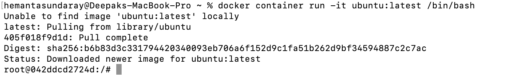
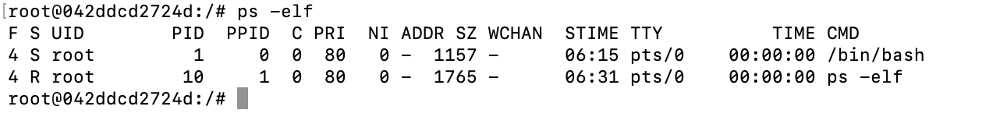
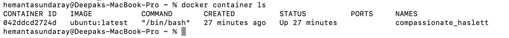
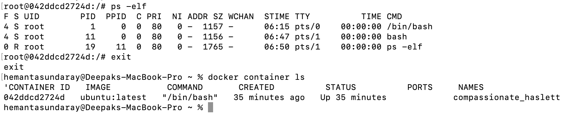

```toc

```

### Start a container

The simplest way to start a container is with the ~~docker container run~~ command.

The following command starts a simple container that will run a containerized version of Ubuntu Linux.

```sh
docker container run -it ubuntu:latest /bin/bash
```



- ~~docker container run~~ tells Docker to run a new container
- The ~~-it~~ flag makes the container interactive and attaches it to your terminal.
- ~~ubuntu:latest~~ tells Docker which image to start the container from.
- ~~/bin/bash~~ is the application that the container will run.

When you hit ~~Return~~, the Docker client packaged up the command and POSTed it to the API server running on the Docker daemon. The Docker daemon accepted the command and searched the Docker host’s local image repository to see if it already had a copy of the requested image. In the example above, it didn’t, so it went to Docker Hub to see if it could find it there. It found, pulled it locally and stored it in its local cache.

Once the image was pulled, the daemon instructed ~~containerd~~ and ~~runc~~ to create and start the container.

We can also see that our terminal is now attached to the container. Our shell prompt has changed. In our example, the shell prompt has changed to ~~root@042ddcd2724d:/#~~. The long number after the ~~@~~ is the first 12 characters of the container’s unique ID.

### Container Processes

When we started the Ubuntu container in the example above, we told it to run the Bash shell (~~/bin/bash~~). This makes the Bash shell the **one and only** process running inside the container. We can see this by running ~~ps -elf~~ from inside the container.

```sh
ps -elf
```



The first process in the list, with PID 1, is the Bash shell we told the container to run. The second process is the ~~ps -elf~~ command we ran to produce the list. This is a short-lived process that exits as soon as the output is displayed. In other words, the container is running a single process - ~~/bin/bash/~~.

### Terminate a Container

If we are logged in to the container and type ~~exit~~, we terminate the Bash process and the container will terminate. This is because a container can’t exist without its designated main process.

> **Killing the main process in the container will kill the container.**

### Terminate a Container Without Terminating its Main Process

We can press ~~Ctrl-PQ~~ to exit the container without terminating its main process. Doing this will place you back in the shell of your Docker host and leave the container running in the background.

We can use the ~~docker container ls~~ command to view the list of running containers in our system.

```sh
docker container ls
```



It’s important to understand that this container is still running & you can reattach your terminal to it with the ~~docker container exec~~ command.

```sh
docker container exec -it 042ddcd2724d bash
```


We can see that the shell prompt has changed back to the container. If you run the ~~ps -elf~~ command again, you will now see two Bash processes. This is because ~~docker container exec~~ command created a new Bash process and attached to that. This means typing ~~exit~~ in the shell will not terminate the container, because the original Bash process will continue running.

```sh
ps -elf
```



### Stop a Container

We can stop a container with the following command:

```sh
docker container stop <container ID>
```

To see the containers including those in stopped state, add the ~~-a~~ flag to the ~~docker container ls~~ command.

### Delete a Container

To delete a container, use the following command:

```sh
docker container rm <container ID>
```
