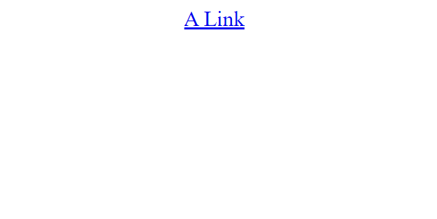
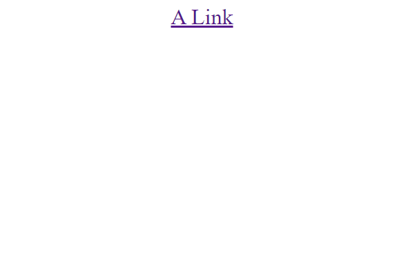
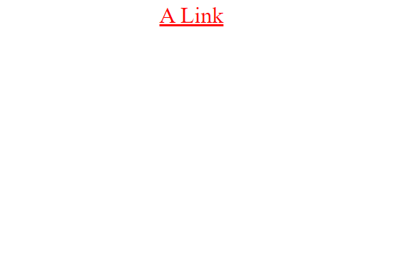
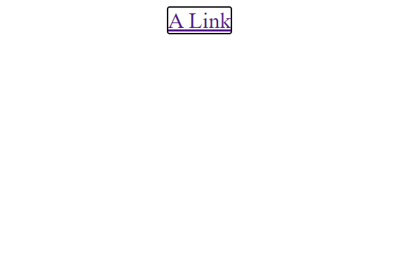

```toc

```

A link can exist in any one of the following five states.

**Link**

- A link that has a destination.
- Styled using the ~~:link~~ pseudo class.

**Visited**

- A link that has already been visited
- Styled using the ~~:visited~~ pseudo class

**Hover**

- A link when it is being hovered over by a user’s mouse pointer
- Styled using the ~~:hover~~ pseudo class.

**Focus**

- A link that has been focused (for example, moved to by a user’s mouse pointer using the ~~tab~~ key or similar).
- Styled using the ~~:focus~~ pseudo class

**Active**

- A link when it is being activated (e.g. clicked on)
- Styled using the ~~:active~~ pseudo class

The following example illustrates the default behavior of links.

```html
<p><a href="”#”">A Link</a></p>
```

```css
P {
  margin: 1rem;
  font-size: 3rem;
  text-align: center;
}
```

We have the following result:



### Default link styles

By default, links, depending on their state, have the following default styles.

#### Unvisited link

Unvisited links are blue and underlined, as you can see above. Also, hovering over a link changes the mouse pointer to a little hand icon.

#### Visited links

Now, click on the link, you will see that the color has changed to purple.



#### Active links

Now click and hold, the link color turns red. Active links are red by default.



#### Focused links

Next, keep pressing the ~~tab~~ key until the link is in focus. You will see an outline around the link.



### Styling links

Links are styled using the following order:

```css
a {
}

a:link {
}

a:visited {
}

a:focus {
}

a:hover {
}

a:active {
}
```

> **The order in which you style the links is important** because the styles in the first rule will apply to all the subsequent ones.
