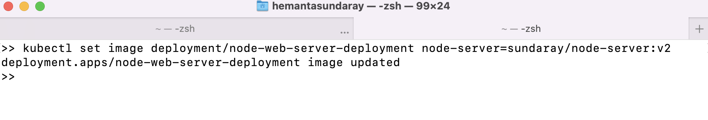

###### Learn how to run a Node.js web application on a local single-node kubernetes cluster in my blog post [here](https://hemanta.io/kubernetes-tutorial-run-a-nodejs-web-application-on-a-local-single-node-kubernetes-cluster-using-minikube-and-kubectl/).

In Docker Hub, I have two versions of a container image: ~~sundaray/node-server:v1~~ & ~~sundaray/node-server:v2~~.


Currently, I have a running container on a Kubernetes cluster using the image tagged with ~~v1~~.

Now, if I want the running container to use the image tagged with ~~v2~~, I can use the ~~kubectl set image~~ command (_without editing the YAML of the Deployment object_).

```sh {numberLines}
kubectl set image deployment/<deployment_name> <container_name>/<image_name>:<tag_name>
```



When I execute the command above, the image used in the container is changed to ~~sundaray/node-server:v2~~ (from :v1).

Now if I check the YAML definition of the pod, I can see that the container is using the new image.


