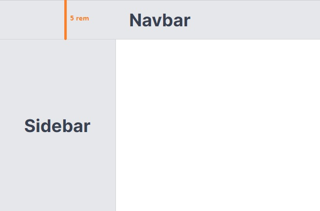

Let's say we have an app with a navbar & a sidebar.



The width of the navbar is 5rem. We want to set the height of sidebar as ~~calc(100%-5rem)~~.

Using Tailwind CSS, we can set the height as shown below:

```js
<div className="w-60 h-[calc(100vh-5rem)]">Sidebar</div>
```
