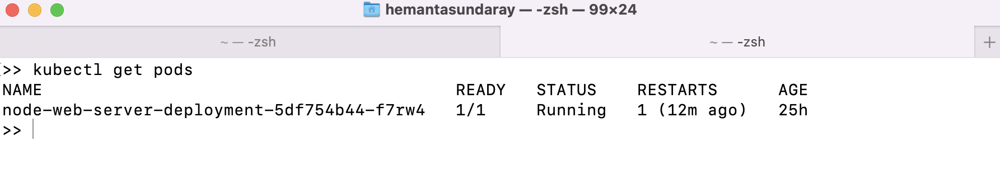
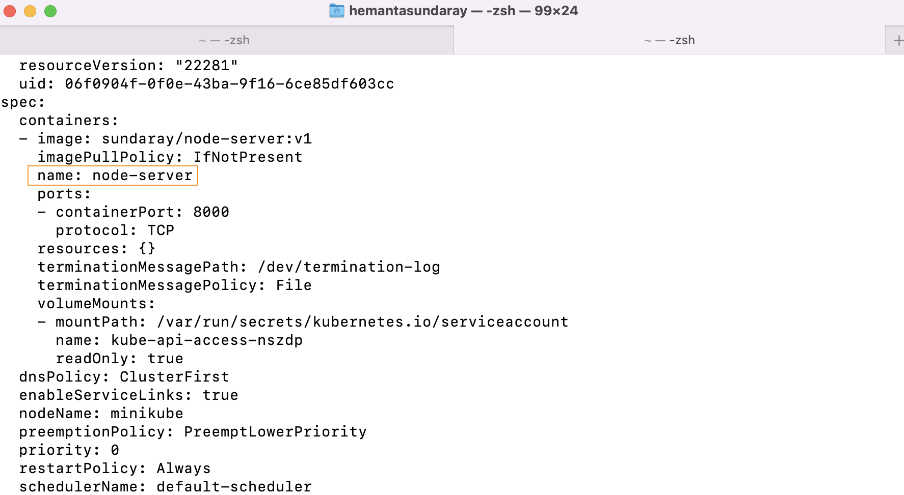
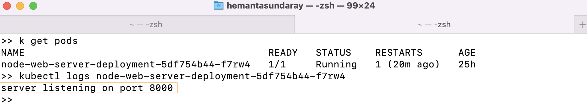

I have a simple Node.js web application running inside a container on a local single-node Kubernetes cluster. When the server starts up, the application logs the text "Server listening on port 8000".

Let’s get the list of pods running inside the cluster.

```sh {numberLines}
kubectl get pods
```



Let’s look at the YAML definition of the pod. We will use the ~~kubectl get~~ command with the ~~-o yaml~~ option to get the whole YAML definition of the pod.

```sh {numberLines}
kubectl get pod <pod_name>  -o yaml
```



Note that our pod contains a single container named ~~node-server~~.

We can retrieve the container log using the ~~kubectl logs <pod_name>~~ command.



Note that if your pod contains multiple containers, you have to explicitly specify the container’s name by including the ~~-c <container_name>~~ option when running ~~kubectl logs~~.

```sh {numberLines}
kubectl logs <pod_name> -c <container_name>
```

**Obtaining the Application Log of a Crashed Container**

If a container is restarted, for whatever reason, the ~~kubectl logs~~ command will show the log of the current container.

When you want to figure out why the previous container terminated, you’ll want to see those logs instead of the current container’s logs. This can be done using the ~~--previous~~ flag.

```sh {numberLines}
kubectl logs <pod_name> --previous
```
