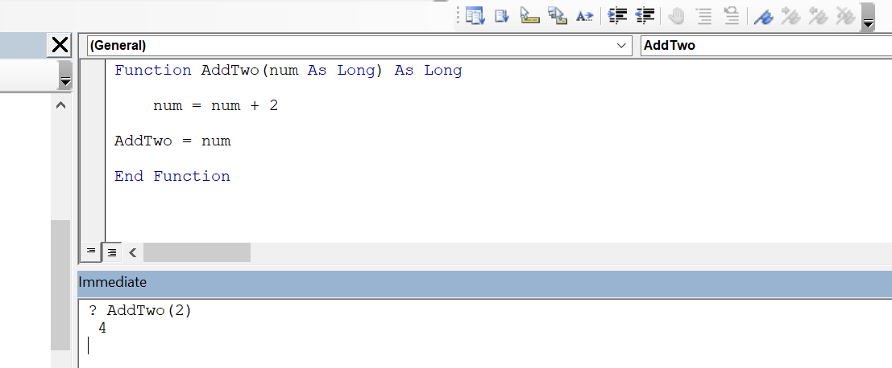

The _immediate window_ displays the result of a function or property and also allows you to run individual lines of code without creating a function or subroutine.

To display the immediate window in the Editor, choose View > Immediate Window, or press ~~Ctrl+G~~.

We can use the immediate window to test custom functions. For example, we can test the ~~AddTwo()~~ function below

```vb {numberLines}
Function AddTwo(num As Long) As Long
    num = num + 2
    AddTwo = num
End Function
```

by performing the following steps:

- Type the name of the function, preceded by a question mark. Be sure to use the proper function for the syntax.
- Press Enter. The current value of the function appears below the line of text that you typed.



We can also use the immediate window to experiment with and test individual lines of code.

If you type ~~? ActiveWorkbook.Worksheets.Count~~ in the immediate window, you will see the number of worksheets in the Excel window.

This type of experimentation can help you become familiar with objects and their properties, so that you can identify errors before runtime. The more testing you do beforehand, the fewer errors you will have to find later.
