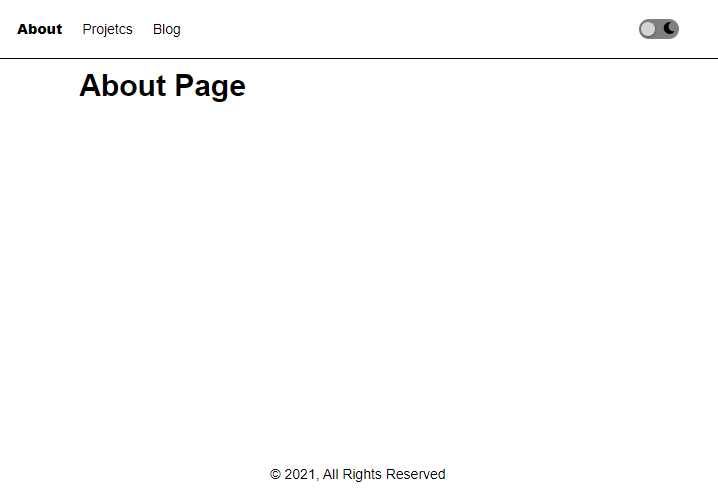
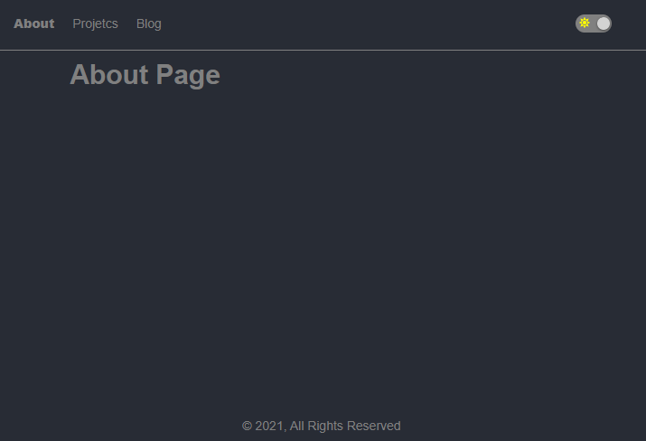
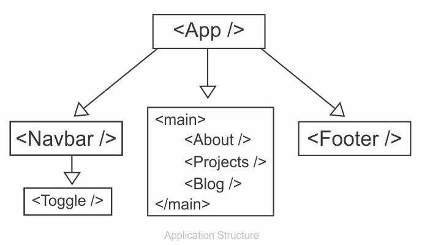
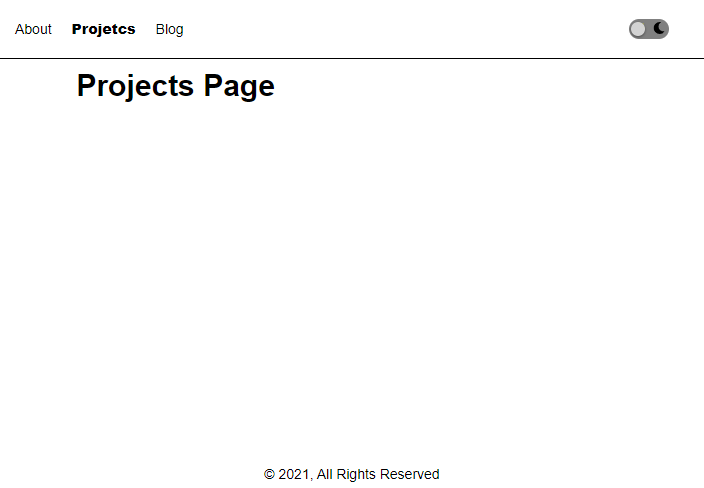

```toc

```

###### If you want to implement a dark mode theme in React using GSAP (a JavaScript animation library), check out my blog post [here](https://hemanta.io/create-a-light-and-dark-mode-toggle-in-react-using-gsap/).

I realized that many people might not be familiar with GSAP. Therefore, I decided to implement the dark mode theme using CSS variables. This tutorial also provides a great learning opportunity on the typical use case of React Context.

Before we start, here is a primer on CSS variables and React Context.

### CSS variables

CSS variables allow us to store a value in one place and then reference it in multiple other places.

The common best practice to define custom variables is on the ~~:root~~ pseudo-class, so that they can be applied globally across the HTML document. Note that the name of the custom variables begin with double hyphens (~~--~~).

```css
:root {
  ---main-text-color: gray;
}
```

Then we can use the custom variable by specifying the name of the property inside the ~~var~~ function. Like so:

```css
p {
  color: var(--main-text-color);
}
```

### React Context

**The first thing to remember about React Context is that it’s NOT a state management tool**.

In a typical React application, data is passed from the parent component to the child component (top-down) through props.

Imagine a React application where components at different nesting levels of the component tree need access to data held by a stateful component located at the top of the component tree.

In such a scenario, we pass down data from the stateful component to the destination component through props, which also get added to intermediate components that don't even require those props. This passing down of props through the intermediate level is known as prop drilling or threading.

Prop drilling is not a big problem if the React app is made up of a handful of components. But in a complex React app, prop drilling makes it difficult to create reusable components.This is where Context API comes into picture.

**Context helps us avoid the issue of prop drilling. It broadcasts data to components that need them, thereby avoiding the need to manually pass props down at every intermediate level of the component tree**.

In a nutshell, Context API is simply a transport mechanism.

### Project walkthrough

Here is the project that we are going to build.

#### Light mode



#### Dark mode



### Application structure

This will be the overall application structure:



A few things to note. First, the ~~App~~ component, which sits at the top of the component tree will store the ~~darkMode~~ state variable (_which is a boolean_). Then, we will use React Context (_a transport mechanism_) to pass the ~~darkMode~~ variable and the ~~setDarkMode~~ function to the child components.

The ~~setDarkMode~~ function will only be used by the ~~Toggle~~ component, which is responsible for toggling between light and dark themes. The ~~darkMode~~ variable will be used by the ~~Navbar~~ and the ~~Footer~~ components, which will need this variable to conditionally decide on the class names to add to HTML elements. All this will be clear as we progress further.

### Starting the project

Create a folder called ~~dark-mode~~, open the folder in VS Code and create a React project using the following command:

```sh
PS C:\Users\Delhivery\Desktop\dark-mode> npx create-react-app .
```

We will install all the dependencies we need in advance.

Install ~~react-router-dom~~ (_which we will use for client-side routing_) using the following command:

```sh
PS C:\Users\Delhivery\Desktop\dark-mode> npm i react-router-dom
```

We will use Font Awesome icons using Font Awesome’s official React component.

We need to install the following three packages:

```sh
PS C:\Users\Delhivery\Desktop\dark-mode> npm i --save @fortawesome/fontawesome-svg-core
@fortawesome/free-solid-svg-icons @fortawesome/react-fontawesome
```

You can find more about using Font Awesome icons in React at the following link:

[Using Font Awesome with React](https://fontawesome.com/v5.15/how-to-use/on-the-web/using-with/react)

Inside the ~~src~~ folder, create a folder named ~~components~~. Inside the ~~components~~ folder, create 6 files: ~~About.js~~, ~~Projects.js~~, ~~Blog.js~~, ~~NavBar.js~~, ~~Toggle.js~~ & ~~Footer.js~~.

```jsx:title=src/components/About.js {numberLines}
import React from "react";

const About = () => {
  return <div>About Page</div>;
};

export default About;
```

```jsx:title=src/components/Protects.js {numberLines}
import React from "react";

const Projects = () => {
  return <div>Projects Page</div>;
};

export default Projects;
```

```jsx:title=src/components/Blog.js {numberLines}
import React from "react";

const Blog = () => {
  return <div>Blog Page</div>;
};

export default Blog;
```

```jsx:title=src/components/Navbar.js {numberLines}
import React from "react";
import { NavLink } from "react-router-dom";
import Toggle from "./Toggle";

const Navbar = () => {
  return (
    <nav className="navigation-light">
      <ul>
        <NavLink to="/about" activeClassName="active">
          About
        </NavLink>
        <NavLink to="/projects" activeClassName="active">
          Projetcs
        </NavLink>
        <NavLink to="/blog" activeClassName="active">
          Blog
        </NavLink>
      </ul>
      <Toggle />
    </nav>
  );
};

export default Navbar;
```

```jsx:title=src/components/Toggle.js {numberLines}
import React from "react";
import { FontAwesomeIcon } from "@fortawesome/react-fontawesome";
import { faSun } from "@fortawesome/free-solid-svg-icons";
import { faMoon } from "@fortawesome/free-solid-svg-icons";

const Toggle = () => {
  return (
    <div className="toggle-wrapper">
      <div className="toggle">
        <div>
          <FontAwesomeIcon icon={faSun} className="sun" />
        </div>
        <div>
          <FontAwesomeIcon icon={faMoon} className="moon" />
        </div>
        <div className="circle-light"></div>
      </div>
    </div>
  );
};

export default Toggle;
```

```jsx:title=src/components/Footer.js {numberLines}
import React from "react";

const Footer = () => {
  return (
    <footer className="footer-light">&copy; 2021, All Rights Reserved</footer>
  );
};

export default Footer;
```

Then paste the following code snippets in ~~App.js~~.

```jsx:title=src/App.js {numberLines}
import React from "react";
import { Route, Switch } from "react-router-dom";
import About from "./components/About";
import Projects from "./components/Projects";
import Blog from "./components/Blog";
import Navbar from "./components/Navbar";
import Footer from "./components/Footer";

const App = () => {
  return (
    <div className="app-wrapper">
      <Navbar />
      <main className="main-light">
        <Switch>
          <Route path="/about">
            <About />
          </Route>
          <Route path="/projects">
            <Projects />
          </Route>
          <Route path="/blog">
            <Blog />
          </Route>
        </Switch>
      </main>
      <Footer />
    </div>
  );
};

export default App;
```

Next, add the following CSS rules in ~~index.css~~.

```css:title=src/index.css {numberLines}
/*_ || Global styling _*/
* {
  padding: 0;
  margin: 0;
  box-sizing: border-box;
}

html {
  font-size: 62.5%;
  font-family: sans-serif;
}
/*_ End of global styling _*/

.app-wrapper {
  min-height: 100vh;
  display: grid;
  grid-template-rows: auto 1fr auto;
}

/* || Toggle button styling */

.toggle {
  width: 4rem;
  height: 2rem;
  margin: 4rem;
  background-color: gray;
  border-radius: 3rem;
  position: relative;
  cursor: pointer;
  display: flex;
  justify-content: space-around;
  align-items: center;
}

.sun,
.moon {
  font-size: 1.2rem;
}

.sun {
  color: yellow;
}

.circle-light {
  width: 1.4rem;
  height: 1.4rem;
  background-color: lightgray;
  border-radius: 50%;
  position: absolute;
  top: 50%;
  left: 5%;
  transform: translateY(-50%);
  box-shadow: 0 0.1rem 0.3rem rgba(0, 0, 0, 0.6);
}

/* End of toggle button styling */

.navigation-light {
  width: 100%;
  height: 6rem;
  display: flex;
  justify-content: space-between;
  align-items: center;
  border-bottom: 0.1rem solid black;
}

.navigation-light ul {
  list-style: none;
  display: flex;
  align-items: center;
  padding: 0 2rem 0 2rem;
}

.navigation-light ul a {
  text-decoration: none;
  font-size: 1.4rem;
  margin-right: 2rem;
}

.navigation-light ul a:link,
.navigation-light ul a:visited {
  color: black;
}

.navigation-light ul a:hover {
  color: gray;
}

.active {
  font-weight: 900;
}

/*_ || Main section styling _*/

.main-light {
  font-size: 3rem;
  width: 80%;
  margin: 0rem auto;
  padding: 1rem;
  font-weight: bold;
}

/*_ End of main section styling _*/

/*_ || Footer section styling _*/

.footer-light {
  width: 100%;
  height: 4rem;
  display: grid;
  place-items: center;
  font-size: 1.4rem;
}

/*_ || End of footer section styling _*/
```

We have the following result:



The toggle button lacks functionality. We will make it work soon.

The logic for implementing dark mode is very simple.

We will keep a boolean state variable named ~~darkMode~~ (_you can name it whatever you want_) and the function responsible for updating the ~~darkMode~~ variable, named ~~setDarkMode~~, in the component which sits at the top of the component tree. This will be the ~~App~~ component in our case.

We will pass the ~~darkMode~~ varaible to the components (~~Navbar.js~~ & ~~Footer.js~~) which will then use its value to conditionally add class names to HTML elements. Next, we will pass the ~~setDarkMode~~ function to the ~~Toggle~~ component. The ~~onClick~~ event listener of the toggle button will call the ~~setDarkMode~~ function, which will then reverse the value of the ~~darkMode~~ variable (_remember that ~~darkMode~~ is a boolean_). We will use Context API to transport the ~~darkMode~~ variable and the ~~setDarkMode~~ function to the required child components.

That's all there is to implementing dark mode theme in React apps.

Now, let's add the highlighted code snippets in the respective components as shown below:

```jsx:title=src/App.js {numberLines, 1-1, 9-9, 12-12, 14-17, 20-20, 23-23, 38-38}
import React, { useState, createContext } from "react";
import { Route, Switch } from "react-router";
import About from "./components/About";
import Projects from "./components/Projects";
import Blog from "./components/Blog";
import Navbar from "./components/Navbar";
import Footer from "./components/Footer";

export const ThemeContext = createContext();

const App = () => {
  const [darkMode, setDarkMode] = useState(false);

  const darkModeTheme = {
    darkMode,
    setDarkMode,
  };

  return (
    <ThemeContext.Provider value={darkModeTheme}>
      <div className="app-wrapper">
        <Navbar />
        <main className={darkMode ? "main-dark" : "main-light"}>
          <Switch>
            <Route path="/about">
              <About />
            </Route>
            <Route path="/projects">
              <Projects />
            </Route>
            <Route path="/blog">
              <Blog />
            </Route>
          </Switch>
        </main>
        <Footer />
      </div>
    </ThemeContext.Provider>
  );
};

export default App;
```

On line 23, notice that we are conditionally adding class names based on the value of the ~~darkMode~~ variable.

```jsx:title=src/components/Navbar.js {numberLines, 1-1, 3-3, 7-7, 10-10}
import React, { useContext } from "react";
import { NavLink } from "react-router-dom";
import { ThemeContext } from "../App";
import Toggle from "./Toggle";

const Navbar = () => {
  const { darkMode } = useContext(ThemeContext);

  return (
    <nav className={darkMode ? "navigation-dark" : "navigation-light"}>
      <ul>
        <NavLink to="/about" activeClassName="active">
          About
        </NavLink>
        <NavLink to="/projects" activeClassName="active">
          Projetcs
        </NavLink>
        <NavLink to="/blog" activeClassName="active">
          Blog
        </NavLink>
      </ul>
      <Toggle />
    </nav>
  );
};

export default Navbar;
```

```jsx:title=src/components/Toggle.js {numberLines, 1-2, 8-8, 10-10, 12-15, 19-19, 26-26}
import React, { useContext } from "react";
import { ThemeContext } from "../App";
import { FontAwesomeIcon } from "@fortawesome/react-fontawesome";
import { faSun } from "@fortawesome/free-solid-svg-icons";
import { faMoon } from "@fortawesome/free-solid-svg-icons";

const Toggle = () => {
  const { darkMode, setDarkMode } = useContext(ThemeContext);

  const theme = darkMode ? "light" : "dark";

  const circleClickHandler = (theme) => {
    setDarkMode(!darkMode);
    document.documentElement.className = theme;
  };

  return (
    <div className="toggle-wrapper">
      <div className="toggle" onClick={() => circleClickHandler(theme)}>
        <div>
          <FontAwesomeIcon icon={faSun} className="sun" />
        </div>
        <div>
          <FontAwesomeIcon icon={faMoon} className="moon" />
        </div>
        <div className={darkMode ? "circle-dark" : "circle-light"}></div>
      </div>
    </div>
  );
};

export default Toggle;
```

```jsx:title=src/components/Footer.js {numberLines, 1-1, 2-2, 5-5, 8-8}
import React, { useContext } from "react";
import { ThemeContext } from "../App";

const Footer = () => {
  const { darkMode } = useContext(ThemeContext);

  return (
    <footer className={darkMode ? "footer-dark" : "footer-light"}>
      &copy; 2021, All Rights Reserved
    </footer>
  );
};

export default Footer;
```

```css:title=src/index.css {numberLines, 8-18, 67-77, 90-112, 119-122, 128-135, 151-158, 172-179}
/*_ || Global styling _*/
* {
  padding: 0;
  margin: 0;
  box-sizing: border-box;
}

:root.light {
  --bg-color: white;
}

:root.dark {
  --bg-color: #282c35;
}

body {
  background-color: var(--bg-color);
}

html {
  font-size: 62.5%;
  font-family: sans-serif;
}
/*_ End of global styling _*/

.app-wrapper {
  min-height: 100vh;
  display: grid;
  grid-template-rows: auto 1fr auto;
}

/* || Toggle button styling */

.toggle {
  width: 4rem;
  height: 2rem;
  margin: 4rem;
  background-color: gray;
  border-radius: 3rem;
  position: relative;
  cursor: pointer;
  display: flex;
  justify-content: space-around;
  align-items: center;
}

.sun,
.moon {
  font-size: 1.2rem;
}

.sun {
  color: yellow;
}

.circle-light {
  width: 1.4rem;
  height: 1.4rem;
  background-color: lightgray;
  border-radius: 50%;
  position: absolute;
  top: 50%;
  left: 5%;
  transform: translateY(-50%);
  box-shadow: 0 0.1rem 0.3rem rgba(0, 0, 0, 0.6);
}
.circle-dark {
  width: 1.4rem;
  height: 1.4rem;
  background-color: lightgray;
  border-radius: 50%;
  position: absolute;
  top: 50%;
  right: 5%;
  transform: translateY(-50%);
  box-shadow: 0 0.1rem 0.3rem rgba(0, 0, 0, 0.6);
}

/* End of toggle button styling */

.navigation-light {
  width: 100%;
  height: 6rem;
  display: flex;
  justify-content: space-between;
  align-items: center;
  border-bottom: 0.1rem solid black;
}

.navigation-dark {
  width: 100%;
  height: 6rem;
  display: flex;
  justify-content: space-between;
  align-items: center;
  border-bottom: 0.1rem solid gray;
}

.navigation-light ul,
.navigation-dark ul {
  list-style: none;
  display: flex;
  align-items: center;
  padding: 0 2rem 0 2rem;
}

.navigation-light ul a,
.navigation-dark ul a {
  text-decoration: none;
  font-size: 1.4rem;
  margin-right: 2rem;
}

.navigation-light ul a:link,
.navigation-light ul a:visited {
  color: black;
}

.navigation-dark ul a:link,
.navigation-dark ul a:visited {
  color: gray;
}

.navigation-light ul a:hover {
  color: gray;
}

.navigation-dark ul a:hover {
  color: white;
}

.navigation-light ul a:active,
.navigation-dark ul a:active {
  color: lawngreen;
}

.active {
  font-weight: 900;
}

/*_ || Main section styling _*/

.main-light {
  font-size: 3rem;
  width: 80%;
  margin: 0rem auto;
  padding: 1rem;
  font-weight: bold;
}

.main-dark {
  font-size: 3rem;
  width: 80%;
  margin: 0rem auto;
  padding: 1rem;
  font-weight: bold;
  color: gray;
}

/*_ End of main section styling _*/

/*_ || Footer section styling _*/

.footer-light {
  width: 100%;
  height: 4rem;
  display: grid;
  place-items: center;
  font-size: 1.4rem;
}

.footer-dark {
  width: 100%;
  height: 4rem;
  display: grid;
  place-items: center;
  font-size: 1.4rem;
  color: gray;
}

/*_ || End of footer section styling _*/

```

Now the toggle button works and we are able to toggle between light and dark mode themes.

###### You can clone the GitHub repo [here](https://github.com/sundaray/react-darkmode).
