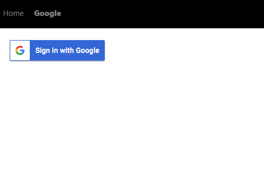
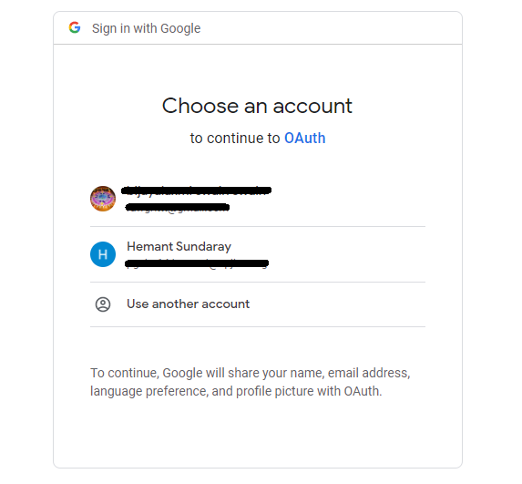
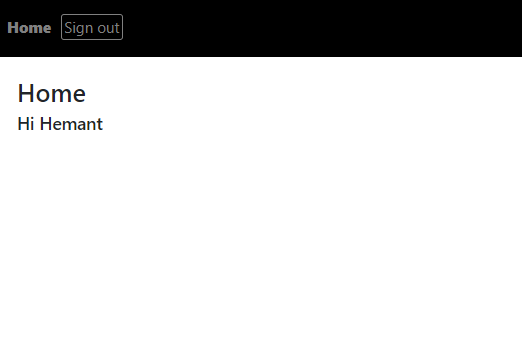
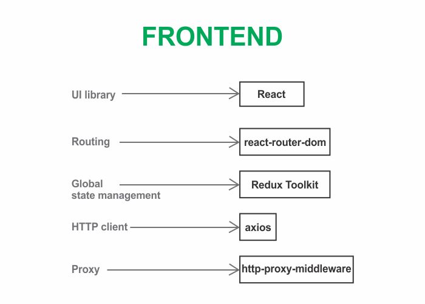
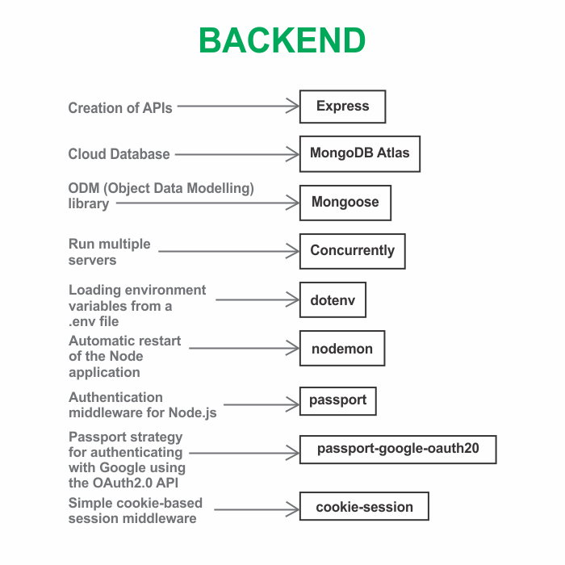

```toc

```

We will learn how to implement user authentication with Google using the OAuth 2.0 API in an Express + React project by building a simple application from scratch.

> OAuth 2.0, which stands for “Open Authorization” is a standard designed to allow a website or application to access resources hosted by other web apps on behalf of a user. OAuth 2.0 provides consented access and restricts actions of what the client app can perform on resources on behalf of the user, without ever sharing the user’s credentials.

Here is the preview of the application we are going to build:

### Home page


After a user successfully signs in, the word ~~Stranger~~ will be replaced with the Google profile name of the user.

### Sign in with Google

The ~~Google~~ page displays a ~~Sign in with Google~~ button.



When you click on the button, you will be redirected to an OAuth consent screen, which will tell you about the application requesting access to your data and the kind of data you will be giving access to.



After you give your permission by clicking on any one of your Google accounts, you will be redirected back to the home page of the application, where the greeting message will display your Google profile name. Also, the ~~Google~~ link in the header will be replaced by a ~~Sign out~~ link, clicking on which will sign you out of the application.



### Techstack

#### Frontend



#### Backend



Continue to [part-2](https://hemanta.io/implement-google-sign-in-using-the-oauth2.0-api-in-an-express-and-react-application-part-2/)
