###### This blog post is part of a series. You should complete [part-1](https://hemanta.io/implement-google-sign-in-using-oauth2.0-api-in-an-express-and-react-application-part-1/) before continuing here.

```toc

```

Google APIs use the OAuth 2.0 protocol for authentication and authorization. Therefore we must obtain OAuth 2.0 client credentials from the Google API console.

### Step-1

Go to Google project dashboard at the following link:

https://console.cloud.google.com

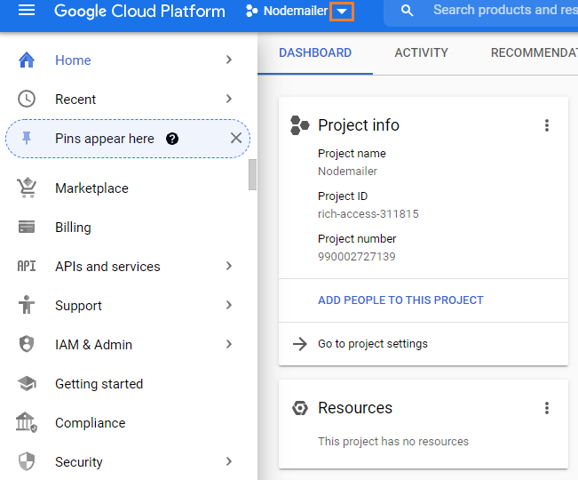

### Step-2

Click on ~~NEW PROJECT~~.

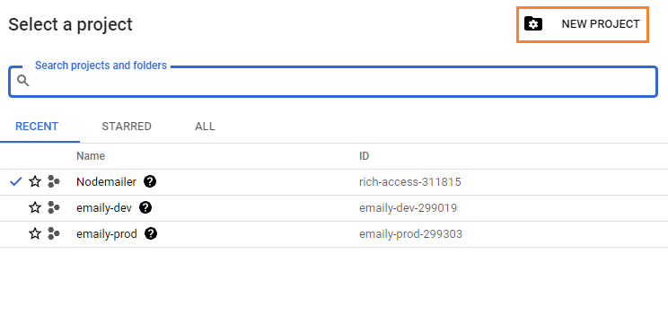

### Step-3

Name the project and click the ~~CREATE~~ button.

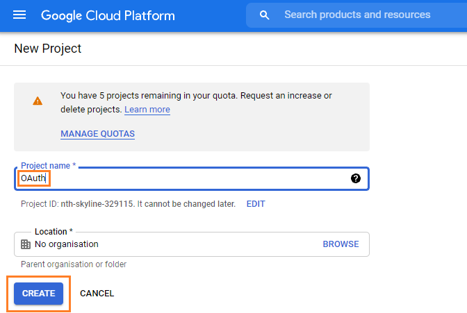

### Step-4

Select ~~APIs and services~~, then ~~OAuth consent screen~~.

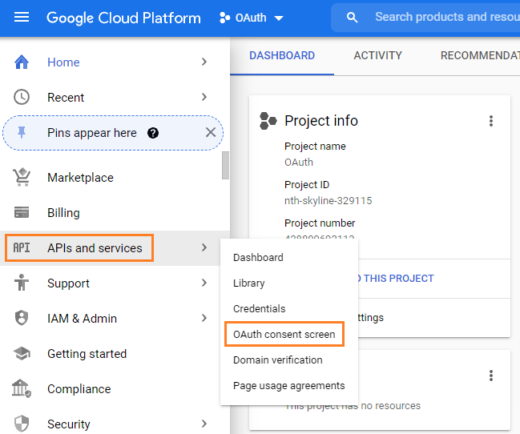

### Step-5

Select ~~External~~ and click the ~~CREATE~~ button.

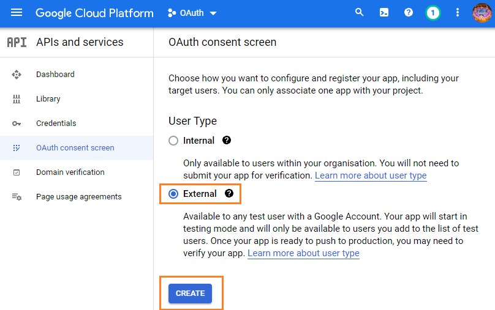

### Step-6

Fill out the application name, scroll to the bottom and click the ~~SAVE & CONTINUE~~ button. No other info should be filled out in the consent screen at this time.

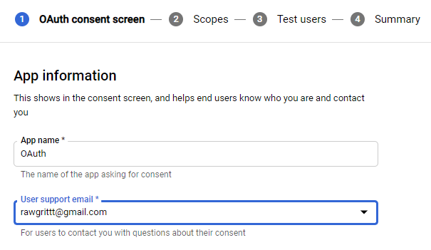

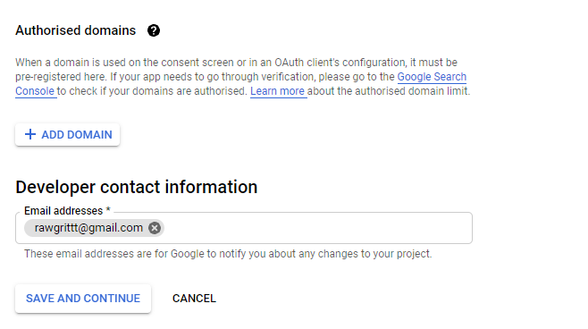

### Step-7

Click ~~Credentials~~ in the sidebar and click on the ~~+ CREATE CREDENTIALS~~ button.

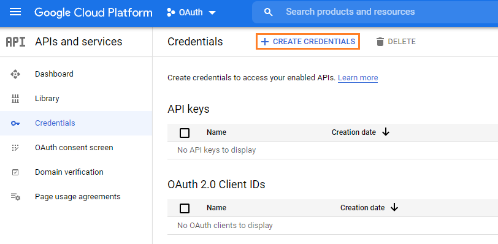

### Step-8

Select ~~OAuth client ID~~.

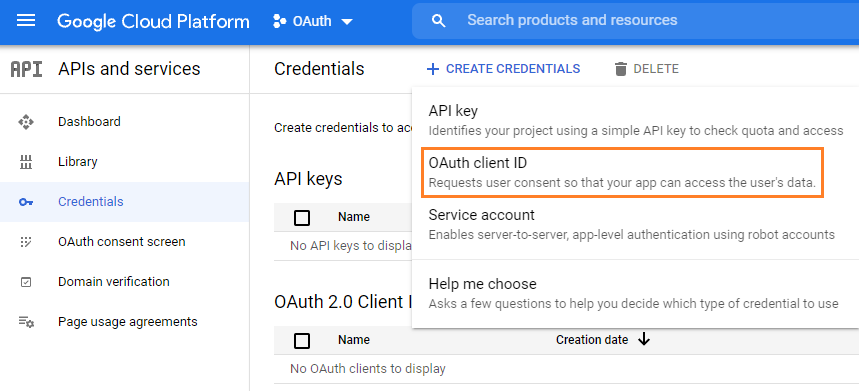

### Step-9

Select ~~Web application~~.

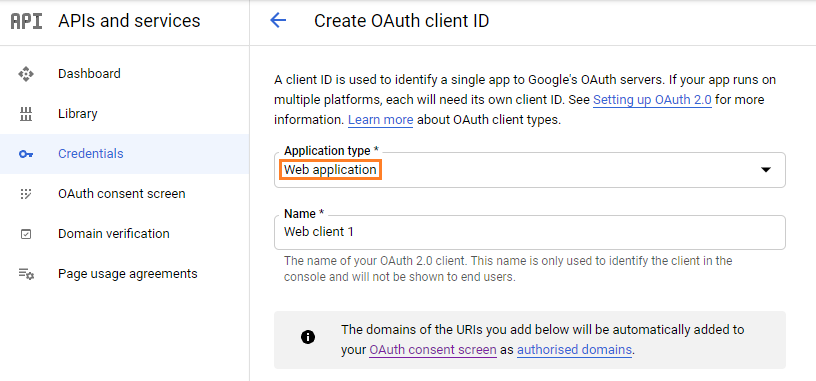

Also, fill out ~~Authorized JavaScript origins~~ and ~~Authorised redirect URIs~~.

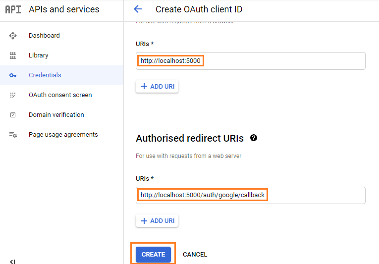

### Step-10

Copy your ~~Client ID~~ & ~~Client secret~~ in a safe place.

Note that ~~Client ID~~ is a public token. This means that we won't have any issues if anybody gets access to this ID. The ~~Client secret~~, on the other hand, is a private token. We don't want anybody to get access to this.

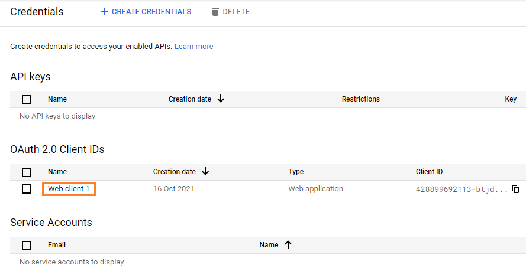

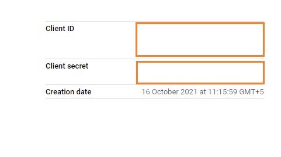

Continue to [part-3](https://hemanta.io/implement-google-sign-in-using-the-oauth2.0-api-in-an-express-and-react-application-part-3/).
