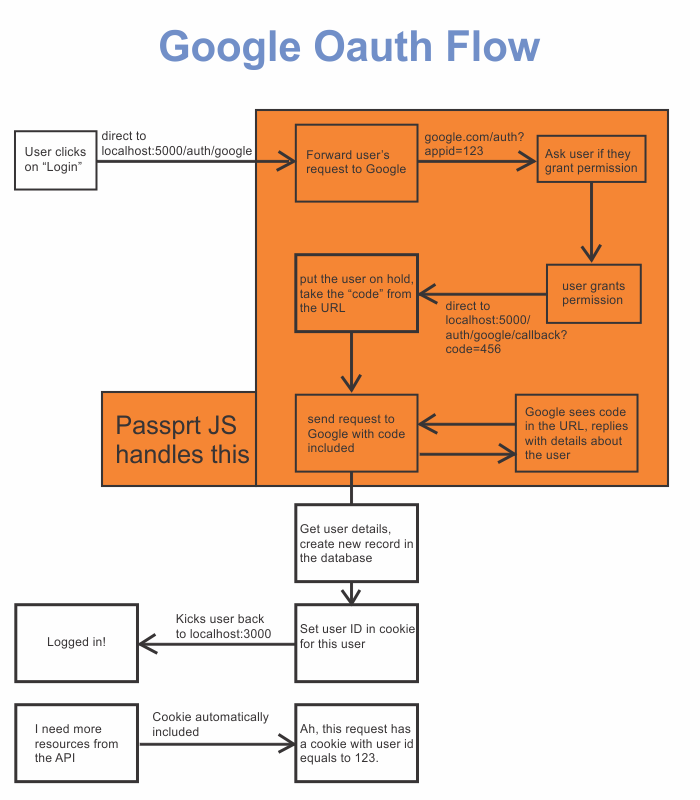

###### This blog post is part of a series. You should complete [part-1](https://hemanta.io/implement-google-sign-in-using-oauth2.0-api-in-an-express-and-react-application-part-1/) & [part-2](https://hemanta.io/implement-google-sign-in-using-the-oauth2.0-api-in-an-express-and-react-application-part-2/) before continuing here.

The following diagram illustrates a high-level overview of the steps that we will go through in order to implement user authentication with Google using the OAuth 2.0 API.

A user clicks on the ~~Sign in with Google~~ button. Then, we redirect the user to the ~~/auth/google~~ route.

The server understands that a user is trying to authenticate using Google and immediately forwards the incoming request to Google. Then Google shows a consent screen, which displays information regarding the application that is requesting access to the user’s data and the kind of data (scope) the application is asking to access.

After the user grants permission, Google automatically redirects the user to the ~~/auth/google/callback~~ route. The route handler inside this route, then, redirects the user to the root route of the application. (_you can decide the route to which you want to redirect the user to._).

When the user gets redirected back to the application, Google puts a parameter named ~~code~~ in the URL query string. We then put the user on hold, take that code from the URL and use that code to make a follow-up request to Google, asking for some information about the user.

Google reads the code and replies back with the user details. We save the required user details in the database, set the user ID in a cookie and redirect the user back to our application.

Now, the user is logged in. Thereafter whenever the user makes any follow-up requests, for example to fetch data from an API, the browser automatically adds the cookie in the request to uniquely identify the user.

_**Note that the name of the routes can be whatever you want.**_

Continue to [part-4](https://hemanta.io/implement-google-sign-in-using-the-oauth2.0-api-in-an-express-and-react-application-part-4/).
