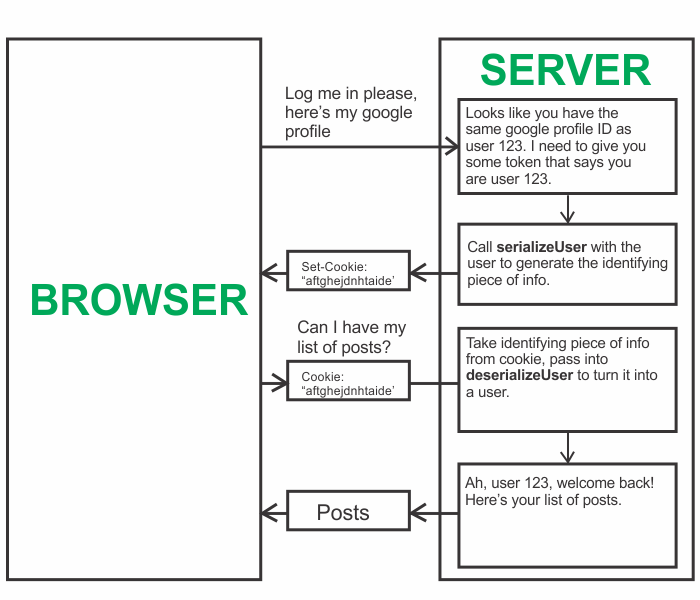

###### This blog post is part of a series. You should complete [part-1](https://hemanta.io/implement-google-sign-in-using-oauth2.0-api-in-an-express-and-react-application-part-1/), [part-2](https://hemanta.io/implement-google-sign-in-using-the-oauth2.0-api-in-an-express-and-react-application-part-2/) & [part-3](https://hemanta.io/implement-google-sign-in-using-the-oauth2.0-api-in-an-express-and-react-application-part-3/) before continuing here.

```toc

```

Implementing Sign in with Google using the OAuth 2.0 API is a server-side feature.

The first step for us will be to build a full-stack application structure and install the requisite libraries. I have already written a post (_as part of a blog series_) on creating a full-stack application structure [here](https://hemanta.io/implement-user-authentication-and-authorization-in-a-mern-stack-application-part-2/). Once you have the structure ready, ensure that you have the following libraries installed on the client

- react
- react-router-dom
- @reduxjs/toolkit
- react-redux
- axios
- http-proxy-middleware

and the following libraries on the server.

- **passport**
- **passport-google-oauth20**
- **cookie-session**
- express
- mongoose
- concurrently
- nodemon
- dotenv

###### Learn how to create a FREE-TIER MongoDB Atlas account in my blog post [here](https://hemanta.io/implement-jwt-based-user-authentication-in-a-mern-stack-app-part-6/).

Then copy and paste the following code snippets in their respective files:

### server/index.js

```js:title=server/index.js {numberLines}
const express = require("express");
const authRoutes = require("./routes/authRoutes");
const connectDB = require("./config/db");
const dotenv = require("dotenv");
const passport = require("passport");
const cookieSession = require("cookie-session");
require("./services/passport");

dotenv.config();

connectDB();

const app = express();

app.use(express.json());

app.use(
  cookieSession({
    maxAge: 30 * 24 * 60 * 60 * 1000,
    keys: [process.env.COOKIE_KEY],
  })
);

app.use(passport.initialize());
app.use(passport.session());

app.use(authRoutes);

const PORT = process.env.PORT || 5000;

app.listen(PORT, () => {
  console.log(`Server listening on port ${PORT}`);
});
```


### server/config/db.js

```js:title=server/config/db.js {numberLines}
const mongoose = require("mongoose");
const dotenv = require("dotenv");

dotenv.config();

const connectDB = async () => {
  try {
    const conn = await mongoose.connect(process.env.MONGO_URI, {
      useNewUrlParser: true,
      useUnifiedTopology: true,
    });
    console.log(`MongoDB connected: ${conn.connection.host}`);
  } catch (error) {
    console.error(`Error: ${error.message}`);
    process.exit(1);
  }
};

module.exports = connectDB;
```

### server/routes/authRoutes.js

```js:title=server/routes/authRoutes.js {numberLines}
const express = require("express");
const passport = require("passport");

const router = express.Router();

router.get(
  "/auth/google",
  passport.authenticate("google", {
    scope: ["profile", "email"],
  })
);

router.get(
  "/auth/google/callback",
  passport.authenticate("google"),
  (req, res) => {
    // successful authentication, redirect home
    res.redirect("/");
  }
);

router.get("/api/currentUser", (req, res) => {
  res.send(req.user);
});

router.get("/api/logout", (req, res) => {
  req.logout();
  res.redirect("/");
});

module.exports = router;
```

### server/models/googleuserModel.js

```js:title=server/models/googleuserModel.js {numberLines}
const mongoose = require("mongoose");

const googleuserSchema = new mongoose.Schema({
  googleId: String,
  givenName: String,
});

const Googleuser = mongoose.model("Googleuser", googleuserSchema);

module.exports = Googleuser;
```

### server/.env

```sh:title=server/.env {numberLines}
PORT = 5000
GOOGLE_CLIENT_ID = value
GOOGLE_CLIENT_SECRET = value
MONGO_URI = value
COOKIE_KEY = xbahkhewjnsdmvnnkjrm12nxudmwoo
```

Remember to paste your Client ID & Client secret that you had copied from Google API console and the MONGO_URI string from your MongoDB Atlas account in the ~~.env~~ file. Also, note that the value of the ~~COOKIE_KEY~~ key can be whatever you want.

### server/services/passport.js

```js:title=server/services/passport.js {numberLines, 6-6, 11-11, 27-27, 34-34}
const passport = require("passport");
const GoogleStrategy = require("passport-google-oauth20").Strategy;
const Googleuser = require("../models/googleuserModel");

passport.serializeUser((user, done) => {
  done(null, user.id);
});

passport.deserializeUser(async (id, done) => {
  const user = await Googleuser.findById(id);
  done(null, user);
});

passport.use(
  new GoogleStrategy(
    {
      clientID: process.env.GOOGLE_CLIENT_ID,
      clientSecret: process.env.GOOGLE_CLIENT_SECRET,
      callbackURL: "/auth/google/callback",
    },
    async (accessToken, refreshToken, profile, done) => {
      const { id } = profile;

      const existingUser = await Googleuser.findOne({ googleId: id });

      if (existingUser) {
        done(null, existingUser);
      } else {
        const user = await new Googleuser({
          googleId: id,
          givenName: profile.name.givenName,
        });
        user.save();
        done(null, user);
      }
    }
  )
);
```

The first argument to the ~~done()~~ callback is an error object. We have provided ~~null~~ as we don't expect any error to occur during the process.

The following diagram will help you understand the ~~serializeUser()~~ and ~~deserializeUser()~~ functions.



Continue to [part-5](https://hemanta.io/implement-google-sign-in-using-the-oauth2.0-api-in-an-express-and-react-application-part-5/).
