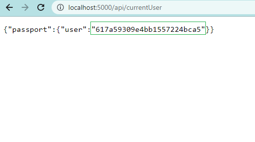
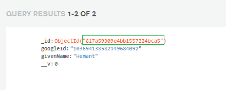
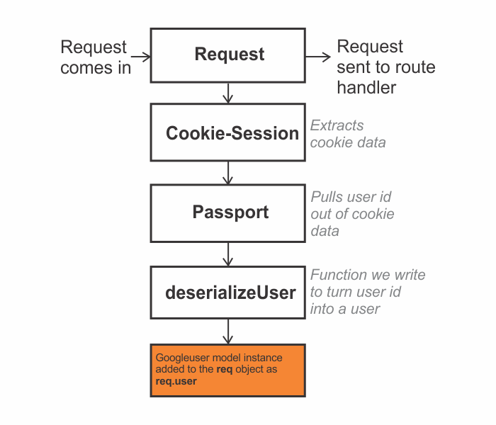
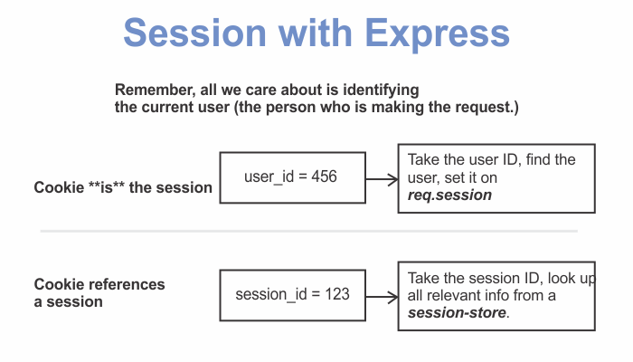
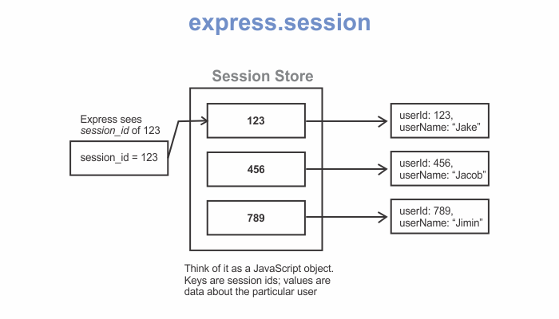
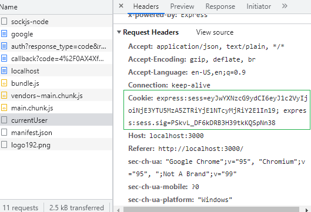

```toc

```

###### This blog post is part of a series. You must complete [part-1](https://hemanta.io/implement-google-sign-in-using-oauth2.0-api-in-an-express-and-react-application-part-1/), [part-2](https://hemanta.io/implement-google-sign-in-using-the-oauth2.0-api-in-an-express-and-react-application-part-2/), [part-3](https://hemanta.io/implement-google-sign-in-using-the-oauth2.0-api-in-an-express-and-react-application-part-3/), [part-4](https://hemanta.io/implement-google-sign-in-using-the-oauth2.0-api-in-an-express-and-react-application-part-4/) & [part-5](https://hemanta.io/implement-google-sign-in-using-the-oauth2.0-api-in-an-express-and-react-application-part-5/) before continuing here.

We have already finished building our application. The purpose of this blog post is to understand in detail what the ~~cookie-session~~ module is doing for us and how it relates to the ~~passport~~ library.

Go to the ~~authRoutes.js~~ file. Comment out the code inside the route handler responsible for the ~~/api/currentUser~~ route and add the following highlighted code snippet.

```js:title=server/routes/authRoutes.js {numberLines, 24-24}
const express = require("express");
const passport = require("passport");

const router = express.Router();

router.get(
  "/auth/google",
  passport.authenticate("google", {
    scope: ["profile", "email"],
  })
);

router.get(
  "/auth/google/callback",
  passport.authenticate("google"),
  (req, res) => {
    // successful authentication, redirect home
    res.redirect("/");
  }
);

router.get("/api/currentUser", (req, res) => {
  // res.send(req.user);
  res.send(req.session)
});

router.get("/api/logout", (req, res) => {
  req.logout();
  res.redirect("/");
});

module.exports = router;
```

Make sure that you are logged in. Then, open a new browser tab and make a request to the route ~~http://localhost:5000/api/currentUser~~.

You should see a response that looks like the following:



This is our ~~req.session~~ object. Note that the same user is stored in our MongoDB Atlas database in the ~~googleusers~~ collection.



The following diagram illustrates the steps that an incoming request goes through before the user model instance is added to the ~~req~~ object as ~~req.user~~.



A request comes in. The ~~cookie-session~~ middleware then extracts the data contained within the cookie and assigns it to the ~~req.session~~ property. Afterwards, the ~~password~~ library pulls out the user id from the extracted data.

**Difference between cookie-session & express-session**

There is another library called ~~express-session~~. Both ~~cookie-session~~ and ~~express-session~~ essentially accomplish the same thing, but they do so in different ways.



### cookie-session

The ~~cookie-session~~ module stores the session data on the client within a cookie. It does not require any database / resources on the server side; however, the total session data can’t exceed the browser’s max cookie size.

### express-session



The ~~express-session~~ module stores only a session identifier on the client within a cookie and stores the session data on the server, typically in a database.

### Cookie in action

In our application, after a user is logged in, we make a subsequent request to the ~~/api/currentUser~~ route. We know that after a user is logged in, for every subsequent request made to the server, the browser _automatically_ attaches the cookie in the request.

To see the cookie in action, sign in with Google. Then in the ~~Network~~ tab, click on ~~currentUser~~ and you will see the cookie in the request header.


