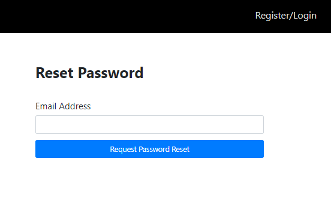
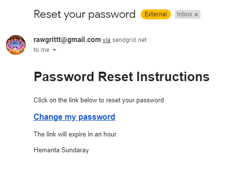
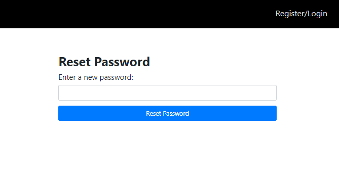

```toc

```

### What will you learn?

You will learn to implement JSON Web Token (JWT) based user authentication in a MERN stack application, wherein users will be able to **register**, **login**, **logout** and **reset** their password. In particular, you will learn how to:

- Structure full-stack applications
- Authenticate users using JSON Web Tokens
- Create forms using Formik
- Do client-side form validation using Yup and server-side form validation using joi
- Manage application state using Redux Toolkit
- Send transactional emails using SendGrid

### A walk-through of the project we will be building

We are going to build a full-stack application (_the user authentication part_) from scratch. Before we write a single line of code, let me walk you through the key features of the application we are going to build.

The home page of our application will show just a header with a ~~Register/Login~~ link.


When a user clicks on the link, we show a login form.


A first time user must register first using the ~~Register~~ link at the bottom of the login form. When the user fills in the registration form and clicks on the ~~Register~~ button, we direct them to the login form.

We do both client-side and server-side validation for all the forms. So, if a user clicks on the Email field, for example, leaves the field blank and then clicks anywhere outside of that form field, we show the validation error message. The same holds true for the Password field as well.


After the user logs in using his/her credentials, we show a welcome page. We also display the first name (_as filled in the registration form_) of the user in the header.


The user can log out of the application by clicking on the ~~Logout~~ link.


In case the user forgets his/her password, he/she can reset the password using the ~~I forgot my password~~ link at the bottom of the login form. When the user clicks on the link, we show a form where the user enters the email for which he/she wants to reset the password.



When the user enters the email address and clicks on the ~~Request Password Reset~~ button, we show a message saying that we have sent a password reset link to his/her email address.


The user receives a password reset link in his/her email address.



When the user clicks on the ~~Change my password~~ link in the email message, we direct them to a page where they can create a new password for their account.



The password reset link that the user receives in his/her email address expires in an 1 hour (_the token expiry time is configurable._). Therefore, if the user tries to reset the password after 1 hour of receiving the password reset link, we show an error message.


After successful reset of the password, the user can now log in to the application using the updated login credentials.

Now that you understand the key features of the application, let’s start coding.

Go to [part-2](https://hemanta.io/implement-jwt-based-user-authentication-in-a-mern-stack-app-part-2/)
