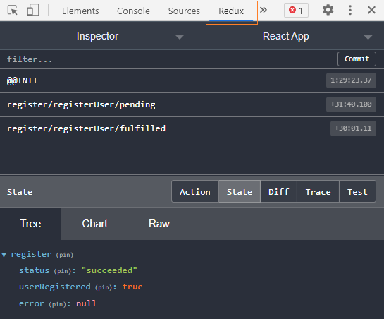
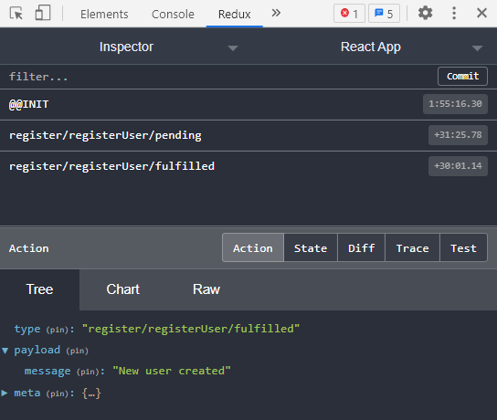
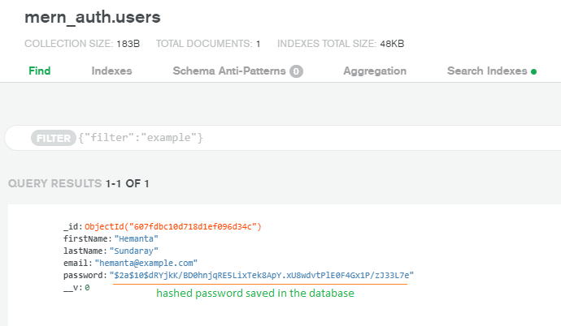

###### This blog post is part of a series. You must finish [part-1](https://hemanta.io/implement-jwt-based-user-authentication-in-a-mern-stack-app-part-1/), [part-2](https://hemanta.io/implement-jwt-based-user-authentication-in-a-mern-stack-app-part-2/), [part-3](https://hemanta.io/implement-jwt-based-user-authentication-in-a-mern-stack-app-part-3/), [part-4](https://hemanta.io/implement-jwt-based-user-authentication-in-a-mern-stack-app-part-4/), [part-5](https://hemanta.io/implement-jwt-based-user-authentication-in-a-mern-stack-app-part-5/), [part-6](https://hemanta.io/implement-jwt-based-user-authentication-in-a-mern-stack-app-part-6/), [part-7](https://hemanta.io/implement-jwt-based-user-authentication-in-a-mern-stack-app-part-7/), [part-8](https://hemanta.io/implement-jwt-based-user-authentication-in-a-mern-stack-app-part-8/) & [part-9](https://hemanta.io/implement-jwt-based-user-authentication-in-a-mern-stack-app-part-9/) before continuing here.

### Proxying API requests in React

In our application, the client server runs at ~~localhost:3000~~ while our Express server runs at ~~localhost:5000~~. In order to avoid CORS error during client-server interaction, we will proxy our API requests from React using a library named ~~http-proxy-middleware~~.

Install ~~http-proxy-middleware~~ using npm.

```sh
PS C:\Users\Delhivery\Desktop\mern-auth\client> npm i http-proxy-middleware
```

Then, create a file named ~~setupProxy.js~~ inside the ~~src~~ folder. There is no need to import this file anywhere. CRA (Create React App) looks for a file by this name and loads it.

We add proxies to the ~~setupProxy.js~~ file as shown below. Note that I have added all the routes that we need in our application.

```js:title=client/src/setupproxy.js {numberLines}
const { createProxyMiddleware } = require("http-proxy-middleware")
module.exports = function (app) {
  app.use(
    [
      "/api/users/login",
      "/api/users/register",
      "/account/password/forgot",
      "/account/password/reset/:token",
    ],
    createProxyMiddleware({
      target: "http://localhost:5000",
    })
  )
}
```

Anytime we make a change to the ~~setupProxy.js~~ file, we need to restart the server.

### Testing user registration

We are now ready to test our user registration feature. Go ahead and fill the registration form and click on the ~~Register~~ button. You will be directed to the login page.

> **Note:** Our user registration feature implementation is such that we direct the user to the login page upon successful registration. There is one more possibility - you might decide to directly log the user in after successful registration. The choice is yours.
> After we are done with implementing the login feature, you should have enough knowledge to implement this option.

I have installed Redux DevTools as a browser extension in Chrome. Open Chrome DevTools and click on the **Redux** tab. Then click on the **State** tab. You will see the global Redux store. As you can see, the user registration is successful.



If you click on the **Action** tab, you will see the actions types generated by the ~~userRegister~~ thunk.



Login to your MongoDB Atlas account. If you check the database, you should see a new document inside the ~~users~~ collection. You would also notice that the password saved in the database is hashed.



Great. User registration is working as expected. Note that we have not tested the scenario wherein the user tries to register for the second time using the same email address he/she used to register the first time. In such a scenario, we will display the error message received from the server (_User already registered_) on top of the registration form. We will test this case after we finish the implementation of the user login feature.

Go to [part-11](https://hemanta.io/implement-jwt-based-user-authentication-in-a-mern-stack-app-part-11/)
