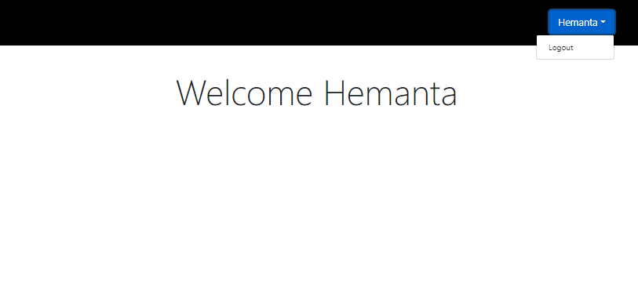
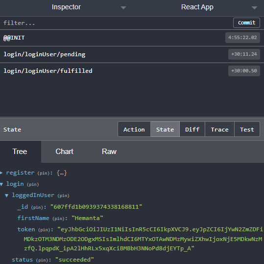
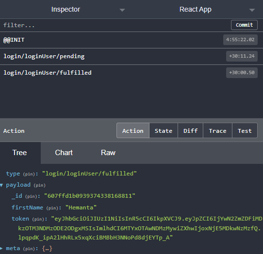

```toc

```

###### This blog post is part of a series. You must finish [part-1](https://hemanta.io/implement-jwt-based-user-authentication-in-a-mern-stack-app-part-1/), [part-2](https://hemanta.io/implement-jwt-based-user-authentication-in-a-mern-stack-app-part-2/), [part-3](https://hemanta.io/implement-jwt-based-user-authentication-in-a-mern-stack-app-part-3/), [part-4](https://hemanta.io/implement-jwt-based-user-authentication-in-a-mern-stack-app-part-4/), [part-5](https://hemanta.io/implement-jwt-based-user-authentication-in-a-mern-stack-app-part-5/), [part-6](https://hemanta.io/implement-jwt-based-user-authentication-in-a-mern-stack-app-part-6/), [part-7](https://hemanta.io/implement-jwt-based-user-authentication-in-a-mern-stack-app-part-7/), [part-8](https://hemanta.io/implement-jwt-based-user-authentication-in-a-mern-stack-app-part-8/), [part-9](https://hemanta.io/implement-jwt-based-user-authentication-in-a-mern-stack-app-part-9/) & [part-10](https://hemanta.io/implement-jwt-based-user-authentication-in-a-mern-stack-app-part-10/) before continuing here.

### Configuring the /api/users/login route

Our login form is ready. After a user fills in the login form with their credentials and clicks on the ~~Login~~ button, we will make a ~~POST~~ request to the ~~/api/users/login~~ endpoint. We have not configured this endpoint yet. Let’s do that now.

In the ~~userRoutes.js~~ file, paste the following highlighted code snippet.

```js:title=server/routes/userRoutes.js {numberLines, 6-6, 34-58}
const express = require("express")
const asyncHandler = require("express-async-handler")
const User = require("../models/userModel")
const { generateToken } = require("../utils/generateToken")
const { registrationValidation } = require("../validation/validate")
const { loginValidation } = require("../validation/validate")

const router = express.Router()

router.post(
  "/register",
  asyncHandler(async (req, res, next) => {
    const { firstName, lastName, email, password } = req.body

    const userExists = await User.findOne({ email })

    if (userExists) {
      const err = new Error("User already registered")
      err.status = 400
      next(err)
    }

    const user = await User.create({
      firstName,
      lastName,
      email,
      password,
    })

    res.json({ message: "New user created" })
  })
)

router.post(
  "/login",
  asyncHandler(async (req, res, next) => {
    const { error } = loginValidation(req.body)

    if (error) {
      const err = new Error(error.details[0].message)
      err.status = 400
      next(err)
    }
    const { email, password } = req.body
    const user = await User.findOne({ email })

    if (user && (await user.matchPassword(password))) {
      res.json({
        firstName: user.firstName,
        token: generateToken(user._id),
      })
    } else {
      const err = new Error("Invalid email or password")
      err.status = 401
      next(err)
    }
  })
)

module.exports = router
```

Update the ~~validate.js~~ file as follows.

```js:title=server/validation/validate.js {numberLines, 14-21, 25-25}
const Joi = require("joi")

const registrationValidation = formData => {
  const schema = Joi.object({
    firstName: Joi.string().required().max(20),
    lastName: Joi.string().required().max(20),
    email: Joi.string().required().email(),
    password: Joi.string().required().min(5),
  })

  return schema.validate(formData)
}

const loginValidation = formData => {
  const schema = Joi.object({
    email: Joi.string().required().email(),
    password: Joi.string().required().min(5),
  })

  return schema.validate(formData)
}

module.exports = {
  registrationValidation,
  loginValidation,
}
```

Let’s understand the code inside the route handler function inside ~~userRoutes.js~~. First, we do server-side validation of the form data coming from the client. If there are no errors, we extract the email and password fields from the request body (~~req.body~~). We then check whether we have an existing user in the database with the specified email address.

We also check whether the password provided matches with the password saved in the database. We use a custom mongoose method named ~~matchPassword~~ to do the password comparison.

Add the highlighted code snippet in the ~~userModel.js~~ file.

```js:title=server/models/userModels.js {numberLines, 24-26}
const mongoose = require("mongoose")
const bcrypt = require("bcryptjs")

const userSchema = new mongoose.Schema({
  firstName: {
    type: String,
    required: true,
  },
  lastName: {
    type: String,
    required: true,
  },
  email: {
    type: String,
    unique: true,
    required: true,
  },
  password: {
    type: String,
    required: true,
  },
})

userSchema.methods.matchPassword = async function (incomingPassword) {
  return await bcrypt.compare(incomingPassword, this.password)
}

userSchema.pre("save", async function () {
  const salt = await bcrypt.genSalt(10)
  this.password = await bcrypt.hash(this.password, salt)
})

const User = mongoose.model("User", userSchema)

module.exports = User
```

We can write custom methods by providing a function to the methods object of a mongoose schema. An instance of a model is known as a document. Any custom method we define at the schema level is available to all the instances of the model created using the schema. Therefore, the ~~matchPassword~~ method is available to all instances of the ~~User~~ model.

Inside the ~~matchPassword~~ function, we use the ~~bcrypt.compare()~~ method to compare the plain text password coming from the client with the hashed password saved in our database.

Only when both the conditions (_the user with the email address exists and the password provided matches with the password saved in our database_) hold true, the ~~/api/users/login~~ endpoint responds with a JSON object. The JSON object that we are sending back to the client contains the name of the user and a JSON Web Token, which we create using the ~~generateToken~~ function inside the ~~utils~~ folder.

### Generating a JSON Web Token

#### What is JWT?

JSON Web Token is an open standard that defines a compact and self-contained way for securely transmitting information between parties as a JSON object.

A JSON Web Token consists of three parts (Base64URL-encoded strings), separated by dots. The parts are:

- Header
- Payload
- Signature

Therefore a JWT typically looks like the following.

xxxxx.yyyyy.zzzzz

Header
The Header typically consists of two parts: the type of the token which is JWT and the signing algorithm being used such as HMAC SHA256 or RSA.

```json
{
  "alg": "HS256",
  "typ": "JWT"
}
```

Then, this JSON is Base64URL encoded to form the first part of the JWT.

#### Payload

The second part of the token is the payload which typically contains information about the user.

An example payload could look like the following.

```json
{
  "sub": "1234567890",
  "name": "John Doe",
  "admin": true
}
```

The payload is then Base64Url encoded to form the second part of the JSON Web Token.

#### Signature

To create the signature part you have to take the encoded header, the encoded payload, a secret, the algorithm specified in the header and sign that.

For example, if you want to use the HMAC SHA256 algorithm, the signature will be created in the following way.

```sh
HMACSHA256(
  base64UrlEncode(header) + "." +
  base64UrlEncode(payload),
  secret)

```

The signature is used to verify that the message was not changed along the way.

You can decode a JSON Web Token using the following link:

<https://jwt.io/#debugger-io>

#### Usage

JWTs are most commonly used in authentication and authorization. Once the user is logged in, each subsequent request will include the JWT, allowing the user to access routes, services and resources that are permitted with that token.

When the user successfully logs in using their credentials, the authentication endpoint responds with a JWT. Whenever the user wants to access a protected route or resource, the user agent should send the JWT, typically in the Authorization header using the Bearer schema. The content of the header should look like the following:

```sh
Authorization: Bearer <token>
```

The protected routes’ will check for a valid JWT in the ~~Authorization~~ header and if its present, the user is allowed to access the protected resources.

Now that you have a basic understanding of what a JWT is, let's generate one using the ~~jsonwebtoken~~ package.

Inside the ~~server~~ folder, create a folder named ~~utils~~ and inside the ~~utils~~ folder, create a file named ~~generateToken.js~~. Paste the following code in that file.

```js:title=server/utils/generateToken.js {numberLines}
const jwt = require("jsonwebtoken")

const generateToken = id => {
  return jwt.sign({ id }, process.env.JWT_SECRET, {
    expiresIn: "1d",
  })
}

module.exports = { generateToken }
```

We use the ~~jsonwebtoken~~ package to generate JSON Web tokens. We need to install ~~jsonwebtoken~~.

```sh
PS C:\Users\Delhivery\Desktop\mern-auth> npm i jsonwebtoken
```

We also need to add a ~~JWT_SECRET~~ key in the ~~.env~~ file. The value of ~~JWT_SECRET~~ key could be anything you want.

```sh:title=mern-auth/.env {numberLines, 3}
PORT=5000
MONGO_URI=mongodb+srv://sundaray:<password>@sandbox.y8blv.mongodb.net/myFirstDatabase?retryWrites=true&w=majority
JWT_SECRET=terces@1234
```

Let’s understand the code we have written inside the ~~generateToken.js~~ file.

The first argument to the ~~jwt.sign()~~ method is the payload. Our payload is a JavaScript object that contains the user ID. The second argument is the secret key, which we have stored in the ~~.env~~ file. The third argument is an options object to which we have passed an ~~expiresIn~~ field with a value of 1 day. This means that the JSON Web Token will expire in 1 day and the user will be signed out of the application.

### Managing login state

The way we created a ~~registerSlice~~ for user registration feature, we will create a ~~loginSlice~~ for all the login related functionalities.

In the ~~stateSlices~~ folder, create a file named ~~loginSlice.js~~.

```js:title=client/src/stateSlices/loginSlice.js {numberLines}
import { createSlice, createAsyncThunk } from "@reduxjs/toolkit"
import axios from "axios"

const initialState = {
  status: "idle",
  loggedInUser: null,
  error: null,
}

export const loginUser = createAsyncThunk(
  "login/loginUser",
  async (loginFormData, { rejectWithValue }) => {
    try {
      const { data } = await axios.post("/api/users/login", loginFormData)
      return data
    } catch (err) {
      return rejectWithValue(err.response.data)
    }
  }
)

export const loginSlice = createSlice({
  name: "login",
  initialState,
  reducers: {
    logout(state, action) {
      state.user = null
    },
  },
  extraReducers: {
    [loginUser.pending]: (state, action) => {
      state.status = "loading"
    },
    [loginUser.fulfilled]: (state, action) => {
      state.status = "succeeded"
      state.loggedInUser = action.payload
    },
    [loginUser.rejected]: (state, action) => {
      state.status = "failed"
      state.error = action.payload.message
    },
  },
})

export const { logout } = loginSlice.actions
export default loginSlice.reducer
```

Next we need to add ~~loginReducer~~ to the store.

```js:title=client/src/store.js {numberLines, 3, 8}
import { configureStore } from "@reduxjs/toolkit"
import registerReducer from "./components/stateSlices/registerSlice"
import loginReducer from "./components/stateSlices/loginSlice"

export default configureStore({
  reducer: {
    register: registerReducer,
    login: loginReducer,
  },
})
```

Update the ~~LoginForm~~ component with the following highlighted code snippet.

```jsx:title=client/src/components/LoginForm.js {numberLines, 5-6, 9-9, 11-11, 25-25, 29-32, 77-81}
import React from "react"
import { Link } from "react-router-dom"
import { useFormik } from "formik"
import * as Yup from "yup"
import { loginUser } from "./stateSlices/loginSlice"
import { useSelector, useDispatch } from "react-redux"

const LoginForm = ({ history }) => {
  const { status, loggedInUser, error } = useSelector(state => state.login)

  const dispatch = useDispatch()

  const formik = useFormik({
    initialValues: {
      email: "",
      password: "",
    },
    validationSchema: Yup.object({
      email: Yup.string()
        .email("Invalid email address")
        .required("Please enter your email address"),
      password: Yup.string().required("Please enter your password"),
    }),
    onSubmit: async values => {
      dispatch(loginUser(values))
    },
  })

  if (loggedInUser) {
    localStorage.setItem("loggedInUser", JSON.stringify(loggedInUser))
    history.push("/welcome")
  }

  return (
    <div className="login-form-container">
      <div className="col-10 col-sm-8 col-md-5 mx-auto">
        <h1 className="font-weight-bold">Login</h1>
      </div>
      <form onSubmit={formik.handleSubmit}>
        <div className="form-group col-10 col-sm-8 col-md-5 mx-auto mt-5">
          {error && (
            <div className="alert alert-danger" role="alert">
              {error}
            </div>
          )}
          <input
            className="form-control form-control-lg"
            id="email"
            name="email"
            type="email"
            {...formik.getFieldProps("email")}
          />
          {formik.touched.email && formik.errors.email ? (
            <small className="form-text text-danger">
              {formik.errors.email}
            </small>
          ) : null}
        </div>
        <div className="form-group col-10 col-sm-8 col-md-5 mx-auto">
          <label htmlFor="password">Password</label>
          <input
            className="form-control form-control-lg"
            id="password"
            name="password"
            type="password"
            {...formik.getFieldProps("password")}
          />
          {formik.touched.password && formik.errors.password ? (
            <small className="form-text text-danger">
              {formik.errors.password}
            </small>
          ) : null}
        </div>

        <div className="col-10 col-sm-8 col-md-5 mx-auto">
          <button type="submit" className="btn btn-lg btn-primary btn-block">
            {status === "loading" ? (
              <div className="spinner-border text-light" role="status">
                <span className="sr-only">Loading...</span>
              </div>
            ) : null}{" "}
            Login
          </button>
        </div>
        <div className="col-10 col-sm-8 col-md-5 mx-auto mt-3">
          <p>
            <Link to="/password/forgot" className="password-forgot">
              I forgot my password
            </Link>
          </p>
          <p className="register-cta">
            Don't have an account?{" "}
            <Link className="register" to="/register">
              Register
            </Link>
          </p>
        </div>
      </form>
    </div>
  )
}

export default LoginForm
```

When the user fills in the login form and clicks on the ~~Login~~ button, we send the ~~loginUser~~ thunk to the store. If the login is successful, we save the ~~loggedInUser~~ object in the local storage and direct the user to a page that will greet the user with the text ~~Welcome <user name>~~.

Let’s create the ~~Welcome~~ component.

```jsx:title=client/src/components/Welcome.js {numberLines}
import React from "react"
import { useSelector } from "react-redux"

const Welcome = () => {
  const { loggedInUser } = useSelector(state => state.login)
  return (
    <div className="display-3 text-center mt-5">
      Welcome {loggedInUser.firstName}
    </div>
  )
}

export default Welcome
```

### Keeping the user logged in on page refresh

We have saved the ~~loggedInUser~~ object (_which contains the JSON Web Token_) in local storage. In order to make sure that the user stays logged into our application even after page reload, we will pass an option called ~~preloadedState~~ to the configuration object passed to ~~configureStore~~.

We will use this option to hydrate the ~~loggedInUser~~ field with the ~~loggedInUser~~ object stored in local storage, unless the user has logged out of our application.

Add the highlighted code snippets in the ~~store.js~~ file.

```js:title=client/src/store.js {numberLines, 5-13, 20-20}
import { configureStore } from "@reduxjs/toolkit"
import registerReducer from "./components/stateSlices/registerSlice"
import loginReducer from "./components/stateSlices/loginSlice"

const loggedInUserFromStorage = localStorage.getItem("loggedInUser")
  ? JSON.parse(localStorage.getItem("loggedInUser"))
  : null

const preloadedState = {
  login: {
    loggedInUser: loggedInUserFromStorage,
  },
}

export default configureStore({
  reducer: {
    register: registerReducer,
    login: loginReducer,
  },
  preloadedState,
})
```

Now, you should stay logged in even when you refresh a page. Now, close the tab where your application is running. Then, open the application by visiting ~~http://localhost:3000~~ and you should still be logged in.

We have to take care of one more thing. After the user logs in to our application, we want to show the name of the user in the Header. Also, when a user clicks on the name, we will show a logout link.

Add the highlighted code snippets in ~~Header.js~~.

```jsx:title=client/src/components/Header.js {numberLines, 3-4, 7-7, 9-9, 11-15, 21-45}
import React from "react"
import { Link, withRouter } from "react-router-dom"
import { useDispatch, useSelector } from "react-redux"
import { logout } from "./stateSlices/loginSlice"

const Header = ({history}) => {
  const { loggedInUser } = useSelector(state => state.login)

  const dispatch = useDispatch()

  const logoutSubmitHandler = () => {
    dispatch(logout())
    localStorage.removeItem("loggedInUser")
    history.push("/login");
  }

  return (
    <header>
      <nav>
        <ul className="navbar-list">
          {loggedInUser ? (
            <div className="dropdown">
              <button
                className="btn btn-lg btn-primary dropdown-toggle"
                type="button"
                id="dropdownMenu2"
                data-toggle="dropdown"
                aria-haspopup="true"
                aria-expanded="false"
              >
                {loggedInUser.firstName}
              </button>
              <div
                className="dropdown-menu dropdown-menu-right"
                aria-labelledby="dropdownMenu2"
              >
                <button
                  className="dropdown-item"
                  type="button"
                  onClick={logoutSubmitHandler}
                >
                  Logout
                </button>
              </div>
            </div>
          ) : (
            <Link to="/login" className="navbar-list-item">
              Register/Login
            </Link>
          )}
        </ul>
      </nav>
    </header>
  )
}

export default withRouter(Header)
```

When a user clicks on the ~~Logout~~ link, we remove the ~~loggedInUser~~ object from the local storage and direct the user to the login page.

In order for the dropdown component to work, we need to add some scripts in the ~~index.html~~ file in the ~~public~~ folder.

```html:title=client/public/index.html {numberLines, 19-33}
<!DOCTYPE html>
<html lang="en">
  <head>
    <meta charset="utf-8" />
    <link rel="icon" href="%PUBLIC_URL%/favicon.ico" />
    <meta name="viewport" content="width=device-width, initial-scale=1" />
    <meta name="theme-color" content="#000000" />
    <meta
      name="description"
      content="Web site created using create-react-app"
    />
    <link rel="apple-touch-icon" href="%PUBLIC_URL%/logo192.png" />
    <link rel="manifest" href="%PUBLIC_URL%/manifest.json" />
    <title>React App</title>
  </head>
  <body>
    <noscript>You need to enable JavaScript to run this app.</noscript>
    <div id="root"></div>
    <script
      src="https://code.jquery.com/jquery-3.3.1.slim.min.js"
      integrity="sha384-q8i/X+965DzO0rT7abK41JStQIAqVgRVzpbzo5smXKp4YfRvH+8abtTE1Pi6jizo"
      crossorigin="anonymous"
    ></script>
    <script
      src="https://cdnjs.cloudflare.com/ajax/libs/popper.js/1.14.7/umd/popper.min.js"
      integrity="sha384-UO2eT0CpHqdSJQ6hJty5KVphtPhzWj9WO1clHTMGa3JDZwrnQq4sF86dIHNDz0W1"
      crossorigin="anonymous"
    ></script>
    <script
      src="https://stackpath.bootstrapcdn.com/bootstrap/4.3.1/js/bootstrap.min.js"
      integrity="sha384-JjSmVgyd0p3pXB1rRibZUAYoIIy6OrQ6VrjIEaFf/nJGzIxFDsf4x0xIM+B07jRM"
      crossorigin="anonymous"
    ></script>
  </body>
</html>
```

Now, when you login using your credentials, you should see a welcome message and your ~~firstName~~ in the header.

And when you click on the icon next to your name, you should see a ~~Logout~~ link.



Also, if you check Redux DevTools, you can see the state and the action types generated by the ~~loginUser~~ thunk.





Go to [part-12](https://hemanta.io/implement-jwt-based-user-authentication-in-a-mern-stack-app-part-12/)
