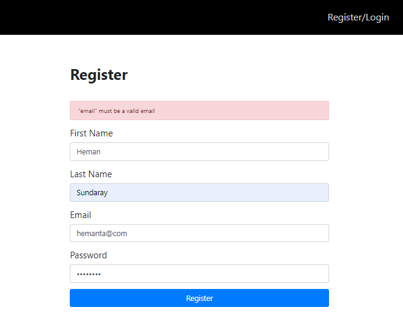

###### This blog post is part of a series. You must finish [part-1](https://hemanta.io/implement-jwt-based-user-authentication-in-a-mern-stack-app-part-1/), [part-2](https://hemanta.io/implement-jwt-based-user-authentication-in-a-mern-stack-app-part-2/), [part-3](https://hemanta.io/implement-jwt-based-user-authentication-in-a-mern-stack-app-part-3/), [part-4](https://hemanta.io/implement-jwt-based-user-authentication-in-a-mern-stack-app-part-4/), [part-5](https://hemanta.io/implement-jwt-based-user-authentication-in-a-mern-stack-app-part-5/), [part-6](https://hemanta.io/implement-jwt-based-user-authentication-in-a-mern-stack-app-part-6/), [part-7](https://hemanta.io/implement-jwt-based-user-authentication-in-a-mern-stack-app-part-7/), [part-8](https://hemanta.io/implement-jwt-based-user-authentication-in-a-mern-stack-app-part-8/), [part-9](https://hemanta.io/implement-jwt-based-user-authentication-in-a-mern-stack-app-part-9/), [part-10](https://hemanta.io/implement-jwt-based-user-authentication-in-a-mern-stack-app-part-10/) & [part-11](https://hemanta.io/implement-jwt-based-user-authentication-in-a-mern-stack-app-part-11/) before continuing here.

### Displaying login error messages

If you try to log in using the wrong email address or password or both, you would see an error message as shown below.

### Displaying registration error messages

If you try to register for the **second time** using the same email address that you used to register the first time, you will receive an error message as shown below.

In addition to client-side validation, we are also doing server-side validation. In order to make sure that server-side validation is working as expected, we will temporarily comment out the highlighted code line as shown below in the ~~RegisterForm.js~~ file.

This means that we will not get any validation error messages even if we try to register using an invalid email address. However, we are checking for the validity of the email address server-side in the ~~validate.js~~ file. So, if I register using an invalid email address (hemanta@com for example) ~~registrationValidation(req.body)~~ will produce an error and the error message should be displayed on top of the form.

If you check the ~~userRoutes.js~~ file, you will see a highlighted line of code as shown below.

You will understand the above line of code when you console log the ~~error~~ object as shown below. The error message is available as the value of the ~~message~~ key. And the object the ~~message~~ key is part of is the first element of the ~~details~~ key, which is an array.

Go to [part-13](https://hemanta.io/implement-jwt-based-user-authentication-in-a-mern-stack-app-part-13/)
