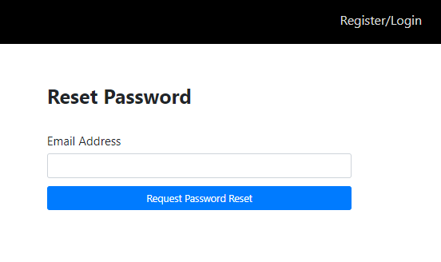
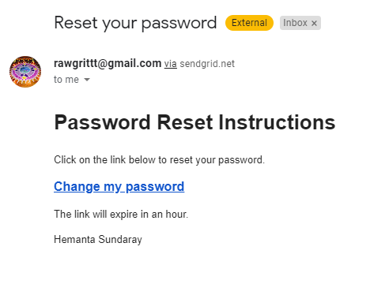
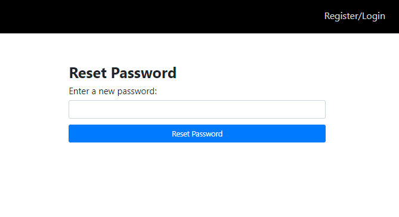

```toc

```

###### This blog post is part of a series. You must finish [part-1](https://hemanta.io/implement-jwt-based-user-authentication-in-a-mern-stack-app-part-1/), [part-2](https://hemanta.io/implement-jwt-based-user-authentication-in-a-mern-stack-app-part-2/), [part-3](https://hemanta.io/implement-jwt-based-user-authentication-in-a-mern-stack-app-part-3/), [part-4](https://hemanta.io/implement-jwt-based-user-authentication-in-a-mern-stack-app-part-4/), [part-5](https://hemanta.io/implement-jwt-based-user-authentication-in-a-mern-stack-app-part-5/), [part-6](https://hemanta.io/implement-jwt-based-user-authentication-in-a-mern-stack-app-part-6/), [part-7](https://hemanta.io/implement-jwt-based-user-authentication-in-a-mern-stack-app-part-7/), [part-8](https://hemanta.io/implement-jwt-based-user-authentication-in-a-mern-stack-app-part-8/), [part-9](https://hemanta.io/implement-jwt-based-user-authentication-in-a-mern-stack-app-part-9/), [part-10](https://hemanta.io/implement-jwt-based-user-authentication-in-a-mern-stack-app-part-10/), [part-11](https://hemanta.io/implement-jwt-based-user-authentication-in-a-mern-stack-app-part-11/) & [part-12](https://hemanta.io/implement-jwt-based-user-authentication-in-a-mern-stack-app-part-12/) before continuing here.

When a user clicks on the link ~~I forgot my password~~ at the bottom of the login form, we direct the user to the ~~/account/password/forgot~~ route, where we show a form where the user will enter the email address for which he/she wants to recover the password.

We will create this form the same way we created the registration and the login form - using Formik & Yup.

### Create a password reset form

Inside the ~~components~~ folder, create a file named ~~PasswordResetFormEmail.js~~.

```jsx:title=client/src/components/PasswordResetFormEmail.js {numberLines}
import React from "react";
import { useFormik } from "formik";
import * as Yup from "yup";

const PasswordResetFormEmail = () => {

  const formik = useFormik({
    initialValues: {
      email: "",
    },
    validationSchema: Yup.object({
      email: Yup.string()
        .email("Invalid email address")
        .required("Please enter your email address"),
    }),
    onSubmit: (values) => {
      console.log(values));
    },
  });

  return (
    <div className="passwordResetEmail-form-container">
      <div className="col-10 col-sm-8 col-md-5 mx-auto">
        <h1 className="font-weight-bold">Reset Password</h1>
      </div>
      <form onSubmit={formik.handleSubmit}>
        <div className="form-group col-10 col-sm-8 col-md-5 mx-auto mt-5">
          <label htmlFor="email">Email Address</label>
          <input
            className="form-control form-control-lg"
            id="email"
            name="email"
            type="email"
            {...formik.getFieldProps("email")}
          />
          {formik.touched.email && formik.errors.email ? (
            <small className="form-text text-danger">
              {formik.errors.email}
            </small>
          ) : null}
        </div>

        <div className="col-10 col-sm-8 col-md-5 mx-auto">
          <button type="submit" className="btn btn-lg btn-primary btn-block">
            Request Password Reset
          </button>
        </div>
      </form>
    </div>
  );
};

export default PasswordResetFormEmail;
```

We will render the form at the ~~/account/password/forgot~~ route.

```jsx:title=client/src/App.js {numberLines, 7-7, 14-17}
import React from "react"
import Header from "./components/Header"
import { Route, Switch } from "react-router-dom"
import LoginForm from "./components/LoginForm"
import RegisterForm from "./components/RegisterForm"
import Welcome from "./components/Welcome"
import PasswordResetFormEmail from "./components/PasswordResetFormEmail"

const App = () => {
  return (
    <>
      <Header />
      <Switch>
        <Route
          path="/account/password/forgot"
          component={PasswordResetFormEmail}
        />
        <Route path="/register" component={RegisterForm} />
        <Route path="/login" component={LoginForm} />
        <Route path="/welcome" component={Welcome} />
      </Switch>
    </>
  )
}

export default App
```

Now, when we click on the ~~I forgot my password~~ link, we should see a form as shown below.



After the user fills in his/her email address and clicks on the ~~Request Password Reset~~ button, we make a ~~POST~~ request to the ~~/account/password/forgot~~ route. Let’s configure this route.

Inside the ~~routes~~ folder, create a file named ~~passwordResetRoutes.js~~.

```js:title=server/routes/passwordResetRoutes.js {numberLines}
const express = require("express")
const dotenv = require("dotenv")
const crypto = require("crypto")
const asyncHandler = require("express-async-handler")
const User = require("../models/userModel")
const sgMail = require("@sendgrid/mail")

dotenv.config()

sgMail.setApiKey(process.env.SENDGRID_API_KEY)

const router = express.Router()

router.post(
  "/password/forgot",
  asyncHandler(async (req, res, next) => {
    const user = await User.findOne({ email: req.body.email })

    if (user) {
      user.passwordResetToken = crypto.randomBytes(20).toString("hex")
      user.passwordResetExpires = Date.now() + 3600000
      await user.save()

      res.json({
        message:
          "I just sent a message to the email you provided with a link to reset your password. Please check your inbox and follow the instructions in the email.",
      })

      const passwordResetUrl = `http://${req.headers.host}/password/reset/${user.passwordResetToken}`
      const msg = {
        to: user.email,
        from: "rawgrittt@gmail.com",
        subject: "Reset your password",
        html: `<h1>Password Reset Instructions</h1>
        <p>Click on the link below to reset your password for your account.</p>
        <a style="font-weight:bold; font-size: 1rem" href=${passwordResetUrl}>Change my password</a>
        <p>The link will expire in an hour.</p>
        <p>Hemanta Sundaray</p>`,
      }

      ;(async () => {
        try {
          await sgMail.send(msg)
        } catch (error) {
          console.error(error)
          if (error.response) {
            console.error(error.response.body)
          }
        }
      })()
    } else {
      const err = new Error("No account with that email exists")
      err.status = 404
      next(err)
    }
  })
)

module.exports = router
```

Let’s try to understand what we are trying to do inside the route handler function.

First, we check whether we have a user with the given email address. If yes, we then add two additional fields -~~passwordResetToken~~ & ~~passwordResetExpires~~ - to the user document.

We have created the ~~passwordResetToken~~ using Node’s ~~crypto~~ module. The ~~crypto.randomBytes()~~ method generates cryptographically strong pseudo-random data for a given number of bytes. We then transform the random data to a string value using the ~~toString()~~ method.

We have configured the ~~passwordResetExpires~~ field in such a way that the link expires 1 hour after the user receives the password reset link.

Line 29: ~~passwordResetUrl~~ is the URL we direct the user to once he/she clicks on the ~~Change my password~~ link.

Line 32: This is the email address (registered with SendGrid) users will receive password reset links from.

You can of course change the subject line and the html body of the email as per your requirement.

Then we send the message using ~~sgMail.send()~~ method.

> **Note:** We will use a third party service called SendGrid that will allow us to send emails without us having to maintain email servers. We will use SendGrid’s WebAPI to send emails from our application. We need to install the ~~@sendgrid/mail~~ package.

We need to add two fields - ~~passwordResetToken~~ & ~~passwordResetExpires~~ - in the ~~User~~ model.

```js:title=server/models/userModel.js {numberLines, 22-27}
const mongoose = require("mongoose");
const bcrypt = require("bcryptjs");

const userSchema = new mongoose.Schema({
  firstName: {
    type: String,
    required: true,
  },
  lastName: {
    type: String,
    required: true,
  },
  email: {
    type: String,
    unique: true,
    required: true,
  },
  password: {
    type: String,
    required: true,
  },
  passwordResetToken: {
    type: String,
  },
  passwordResetExpires: {
    type: Date,
  },
});

userSchema.methods.matchPassword = async function (incomingPassword) {
  return await bcrypt.compare(incomingPassword, this.password);
};

userSchema.pre("save", async function () {
  const salt = await bcrypt.genSalt(10);
  this.password = await bcrypt.hash(this.password, salt);
});

const User = mongoose.model("User", userSchema);

module.exports = User;
```

Then we require the ~~passwordResetRoutes.js~~ module in ~~index.js~~ and add the router in the middleware handling chain.

```js:title=server/index.js {numberLines, 5, 18}
const express = require("express")
const dotenv = require("dotenv")
const globalErrorHandler = require("./middleware/errorMiddleware")
const userRoutes = require("./routes/userRoutes")
const passwordResetRoutes = require("./routes/passwordResetRoutes")

const connectDB = require("./config/db")

dotenv.config()

connectDB()

const app = express()

app.use(express.json())

app.use("/api/users", userRoutes)
app.use("/account", passwordResetRoutes)

app.use(globalErrorHandler)

const PORT = process.env.PORT || 5000

app.listen(PORT, () => {
  console.log(`Server listening on port ${PORT}`)
})
```

We also need to install the ~~@sendgrid/mail~~ package and add the sendgrid API key in the ~~.env~~ file.

```sh
PS C:\Users\Delhivery\Desktop\mern-auth> npm i @sendgrid/mail
```

```sh:title=mern-auth/.env {numberLines, 4}
PORT=5000
MONGO_URI=mongodb+srv://sundaray:<password>@sandbox.y8blv.mongodb.net/myFirstDatabase?retryWrites=true&w=majority
JWT_SECRET=terces@1234
SENDGRID_API_KEY=<your-sendgrid-api-key>
```

> **Note:** You need to create an account on **www.sendgrid.com** and get the SendGrid API key. We need a SendGrid API key, so that SendGrid can recognize our application when we send a request to SendGrid’s API.

### Create a PasswordResetEmail state slice

Inside the ~~stateSlices~~ folder, create a file named ~~passwordResetEmailSlice.js~~.

```js:title=client/src/components/stateSlices/passwordResetEmailSlice.js {numberLines}
import { createSlice, createAsyncThunk } from "@reduxjs/toolkit"
import axios from "axios"

const initialState = {
  status: "idle",
  emailSentSuccess: null,
  error: null,
}

export const sendPasswordResetEmail = createAsyncThunk(
  "passwordReset/sendPasswordResetEmail",
  async (passwordResetEmail, { rejectWithValue }) => {
    try {
      const { data } = await axios.post(
        "/account/password/forgot",
        passwordResetEmail
      )
      return data
    } catch (err) {
      return rejectWithValue(err.response.data)
    }
  }
)

export const passwordResetSlice = createSlice({
  name: "passwordReset",
  initialState,
  reducers: {},
  extraReducers: {
    [sendPasswordResetEmail.pending]: (state, action) => {
      state.status = "loading"
    },
    [sendPasswordResetEmail.fulfilled]: (state, action) => {
      state.status = "succeeded"
      state.emailSentSuccess = action.payload
      state.error = null
    },
    [sendPasswordResetEmail.rejected]: (state, action) => {
      state.status = "failed"
      state.error = action.payload.message
      state.emailSentSuccess = null
    },
  },
})

export default passwordResetSlice.reducer
```

Add the reducer to the store.

```js:title=client/src/store.js {numberLines, 4, 20}
import { configureStore } from "@reduxjs/toolkit"
import registerReducer from "./components/stateSlices/registerSlice"
import loginReducer from "./components/stateSlices/loginSlice"
import passwordResetEmailReducer from "./components/stateSlices/passwordResetEmailSlice"

const loggedInUserFromStorage = localStorage.getItem("loggedInUser")
  ? JSON.parse(localStorage.getItem("loggedInUser"))
  : null

const preloadedState = {
  login: {
    loggedInUser: loggedInUserFromStorage,
  },
}

export default configureStore({
  reducer: {
    register: registerReducer,
    login: loginReducer,
    passwordResetEmail: passwordResetEmailReducer,
  },
  preloadedState,
})
```

We will update the ~~passwordResetFormEmail.js~~ file, so that we can dispatch actions and interact with the global Redux store.

```jsx:title=client/src/components/PasswordResetFormEmail.js {numberLines, 4-5, 8-10, 12-12, 24-24, 35-47, 66-70}
import React from "react"
import { useFormik } from "formik"
import * as Yup from "yup"
import { useSelector, useDispatch } from "react-redux"
import { sendPasswordResetEmail } from "./stateSlices/passwordResetEmailSlice"

const PasswordResetFormEmail = () => {
  const { status, emailSentSuccess, error } = useSelector(
    state => state.passwordResetEmail
  )

  const dispatch = useDispatch()

  const formik = useFormik({
    initialValues: {
      email: "",
    },
    validationSchema: Yup.object({
      email: Yup.string()
        .email("Invalid email address")
        .required("Please enter your email address"),
    }),
    onSubmit: values => {
      dispatch(sendPasswordResetEmail(values))
    },
  })

  return (
    <div className="passwordResetEmail-form-container">
      <div className="col-10 col-sm-8 col-md-5 mx-auto">
        <h1 className="font-weight-bold">Reset Password</h1>
      </div>
      <form onSubmit={formik.handleSubmit}>
        <div className="form-group col-10 col-sm-8 col-md-5 mx-auto mt-5">
          {emailSentSuccess && (
            <div
              className="alert alert-success password-reset-email"
              role="alert"
            >
              {emailSentSuccess.message}
            </div>
          )}
          {error && (
            <div className="alert alert-danger" role="alert">
              {error}
            </div>
          )}

          <label htmlFor="email">Email Address</label>
          <input
            className="form-control form-control-lg"
            id="email"
            name="email"
            type="email"
            {...formik.getFieldProps("email")}
          />
          {formik.touched.email && formik.errors.email ? (
            <small className="form-text text-danger">
              {formik.errors.email}
            </small>
          ) : null}
        </div>

        <div className="col-10 col-sm-8 col-md-5 mx-auto">
          <button type="submit" className="btn btn-lg btn-primary btn-block">
            {status === "loading" ? (
              <div className="spinner-border text-light" role="status">
                <span className="sr-only">Loading...</span>
              </div>
            ) : null}{" "}
            Request Password Reset
          </button>
        </div>
      </form>
    </div>
  )
}

export default PasswordResetFormEmail
```

When the user enters the email address for which he/she wants to reset the password and clicks on the ~~Request Password Reset~~ button, The user receives a message in his/her email address with a link to reset the password.



When the user clicks on the ~~Change my password~~ link, we show a form where the user enters his/her new password as shown below.



Let’s create this form.

Inside the ~~components~~ folder, create a file named ~~PasswordResetFormPassword.js~~.

```jsx:title=client/src/components/PasswordResetFormPassword.js {numberLines}
import React from "react"
import { useFormik } from "formik"
import * as Yup from "yup"

const PasswordResetFormPassword = ({ history, match }) => {
  const formik = useFormik({
    initialValues: {
      password: "",
    },
    validationSchema: Yup.object({
      password: Yup.string().required("Please enter your password"),
    }),
    onSubmit: values => {
      console.log(values)
    },
  })

  return (
    <div className="passwordResetPassword-form-container">
      <div className="col-10 col-sm-8 col-md-5 mx-auto">
        <h1 className="font-weight-bold">Reset Password</h1>
      </div>
      <form onSubmit={formik.handleSubmit}>
        <div className="form-group col-10 col-sm-8 col-md-5 mx-auto mt-5"></div>
        <div className="form-group col-10 col-sm-8 col-md-5 mx-auto">
          <label htmlFor="password">Enter a new password:</label>
          <input
            className="form-control form-control-lg"
            id="password"
            name="password"
            type="password"
            {...formik.getFieldProps("email")}
          />
          {formik.touched.password && formik.errors.password ? (
            <small className="form-text text-danger">
              {formik.errors.password}
            </small>
          ) : null}
        </div>

        <div className="col-10 col-sm-8 col-md-5 mx-auto">
          <button
            type="submit"
            className="btn btn-lg btn-primary btn-block login-button"
          >
            Reset Password
          </button>
        </div>
      </form>
    </div>
  )
}

export default PasswordResetFormPassword
```

We will show the form at the ~~/password/reset/:token~~ route.

```jsx:title=client/src/App.js {numberLines, 8-8, 15-19}
import React from "react"
import Header from "./components/Header"
import { Route, Switch } from "react-router-dom"
import LoginForm from "./components/LoginForm"
import RegisterForm from "./components/RegisterForm"
import Welcome from "./components/Welcome"
import PasswordResetFormEmail from "./components/PasswordResetFormEmail"
import PasswordResetFormPassword from "./components/PasswordResetFormPassword"

const App = () => {
  return (
    <>
      <Header />
      <Switch>
        <Route
          path="password/reset/:token"
          component={PasswordResetFormPassword}
        />
        <Route
          path="/account/password/forgot"
          component={PasswordResetFormEmail}
        />
        <Route path="/register" component={RegisterForm} />
        <Route path="/login" component={LoginForm} />
        <Route path="/welcome" component={Welcome} />
      </Switch>
    </>
  )
}

export default App
```

After the user enters a new password and clicks on the ~~Reset Password~~ button, we send a ~~POST~~ request to the ~~/account/password/reset/:token~~ endpoint.

We will configure this endpoint in the ~~passwordResetRoutes.js~~ file.

```js:title=server/routes/passwordResetRoutes.js {numberLines, 59-79}
const express = require("express")
const crypto = require("crypto")
const dotenv = require("dotenv")
const asyncHandler = require("express-async-handler")
const User = require("../models/userModel")
const sgMail = require("@sendgrid/mail")

dotenv.config()

sgMail.setApiKey(process.env.SENDGRID_API_KEY)

const router = express.Router()

router.post(
  "/password/forgot",
  asyncHandler(async (req, res, next) => {
    const user = await User.findOne({ email: req.body.email })

    if (user) {
      user.passwordResetToken = crypto.randomBytes(20).toString("hex")
      user.passwordResetExpires = Date.now() + 3600000
      await user.save()

      res.json({
        message:
          "I just sent a message to the email you provided with a link to reset your password. Please check your inbox and follow the instructions in the email.",
      })

      const passwordResetUrl = `http://${req.headers.host}/password/reset/${user.passwordResetToken}`
      const msg = {
        to: user.email,
        from: "rawgrittt@gmail.com",
        subject: "Reset your password",
        html: `<h1>Password Reset Instructions</h1>
        <p>Click on the link below to reset your password for your account.</p>
        <a style="font-weight:bold; font-size: 1rem" href=${passwordResetUrl}>Change my password</a>
        <p>The link will expire in an hour.</p>
        <p>Hemanta Sundaray</p>`,
      }

      ;(async () => {
        try {
          await sgMail.send(msg)
        } catch (error) {
          console.error(error)
          if (error.response) {
            console.error(error.response.body)
          }
        }
      })()
    } else {
      const err = new Error("No account with that email exists")
      err.status = 404
      next(err)
    }
  })
)

router.post(
  "/password/reset/:token",
  asyncHandler(async (req, res, next) => {
    const user = await User.findOne({
      passwordResetToken: req.params.token,
      passwordResetExpires: { $gt: Date.now() },
    })

    if (user) {
      user.password = req.body.password
      user.passwordResetToken = undefined
      user.passwordResetExpires = undefined
      const updatedUser = await user.save()
      res.json(updatedUser)
    } else {
      const err = new Error("Password reset token is invalid or has expired")
      err.status = 404
      next(err)
    }
  })
)

module.exports = router
```

In the route handler function, we check whether we have a user wherein the value of the ~~passwordResetToken~~ field matches the token in the ~~passwordResetUrl~~ and the value of the ~~passwordResetExpires~~ field is within 1 hour of the user receiving the password reset link.

Once we complete the check for token validity and token expiry, we update the user’s password with the new password and remove the two fields - ~~passwordResetToken~~(line 69) and ~~passwordResetExpires~~(line 70) - from the user document. Otherwise, we send an error message to the client.

### Create a PasswordResetPassword state slice

Inside the ~~stateSlices~~ folder, create a file named ~~passwordResetPasswordSlice.js~~.

```jsx:title=client/components/stateSlices/passwordResetPasswordSlice.js {numberLines}
import { createSlice, createAsyncThunk } from "@reduxjs/toolkit"
import axios from "axios"

const initialState = {
  status: "idle",
  passwordReset: null,
  error: null,
}

export const sendNewPassword = createAsyncThunk(
  "passwordReset/sendNewPassword",
  async ({ password, token }, { rejectWithValue }) => {
    try {
      const { data } = await axios.post(`/account/password/reset/${token}`, {
        password,
      })
      return data
    } catch (err) {
      return rejectWithValue(err.response.data)
    }
  }
)

export const passwordResetSlice = createSlice({
  name: "passwordReset",
  initialState,
  reducers: {},
  extraReducers: {
    [sendNewPassword.pending]: (state, action) => {
      state.status = "loading"
    },
    [sendNewPassword.fulfilled]: (state, action) => {
      state.status = "succeeded"
      state.passwordReset = true
    },
    [sendNewPassword.rejected]: (state, action) => {
      state.status = "failed"
      state.error = action.payload.message
    },
  },
})

export default passwordResetSlice.reducer
```

We then add the reducer to the store.

```jsx:title=client/src/store.js {numberLines, 5, 22}
import { configureStore } from "@reduxjs/toolkit"
import registerReducer from "./components/stateSlices/registerSlice"
import loginReducer from "./components/stateSlices/loginSlice"
import passwordResetEmailReducer from "./components/stateSlices/passwordResetEmailSlice"
import passwordResetPasswordReducer from "./components/stateSlices/passwordResetPasswordSlice"

const loggedInUserFromStorage = localStorage.getItem("loggedInUser")
  ? JSON.parse(localStorage.getItem("loggedInUser"))
  : null

const preloadedState = {
  login: {
    loggedInUser: loggedInUserFromStorage,
  },
}

export default configureStore({
  reducer: {
    register: registerReducer,
    login: loginReducer,
    passwordResetEmail: passwordResetEmailReducer,
    passwordResetPassword: passwordResetPasswordReducer,
  },
  preloadedState,
})
```

We will update the ~~passwordResetFormPassword.js~~ file, so that we can dispatch actions and interact with the global Redux store.

```jsx:title=client/src/components/PasswordResetFormPassword.js {numberLines, 4-5, 8-10, 12-12, 22-28, 42-46, 70-74}
import React from "react"
import { useFormik } from "formik"
import * as Yup from "yup"
import { useSelector, useDispatch } from "react-redux"
import { sendNewPassword } from "./stateSlices/passwordResetPasswordSlice"

const PasswordResetFormPassword = ({ history, match }) => {
  const { status, passwordReset, error } = useSelector(
    state => state.passwordResetPassword
  )

  const dispatch = useDispatch()

  const formik = useFormik({
    initialValues: {
      password: "",
    },
    validationSchema: Yup.object({
      password: Yup.string().required("Please enter your password"),
    }),
    onSubmit: values => {
      const { password } = values
      dispatch(
        sendNewPassword({
          password,
          token: match.params.token,
        })
      )
    },
  })

  if (passwordReset) {
    history.push("/login")
  }

  return (
    <div className="passwordResetPassword-form-container">
      <div className="col-10 col-sm-8 col-md-5 mx-auto">
        <h1 className="font-weight-bold">Reset Password</h1>
      </div>
      <form onSubmit={formik.handleSubmit}>
        {error && (
          <div className="alert alert-danger" role="alert">
            {error}
          </div>
        )}

        <div className="form-group col-10 col-sm-8 col-md-5 mx-auto mt-5"></div>
        <div className="form-group col-10 col-sm-8 col-md-5 mx-auto">
          <label htmlFor="password">Enter a new password:</label>
          <input
            className="form-control form-control-lg"
            id="password"
            name="password"
            type="password"
            {...formik.getFieldProps("email")}
          />
          {formik.touched.password && formik.errors.password ? (
            <small className="form-text text-danger">
              {formik.errors.password}
            </small>
          ) : null}
        </div>

        <div className="col-10 col-sm-8 col-md-5 mx-auto">
          <button
            type="submit"
            className="btn btn-lg btn-primary btn-block login-button"
          >
            {status === "loading" ? (
              <div className="spinner-border text-light" role="status">
                <span className="sr-only">Loading...</span>
              </div>
            ) : null}{" "}
            Reset Password
          </button>
        </div>
      </form>
    </div>
  )
}

export default PasswordResetFormPassword
```

Now, when the user enters a new password and clicks on the ~~Reset Password~~ button, the user is taken to the login page, where he/she can enter his/her email address and the new password to log in to the application.

This completes the password reset feature of our application and marks the end of the series.

### Conclusion

The user authentication that we implemented in this blog series is the exact implementation that I have on my site [www.sundaray.io](https://sundaray.io).
