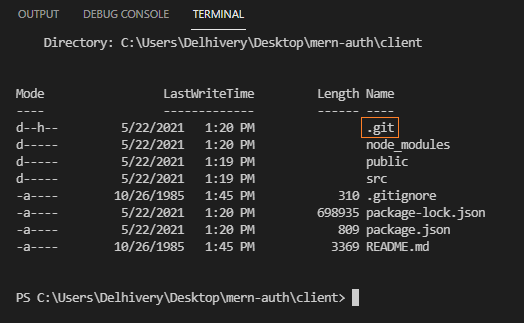
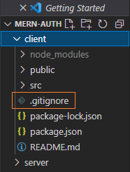
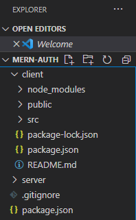

###### This blog post is part of a series. You must finish [part-1](https://hemanta.io/implement-jwt-based-user-authentication-in-a-mern-stack-app-part-1/) before continuing here.

### Full-stack application structure

There are many ways you can structure a full-stack application. The structure that we are going to create below is the one that I use in all my projects.

> I created this application on windows. However, you should have no problem following the instructions on macOS.

Create a folder named ~~mern-auth~~ and open it in Visual Studio Code or any other code editor of your choice. By the way, if you have not tried VS code yet, I highly encourage you to give it a try.

You can open an integrated terminal inside VS code using the keyboard shortcut ~~Ctrl+`~~ (_with the backtick character_). This is convenient as you don’t have to switch between windows.

Inside ~~mern-auth~~, create a React project called ~~client~~.

```sh
PS C:\Users\Delhivery\Desktop\mern-auth> npx create-react-app client
```

> If you have previously installed ~~create-react-app~~ globally via ~~npm install -g create-react-app~~, it is recommended that you uninstall the package using ~~npm uninstall -g create-react-app~~ to ensure that npx always uses the latest version. npx comes with npm 5.2+ and higher.

Next, inside ~~mern-auth~~, create a folder named ~~server~~.

```sh
PS C:\Users\Delhivery\Desktop\mern-auth> mkdir server
```

At this stage, inside ~~mern-auth~~, we have two folders - ~~client~~ & ~~server~~. What’s more, ~~create-react-app~~ has already initialized the ~~client~~ folder as a Git repository by default. If you ~~cd~~ into the ~~client~~ folder, you can see the ~~.git~~ sub-folder (_hidden_) using the following command:

```sh
PS C:\Users\Delhivery\Desktop\mern-auth\client> ls -Fo
```



We will also see a ~~.gitignore~~ file inside the ~~client~~ folder.



Because we are building a full-stack application, we want to initialize the root folder (~~mern-auth~~) as a Git repository, not the ~~client~~ folder.

Therefore, we have to uninitialize the ~~client~~ folder as a Git repository by removing the ~~.git~~ sub-folder inside it. We can to do so using the following command:

```sh
PS C:\Users\Delhivery\Desktop\mern-auth\client> rm ./.git -Force
```

After executing the command, you will receive the following prompt.

```sh
Confirm
The item at C:\Users\Delhivery\Desktop\mern-auth\client\.git has children and the Recurse parameter was not specified. If you continue, all children will
be removed with the item. Are you sure you want to continue?
[Y] Yes  [A] Yes to All  [N] No  [L] No to All  [S] Suspend  [?] Help (default is "Y"):
```

Type ~~Y~~ and hit enter. The ~~.git~~ subdirectory will be deleted.

Next, move the ~~.gitignore~~ file from the ~~client~~ folder to the ~~mern-auth~~ folder.

Inside the ~~.gitignore~~ file, change ~~/node_modules~~ to ~~\*\*/node_modules~~. This will ensure that the ~~node_modules~~ folder in the current folder and all the sub-folders will be ignored.

Now, generate a ~~package.json~~ file inside the ~~mern-auth~~ folder using the following command:

```sh
PS C:\Users\Delhivery\Desktop\mern-auth> npm init -y
```

The ~~package.json~~ file is the manifest for our project and will include all the packages that our application depends on. You can generate a ~~package.json~~ file without having it ask you any questions with a ~~-y~~ flag.

Now, your folder structure should look like the following:



Let’s also initialize the ~~mern-auth~~ folder as a Git repository.

```sh
PS C:\Users\Delhivery\Desktop\mern-auth> git init
```

I highly recommend that you push the local repository to a remote repository such as GitHub and do commits at regular intervals.

Our application structure is now ready.

Go to [part-3](https://hemanta.io/implement-jwt-based-user-authentication-in-a-mern-stack-app-part-3/)
