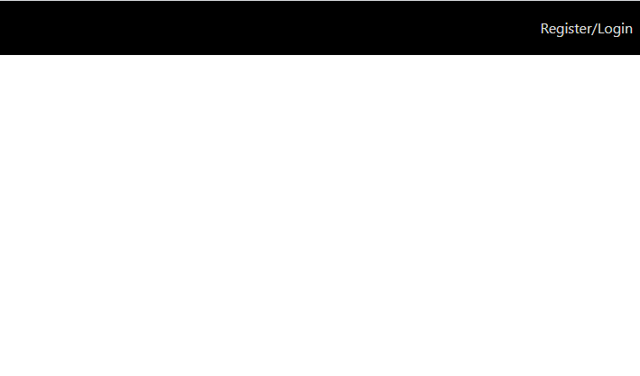
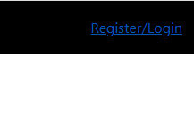

```toc

```

###### This blog post is part of a series. You must finish [part-1](https://hemanta.io/implement-jwt-based-user-authentication-in-a-mern-stack-app-part-1/) & [part-2](https://hemanta.io/implement-jwt-based-user-authentication-in-a-mern-stack-app-part-2/) before continuing here.

## Install Bootstrap

We will start working at the frontend. We will use Bootstrap for styling. So, let’s install it.

```sh
PS C:\Users\Delhivery\Desktop\mern-auth\client> npm i bootstrap
```

Import Bootstrap CSS above ~~index.css~~ import in the ~~src/index.js~~ file.

```jsx:title=client/src/index.js {numberLines, 3}
import React from "react";
import ReactDOM from "react-dom";
import "bootstrap/dist/css/bootstrap.min.css";
import "./index.css";
import App from "./App";
import reportWebVitals from "./reportWebVitals";

ReactDOM.render(
  <React.StrictMode>
    <App />
  </React.StrictMode>,
  document.getElementById("root")
);
```

Next, go to the ~~index.css~~ file, delete all the css rulesets and paste the following rules.

```css:title=client/src/index.css {numberLines}
* {
  margin: 0;
  padding: 0;
  box-sizing: border-box;
}

html {
  font-size: 62.5%;
}
```

We will add all the CSS rules in ~~index.css~~.

## Create the header

Inside the ~~src~~ folder, create a folder named ~~components~~ and inside the ~~components~~ folder create a file named ~~Header.js~~.

Paste the following code snippet inside ~~Header.js~~.

```jsx:title=client/src/components/Header.js {numberLines}
import React from "react"

const Header = () => {
  return (
    <header>
      <nav>
        <ul className="navbar-list">
          <li className="navbar-list-item">Register/Login</li>
        </ul>
      </nav>
    </header>
  )
}

export default Header
```

Add the following css rules inside ~~index.css~~.

```css:title=client/src/index.css {numberLines, 11-36}
* {
  margin: 0;
  padding: 0;
  box-sizing: border-box;
}

html {
  font-size: 62.5%;
}

header {
  width: 100%;
  height: 6rem;
  background-color: black;
  display: flex;
  align-items: center;
  justify-content: flex-end;
}

nav {
  height: 100%;
  margin-right: 3rem;
}

.navbar-list {
  list-style: none;
  position: relative;
  top: 50%;
  transform: translate(0, -50%);
}

.navbar-list-item {
  color: gainsboro;
  font-size: 1.6rem;
  cursor: pointer;
}
```

Now, we will import the ~~Header~~ component inside the ~~App~~ component.

```jsx:title=client/src/App.js {numberLines}
import React from "react"
import Header from "./components/Header"

const App = () => {
  return (
    <>
      <Header />
    </>
  )
}

export default App
```

~~cd~~ into the ~~client~~ folder and start the development server using ~~npm start~~.

```sh
PS C:\Users\Delhivery\Desktop\mern-auth\client> npm start
```

Visit ~~http://localhost:3000/~~ and you should see the application.



## Client-side routing

Ours is a single-page application. We will implement client-side routing using ~~React Router~~ which will render a certain component based on the route in the URL.

Since we are developing a web application, we will install ~~react-router-dom~~.

```sh
PS C:\Users\Delhivery\Desktop\mern-auth\client> npm i react-router-dom
```

### Router

The first Router component we are going to work with from ~~react-router-dom~~ is called ~~BrowserRouter~~. Its job is to keep the UI in sync with the URL.

In order to use ~~BrowserRouter~~, we have to render it at the root of the element hierarchy. We can do so by wrapping the top level ~~App~~ component with the ~~Router~~ component as shown below:

```jsx:title=client/src/index.js {numberLines, 7-7, 10-10, 12-12}
import React from "react"
import ReactDOM from "react-dom"
import "bootstrap/dist/css/bootstrap.min.css"
import "./index.css"
import App from "./App"
import reportWebVitals from "./reportWebVitals"
import { BrowserRouter as Router } from "react-router-dom"

ReactDOM.render(
  <Router>
    <App />
  </Router>,
  document.getElementById("root")
)
```

> **Note:** ~~BrowesrRouter~~ uses the HTML5 history API (~~pushState~~, ~~replaceState~~ & the ~~popState~~ event) to keep the UI in sync with the URL.

### Navigation

Currently in ~~Header.js~~, the text ~~Register/Login~~ is wrapped by ~~li~~ tags. We don’t want that. We want to create a link, so that when the user clicks on it, we will render a component that shows a login form. In order to do that, we will use the ~~Link~~ component from ~~react-router-dom~~.

```jsx:title=client/src/components/Header.js {numberLines, 2-2, 9-9}
import React from "react"
import { Link } from "react-router-dom"

const Header = () => {
  return (
    <header>
      <nav>
        <ul className="navbar-list">
          <Link to="/login" className="navbar-list-item">
            Register/Login
          </Link>
        </ul>
      </nav>
    </header>
  )
}

export default Header
```

The ~~to~~ attribute in the ~~Link~~ component represents the route part of the URL.

We will notice that when we hover over ~~Register/Login~~, the link is turned blue and is underlined with blue color as well.



We will change the color to gray and remove the underline by adding the following CSS in ~~index.css~~.

```css:title=client/src/index.css {numberLines, 38-41}
* {
  margin: 0;
  padding: 0;
  box-sizing: border-box;
}

html {
  font-size: 62.5%;
}

header {
  width: 100%;
  height: 6rem;
  background-color: black;
  display: flex;
  align-items: center;
  justify-content: flex-end;
}

nav {
  height: 100%;
  margin-right: 3rem;
}

.navbar-list {
  list-style: none;
  position: relative;
  top: 50%;
  transform: translate(0, -50%);
}

.navbar-list-item {
  color: gainsboro;
  font-size: 1.6rem;
  cursor: pointer;
}

.navbar-list-item:hover {
  text-decoration: none;
  color: gray;
}
```

Now, when we click on ~~Register/Login~~ our URL will change from ~~localhost:3000~~ to ~~localhost:3000/login~~. Next, we will render a login form in the path ~~/login~~.

Go to [part-4](https://hemanta.io/implement-jwt-based-user-authentication-in-a-mern-stack-app-part-4/)
