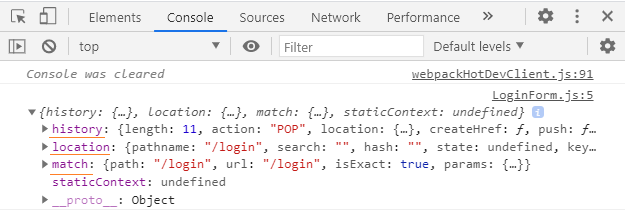
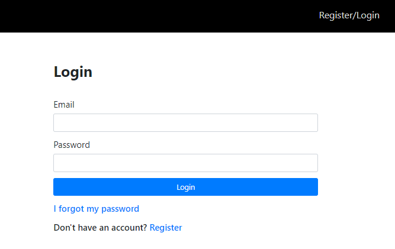
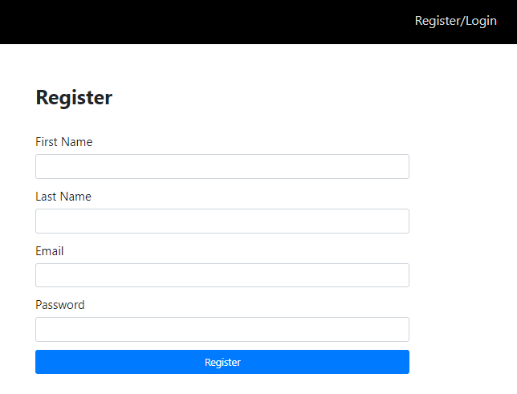

```toc

```

###### This blog post is part of a series. You must finish [part-1](https://hemanta.io/implement-jwt-based-user-authentication-in-a-mern-stack-app-part-1/), [part-2](https://hemanta.io/implement-jwt-based-user-authentication-in-a-mern-stack-app-part-2/) & [part-3](https://hemanta.io/implement-jwt-based-user-authentication-in-a-mern-stack-app-part-3/) before continuing here.

### The login form

In the ~~components~~ folder, create a file named ~~LoginForm.js~~.

We will create a simple React form and style it using Bootstrap classes.

```jsx:title=client/src/components/LoginForm.js {numberLines}
import React from "react"
import { Link } from "react-router-dom"

const LoginForm = () => {
  return (
    <div className="login-form-container">
      <div className="col-10 col-sm-8 col-md-5 mx-auto">
        <h1 className="font-weight-bold">Login</h1>
      </div>
      <form>
        <div className="form-group col-10 col-sm-8 col-md-5 mx-auto mt-5">
          <label htmlFor="email">Email Address</label>
          <input
            className="form-control form-control-lg"
            id="email"
            name="email"
            type="email"
          />
        </div>
        <div className="form-group col-10 col-sm-8 col-md-5 mx-auto">
          <label htmlFor="password">Password</label>
          <input
            className="form-control form-control-lg"
            id="password"
            name="password"
            type="password"
          />
        </div>

        <div className="col-10 col-sm-8 col-md-5 mx-auto">
          <button type="submit" className="btn btn-lg btn-primary btn-block">
            Login
          </button>
        </div>
        <div className="col-10 col-sm-8 col-md-5 mx-auto mt-3">
          <p>
            <Link to="/account/forgot" className="password-forgot">
              I forgot my password
            </Link>
          </p>
          <p className="register-cta">
            Don't have an account?{" "}
            <Link className="register" to="/register">
              Register
            </Link>
          </p>
        </div>
      </form>
    </div>
  )
}

export default LoginForm
```

Add the following css rulesets in ~~index.css~~.

```css:title=client/src/index.css {numberLines: 43}
/*****************************/
/******* REGISTER & LOGIN*****/
/*****************************/

.login-form-container {
  margin-top: 5rem;
}

label {
  font-size: 1.5rem;
}

.register-cta {
  text-decoration: none;
  font-size: 1.5rem;
  font-weight: 600;
}

.register:hover {
  text-decoration: none;
}

/***********************************/
/*******END OF REGISTER & LOGIN*****/
/***********************************/

/**********************************/
/******* I FORGOT MY PASSWORD *****/
/**********************************/
.password-forgot {
  text-decoration: none;
  font-size: 1.5rem;
  font-weight: 600;
}

.password-forgot:hover {
  text-decoration: none;
}
/****************************************/
/******* END OF I FORGOT MY PASSWORD*****/
/****************************************/
```

Now that we have the ~~LoginForm~~ component, we need to render it when the route in the URL matches ~~/login~~. We can do so by wrapping the ~~LoginForm~~ component with ~~Route~~, which is a route matching component from ~~react-router-dom~~.

```jsx:title=client/src/App.js {numberLines, 3-4, 10-12}
import React from "react";
import Header from "./components/Header";
import { Route, Switch } from "react-router-dom";
import LoginForm from "./components/LoginForm";

const App = () => {
  return (
    <>
      <Header />
      <Switch>
        <Route path="/login" component={LoginForm} />
      </Switch>
    </>
  );
};

export default App;
```

> **Note**: The ~~Route~~ component automatically injects ~~history~~, ~~location~~ and ~~match~~ props to the rendered component.

If you console.log the ~~props~~ object inside the ~~LoginForm~~ component, you will see an object like the following:



In the ~~LoginForm~~ component, you will notice that I have wrapped the ~~Route~~ component with the ~~Switch~~ component.

Why do we need a ~~Switch~~ component?

The ~~Switch~~ component is also a route matching component. It looks through all its children Route elements and renders the first one whose path matches the path in the URL.

Use a Switch anytime you have multiple routes but you want only one of them to render at a time. Right now, we have only one route - ~~/login~~. However, we will add more routes as we progress further.

Now, when you click on the ~~Register/Login~~ link, the ~~LoginForm~~ component gets rendered on the screen and you should see a form like below:



The login form does not do anything yet. Before we work on the functionalities, let's finish the registartion form.

### The registration form

When we click on the ~~Register~~ link (_at the bottom of the login form_), we are taken to the URL ~~localhost:3000/register~~. When the path matches ~~/register~~, we want to show a registration form. We have not created a registration form yet. Let’s do that now.

Inside the ~~components~~ folder, create a file named ~~RegisterForm.js~~.

Similar to how we created the login form, we will create a simple registration form first before adding the functionalities.

Place the following code inside ~~RegisterForm.js~~,

```jsx:title=client/src/components/RegisterForm.js {numberLines}
import React from "react";

const RegisterForm = () => {
  return (
    <div className="register-form-container">
      <div className="col-10 col-sm-8 col-md-5 mx-auto">
        <h1 className="font-weight-bold">Register</h1>
      </div>

      <form>
        <div className="form-group col-10 col-sm-8 col-md-5 mx-auto mt-5">
          <label htmlFor="firstName">First Name</label>
          <input
            className="form-control form-control-lg"
            id="firstName"
            name="firstName"
            type="text"
          />
        </div>
        <div className="form-group col-10 col-sm-8 col-md-5 mx-auto">
          <label htmlFor="lastName">Last Name</label>
          <input
            className="form-control form-control-lg"
            id="lastName"
            name="lastName"
            type="text"
          />
        </div>
        <div className="form-group col-10 col-sm-8 col-md-5 mx-auto">
          <label htmlFor="email">Email</label>
          <input
            className="form-control form-control-lg"
            id="email"
            name="email"
            type="email"
          />
        </div>
        <div className="form-group col-10 col-sm-8 col-md-5 mx-auto">
          <label htmlFor="password">Password</label>
          <input
            className="form-control form-control-lg"
            id="password"
            name="password"
            type="password"
          />
        </div>
        <div className="col-10 col-sm-8 col-md-5 mx-auto">
          <button
            type="submit"
            className="btn btn-lg btn-primary btn-block register-button"
          >
            Register
          </button>
        </div>
      </form>
    </div>
  );
};

export default RegisterForm;
```

Add the following highlighted css rules in ~~index.css~~.

```css:title=client/src/index.css {numberLines:43, 9-10}
/*****************************/
/******* REGISTER & LOGIN*****/
/*****************************/

.login-form-container {
  margin-top: 5rem;
}

.register-form-container {
  margin-top: 5rem;
}


label {
  font-size: 1.5rem;
}

.register-cta {
  text-decoration: none;
  font-size: 1.5rem;
  font-weight: 600;
}

.register:hover {
  text-decoration: none;
}

/***********************************/
/*******END OF REGISTER & LOGIN*****/
/***********************************/
```

Next, we will import and render the ~~RegisterForm~~ component inside the ~~App~~ component by wrapping it inside a ~~Route~~ component.

```jsx:title=client/src/App.js {numberLines, 5-5, 12-12}
import React from "react";
import Header from "./components/Header";
import { Route, Switch } from "react-router-dom";
import LoginForm from "./components/LoginForm";
import RegisterForm from "./components/RegisterForm";

const App = () => {
  return (
    <>
      <Header />
      <Switch>
        <Route path="/register" component={RegisterForm} />
        <Route path="/login" component={LoginForm} />
      </Switch>
    </>
  );
};

export default App;
```

Now, when you click on the ~~Register~~ link (_at the bottom of the login form_), the URL changes to ~~localhost:3000/register~~ and the ~~RegisterForm~~ component gets rendered and we see a registration form.



Go to [part-5](https://hemanta.io/implement-jwt-based-user-authentication-in-a-mern-stack-app-part-5/)
