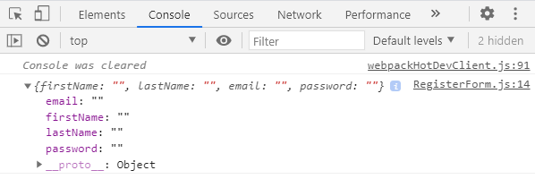
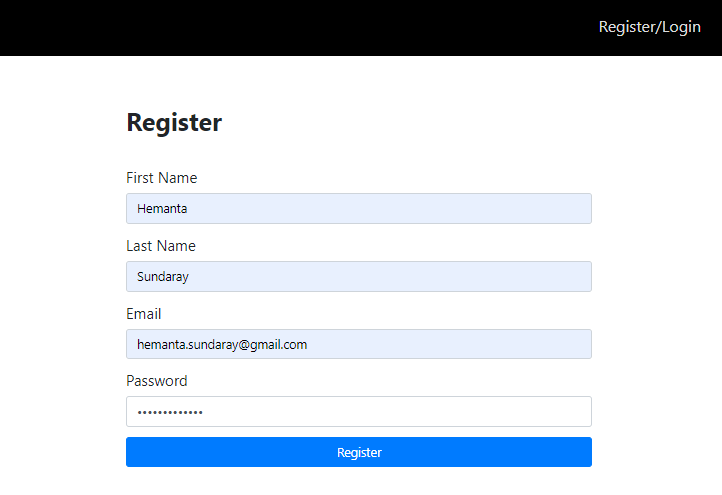
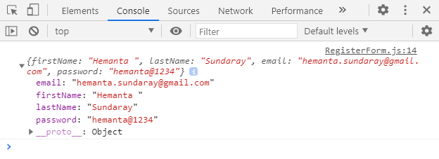
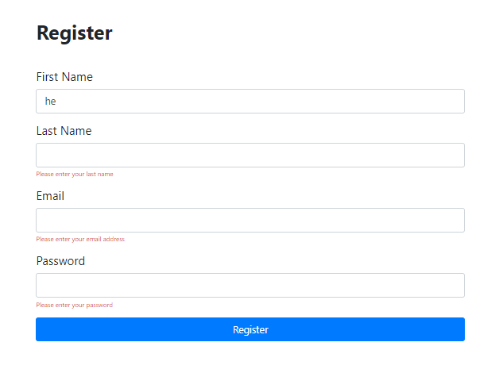
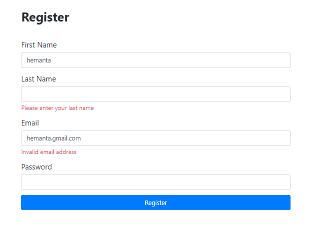

```toc

```

###### This blog post is part of a series. You must finish [part-1](https://hemanta.io/implement-jwt-based-user-authentication-in-a-mern-stack-app-part-1/), [part-2](https://hemanta.io/implement-jwt-based-user-authentication-in-a-mern-stack-app-part-2/), [part-3](https://hemanta.io/implement-jwt-based-user-authentication-in-a-mern-stack-app-part-3/) & [part-4](https://hemanta.io/implement-jwt-based-user-authentication-in-a-mern-stack-app-part-4/) before continuing here.

Our registartion and login forms are ready. Now comes the fun part - handling form state, form validation and error messages.

We can handle these things using plain react. No problem at all. But we will take the help of a library called Formik to make our life a little bit easier.

Formik will help us achieve the following:

- Getting values in and out of form state
- Validation and error messages
- Handling form submission

First, we will install formik.

```sh
PS C:\Users\Delhivery\Desktop\mern-auth\client> npm i formik
```

### Handling form state

In the ~~RegisterForm~~ component, we import the ~~useFormik~~ hook. Then we pass our form’s initial values and a submission function (~~onSubmit~~) to the ~~useFormik~~ hook. The hook then returns to us the form state and helper methods in a variable called ~~formik~~.

The helpers methods that we care about are as follows:

- **values**: Our form’s current values
- **handleSubmit**: A submission handler
- **handleChange**: A change handler to pass to each input

What we have done below is we have passed each of these helper methods to their respective props.

```jsx:title=client/src/components/RegisterForm.js {numberLines, 2, 5, 6, 7, 8, 9, 10, 11, 12, 13, 14, 15, 16, 24, 32, 33, 43, 44, 54, 55, 65, 66}
import React from "react"
import { useFormik } from "formik"

const RegisterForm = () => {
  const formik = useFormik({
    initialValues: {
      firstName: "",
      lastName: "",
      email: "",
      password: "",
    },

    onSubmit: values => {
      console.log(values)
    },
  })

  return (
    <div className="register-form-container">
      <div className="col-10 col-sm-8 col-md-5 mx-auto">
        <h1 className="font-weight-bold">Register</h1>
      </div>

      <form onSubmit={formik.handleSubmit}>
        <div className="form-group col-10 col-sm-8 col-md-5 mx-auto mt-5">
          <label htmlFor="firstName">First Name</label>
          <input
            className="form-control form-control-lg"
            id="firstName"
            name="firstName"
            type="text"
            onChange={formik.handleChange}
            value={formik.values.firstName}
          />
        </div>
        <div className="form-group col-10 col-sm-8 col-md-5 mx-auto">
          <label htmlFor="lastName">Last Name</label>
          <input
            className="form-control form-control-lg"
            id="lastName"
            name="lastName"
            type="text"
            onChange={formik.handleChange}
            value={formik.values.lastName}
          />
        </div>
        <div className="form-group col-10 col-sm-8 col-md-5 mx-auto">
          <label htmlFor="email">Email</label>
          <input
            className="form-control form-control-lg"
            id="email"
            name="email"
            type="email"
            onChange={formik.handleChange}
            value={formik.values.email}
          />
        </div>
        <div className="form-group col-10 col-sm-8 col-md-5 mx-auto">
          <label htmlFor="password">Password</label>
          <input
            className="form-control form-control-lg"
            id="password"
            name="password"
            type="password"
            onChange={formik.handleChange}
            value={formik.values.password}
          />
        </div>
        <div className="col-10 col-sm-8 col-md-5 mx-auto">
          <button type="submit" className="btn btn-lg btn-primary btn-block">
            Register
          </button>
        </div>
      </form>
    </div>
  )
}

export default RegisterForm
```

> **Note**: The **id** and **name** HTML attribute that we pass to the input must match the property names defined in ~~initialValues~~.

On line 14, we are logging the value of ~~values~~ to the console inside the ~~onSubmit~~ submission function. The ~~values~~ variable is where formik stores our form’s current values.

Don’t fill anything in the registration form and click on ~~Register~~. If you check the console, you will see an object that holds our form’s values. Because we did not fill anything in the form, our form’s values (~~firstName~~, ~~lastName~~, ~~email~~, ~~password~~) are empty strings.



Now, fill the form with details and click on the ~~Register~~ button.



In the console, you will get an object that holds our form’s values.



With the help of some handler methods from Formik, we have now taken care of the form state. Next, we will move on to form validation.

### Handling form validation and showing error messages

Before we send our form data to the server, we must ensure that all the required form controls are filled in the correct format. This is called client-side form validation.

Because it is relatively easier to bypass client-side validation, a malicious user can send bad data to our server. Therefore, as a security measure, we are also going to implement server-side form validation later when we tackle the server-side part of our application.

Coming back to client-side form validation, we can write our own custom validation function if we want. However, a large portion of Formik’s users use a library called ~~Yup~~, whose primary use case is client-side validation.

Since Formik users love ~~Yup~~ so much, Formik has a special configuration prop for ~~Yup~~ called ~~validationSchema~~, which will automatically transform ~~Yup~~’s validation errors into a pretty object.

First, we will install ~~Yup~~.

```sh
PS C:\Users\Delhivery\Desktop\mern-auth\client> npm i yup
```

In addition to the form state, Formik keeps track of the validation and error messages. All the validation errors will be available to us in the ~~formik.errors~~ object.

If there is any validation error, we will show the error message below the respective input field.

```jsx:title=client/src/components/RegisterForm.js {numberLines, 3, 13-26, 50-54, 66-70, 82-86, 98-102}
import React from "react"
import { useFormik } from "formik"
import * as Yup from "yup"

const RegisterForm = () => {
  const formik = useFormik({
    initialValues: {
      firstName: "",
      lastName: "",
      email: "",
      password: "",
    },
    validationSchema: Yup.object({
      firstName: Yup.string()
        .max(20, "Must be 20 characters or less")
        .required("Please enter your first name"),
      lastName: Yup.string()
        .max(20, "Must be 20 characters or less")
        .required("Please enter your last name"),
      email: Yup.string()
        .email("Invalid email address")
        .required("Please enter your email address"),
      password: Yup.string()
        .min(5, "Must be 5 characters or more")
        .required("Please enter your password"),
    }),

    onSubmit: values => {
      console.log(values)
    },
  })

  return (
    <div className="register-form-container">
      <div className="col-10 col-sm-8 col-md-5 mx-auto">
        <h1 className="font-weight-bold">Register</h1>
      </div>

      <form onSubmit={formik.handleSubmit}>
        <div className="form-group col-10 col-sm-8 col-md-5 mx-auto mt-5">
          <label htmlFor="firstName">First Name</label>
          <input
            className="form-control form-control-lg"
            id="firstName"
            name="firstName"
            type="text"
            onChange={formik.handleChange}
            value={formik.values.firstName}
          />
          {formik.errors.firstName ? (
            <small className="form-text text-danger">
              {formik.errors.firstName}
            </small>
          ) : null}
        </div>
        <div className="form-group col-10 col-sm-8 col-md-5 mx-auto">
          <label htmlFor="lastName">Last Name</label>
          <input
            className="form-control form-control-lg"
            id="lastName"
            name="lastName"
            type="text"
            onChange={formik.handleChange}
            value={formik.values.lastName}
          />
          {formik.errors.lastName ? (
            <small className="form-text text-danger">
              {formik.errors.lastName}
            </small>
          ) : null}
        </div>
        <div className="form-group col-10 col-sm-8 col-md-5 mx-auto">
          <label htmlFor="email">Email</label>
          <input
            className="form-control form-control-lg"
            id="email"
            name="email"
            type="email"
            onChange={formik.handleChange}
            value={formik.values.email}
          />
          {formik.errors.email ? (
            <small className="form-text text-danger">
              {formik.errors.email}
            </small>
          ) : null}
        </div>
        <div className="form-group col-10 col-sm-8 col-md-5 mx-auto">
          <label htmlFor="password">Password</label>
          <input
            className="form-control form-control-lg"
            id="password"
            name="password"
            type="password"
            onChange={formik.handleChange}
            value={formik.values.password}
          />
          {formik.errors.password ? (
            <small className="form-text text-danger">
              {formik.errors.password}
            </small>
          ) : null}
        </div>
        <div className="col-10 col-sm-8 col-md-5 mx-auto">
          <button
            type="submit"
            className="btn btn-lg btn-primary btn-block register-button"
          >
            Register
          </button>
        </div>
      </form>
    </div>
  )
}

export default RegisterForm
```

By default, Formik validates after each keystroke (_change event_), each input’s blur event as well as prior to submission.

> The blur event will fire when an element has lost focus.

Now, if I type just the text ~~he~~ in the "First Name" form field, error messages for the rest of the form fields (_which I have not visited yet_) are displayed.



This happens because our validation function runs on each keystroke against the entire form’s values and our errors object contains all the errors at any given moment.

This is clearly a bad user experience. We want to show a field’s error message only after a user is done typing in that field.

Like errors and values, Formik keeps track of which fields have been visited in an object called ~~touched~~. The keys of ~~touched~~ are the field names and the values of touched are booleans true/false.

To take advantage of ~~touched~~, we pass ~~formik.handleBlur~~ to each input’s ~~onBlur~~ prop. Now that we are tracking ~~touched~~, we can now change the error message render logic to only show a given field’s error messages if it exists and if the user has visited the field.

```jsx:title=client/src/components/RegisterForm.js {numberLines, 48-48, 51-55, 65-65, 68-72, 82-82, 85-89, 99-99, 102-106 }
import React from "react";
import { useFormik } from "formik";
import * as Yup from "yup";

const RegisterForm = () => {
  const formik = useFormik({
    initialValues: {
      firstName: "",
      lastName: "",
      email: "",
      password: "",
    },
    validationSchema: Yup.object({
      firstName: Yup.string()
        .max(20, "Must be 20 characters or less")
        .required("Please enter your first name"),
      lastName: Yup.string()
        .max(20, "Must be 20 characters or less")
        .required("Please enter your last name"),
      email: Yup.string()
        .email("Invalid email address")
        .required("Please enter your email address"),
      password: Yup.string()
        .min(5, "Must be 5 characters or more")
        .required("Please enter your password"),
    }),

    onSubmit: (values) => {
      console.log(values);
    },
  });

  return (
    <div className="register-form-container">
      <div className="col-10 col-sm-8 col-md-5 mx-auto">
        <h1 className="font-weight-bold">Register</h1>
      </div>

      <form onSubmit={formik.handleSubmit}>
        <div className="form-group col-10 col-sm-8 col-md-5 mx-auto mt-5">
          <label htmlFor="firstName">First Name</label>
          <input
            className="form-control form-control-lg"
            id="firstName"
            name="firstName"
            type="text"
            onChange={formik.handleChange}
            onBlur={formik.handleBlur}
            value={formik.values.firstName}
          />
          {formik.touched.firstName && formik.errors.firstName ? (
            <small className="form-text text-danger">
              {formik.errors.firstName}
            </small>
          ) : null}
        </div>
        <div className="form-group col-10 col-sm-8 col-md-5 mx-auto">
          <label htmlFor="lastName">Last Name</label>
          <input
            className="form-control form-control-lg"
            id="lastName"
            name="lastName"
            type="text"
            onChange={formik.handleChange}
            onBlur={formik.handleBlur}
            value={formik.values.lastName}
          />
          {formik.touched.lastName && formik.errors.lastName ? (
            <small className="form-text text-danger">
              {formik.errors.lastName}
            </small>
          ) : null}
        </div>
        <div className="form-group col-10 col-sm-8 col-md-5 mx-auto">
          <label htmlFor="email">Email</label>
          <input
            className="form-control form-control-lg"
            id="email"
            name="email"
            type="email"
            onChange={formik.handleChange}
            onBlur={formik.handleBlur}
            value={formik.values.email}
          />
          {formik.touched.email && formik.errors.email ? (
            <small className="form-text text-danger">
              {formik.errors.email}
            </small>
          ) : null}
        </div>
        <div className="form-group col-10 col-sm-8 col-md-5 mx-auto">
          <label htmlFor="password">Password</label>
          <input
            className="form-control form-control-lg"
            id="password"
            name="password"
            type="password"
            onChange={formik.handleChange}
            onBlur={formik.handleBlur}
            value={formik.values.password}
          />
          {formik.touched.password && formik.errors.password ? (
            <small className="form-text text-danger">
              {formik.errors.password}
            </small>
          ) : null}
        </div>
        <div className="col-10 col-sm-8 col-md-5 mx-auto">
          <button
            type="submit"
            className="btn btn-lg btn-primary btn-block register-button"
          >
            Register
          </button>
        </div>
      </form>
    </div>
  );
};

export default RegisterForm;

```

Now, if we click on a form field (_let’s say Last Name_), leave the field blank and then click anywhere outside of that form field, the blur event will be fired. Because the "Last Name" form field is required (_as defined in ~~validationSchema~~_), the Formik errors object will be filled with the error message, which will then be rendered below the form field. This holds true for other form fields as well.

This is the validation behavior that we want in our form. Perfect.

We have a minor issue to fix though. Notice that the size of the error message displayed is very small.

Include the following highlighted CSS in ~~index.css~~ to fix the size.

```css:title=client/src/index.css {numberLines:43, 28-30}
/*****************************/
/******* REGISTER & LOGIN*****/
/*****************************/

.login-form-container {
  margin-top: 5rem;
}

.register-form-container {
  margin-top: 5rem;
}


label {
  font-size: 1.5rem;
}

.register-cta {
  text-decoration: none;
  font-size: 1.5rem;
  font-weight: 600;
}

.register:hover {
  text-decoration: none;
}

.text-danger {
  font-size: 1.2rem;
}

/***********************************/
/*******END OF REGISTER & LOGIN*****/
/***********************************/
```

The error messages are legible now. We are done with form validation and display of error messages.



### Reducing the boilerplate using getFieldprops()

The code we have written for the registration form is very explicit about what Formik is doing. We are repeating the ~~onChange~~, ~~onBlur~~ and ~~value~~ attributes for each form input. However, to save time, ~~useFormik~~ returns a helper method called ~~formik.getFieldProps()~~ to make it faster to wire up inputs. Given some field-level info, it returns to you the exact group of ~~onChange~~, ~~onBlur~~ and ~~value~~ for a given field. You can then spread that on an input.

So, using ~~getFieldProps()~~, we will refactor the code for the registration form as follows:

```jsx:title=client/src/components/RegisterForm.js {numberLines, 47, 62, 77, 92}
import React from "react"
import { useFormik } from "formik"
import * as Yup from "yup"

const RegisterForm = () => {
  const formik = useFormik({
    initialValues: {
      firstName: "",
      lastName: "",
      email: "",
      password: "",
    },
    validationSchema: Yup.object({
      firstName: Yup.string()
        .max(20, "Must be 20 characters or less")
        .required("Please enter your first name"),
      lastName: Yup.string()
        .max(20, "Must be 20 characters or less")
        .required("Please enter your last name"),
      email: Yup.string()
        .email("Invalid email address")
        .required("Please enter your email address"),
      password: Yup.string()
        .min(5, "Must be 5 characters or more")
        .required("Please enter your password"),
    }),

    onSubmit: values => {
      console.log(values)
    },
  })

  return (
    <div className="register-form-container">
      <div className="col-10 col-sm-8 col-md-5 mx-auto">
        <h1 className="font-weight-bold">Register</h1>
      </div>

      <form onSubmit={formik.handleSubmit}>
        <div className="form-group col-10 col-sm-8 col-md-5 mx-auto mt-5">
          <label htmlFor="firstName">First Name</label>
          <input
            className="form-control form-control-lg"
            id="firstName"
            name="firstName"
            type="text"
            {...formik.getFieldProps("firstName")}
          />
          {formik.touched.firstName && formik.errors.firstName ? (
            <small className="form-text text-danger">
              {formik.errors.firstName}
            </small>
          ) : null}
        </div>
        <div className="form-group col-10 col-sm-8 col-md-5 mx-auto">
          <label htmlFor="lastName">Last Name</label>
          <input
            className="form-control form-control-lg"
            id="lastName"
            name="lastName"
            type="text"
            {...formik.getFieldProps("lastName")}
          />
          {formik.touched.lastName && formik.errors.lastName ? (
            <small className="form-text text-danger">
              {formik.errors.lastName}
            </small>
          ) : null}
        </div>
        <div className="form-group col-10 col-sm-8 col-md-5 mx-auto">
          <label htmlFor="email">Email</label>
          <input
            className="form-control form-control-lg"
            id="email"
            name="email"
            type="email"
            {...formik.getFieldProps("email")}
          />
          {formik.touched.email && formik.errors.email ? (
            <small className="form-text text-danger">
              {formik.errors.email}
            </small>
          ) : null}
        </div>
        <div className="form-group col-10 col-sm-8 col-md-5 mx-auto">
          <label htmlFor="password">Password</label>
          <input
            className="form-control form-control-lg"
            id="password"
            name="password"
            type="password"
            {...formik.getFieldProps("password")}
          />
          {formik.touched.password && formik.errors.password ? (
            <small className="form-text text-danger">
              {formik.errors.password}
            </small>
          ) : null}
        </div>
        <div className="col-10 col-sm-8 col-md-5 mx-auto">
          <button
            type="submit"
            className="btn btn-lg btn-primary btn-block register-button"
          >
            Register
          </button>
        </div>
      </form>
    </div>
  )
}

export default RegisterForm
```

We need to work on our login form now and turn it into a form powered by Formik.

We will follow the exact same steps that we followed in creating the registration form. There is no point in repeating the steps again. So I will give the code for the final login form:

```jsx:title=client/src/components/LoginForm.js {numberLines}
import React from "react"
import { Link } from "react-router-dom"
import { useFormik } from "formik"
import * as Yup from "yup"

const LoginForm = () => {
  const formik = useFormik({
    initialValues: {
      email: "",
      password: "",
    },
    validationSchema: Yup.object({
      email: Yup.string()
        .email("Invalid email address")
        .required("Please enter your email address"),
      password: Yup.string().required("Please enter your password"),
    }),
    onSubmit: async values => {
      console.log(values)
    },
  })

  return (
    <div className="login-form-container">
      <div className="col-10 col-sm-8 col-md-5 mx-auto">
        <h1 className="font-weight-bold">Login</h1>
      </div>
      <form onSubmit={formik.handleSubmit}>
        <div className="form-group col-10 col-sm-8 col-md-5 mx-auto mt-5">
          <label htmlFor="email">Email Address</label>
          <input
            className="form-control form-control-lg"
            id="email"
            name="email"
            type="email"
            {...formik.getFieldProps("email")}
          />
          {formik.touched.email && formik.errors.email ? (
            <small className="form-text text-danger">
              {formik.errors.email}
            </small>
          ) : null}
        </div>
        <div className="form-group col-10 col-sm-8 col-md-5 mx-auto">
          <label htmlFor="password">Password</label>
          <input
            className="form-control form-control-lg"
            id="password"
            name="password"
            type="password"
            {...formik.getFieldProps("password")}
          />
          {formik.touched.password && formik.errors.password ? (
            <small className="form-text text-danger">
              {formik.errors.password}
            </small>
          ) : null}
        </div>

        <div className="col-10 col-sm-8 col-md-5 mx-auto">
          <button type="submit" className="btn btn-lg btn-primary btn-block">
            Login
          </button>
        </div>
        <div className="col-10 col-sm-8 col-md-5 mx-auto mt-3">
          <p>
            <Link to="/account/forgot" className="password-forgot">
              I forgot my password
            </Link>
          </p>
          <p className="register-cta">
            Don't have an account?{" "}
            <Link className="register" to="/register">
              Register
            </Link>
          </p>
        </div>
      </form>
    </div>
  )
}

export default LoginForm
```

With this, we have taken care of the client-side validation and display of validation error messages for both the registartion and the login form.

Go to [part-6](https://hemanta.io/implement-jwt-based-user-authentication-in-a-mern-stack-app-part-6/)
