```toc

```

###### This blog post is part of a series. You must finish [part-1](https://hemanta.io/implement-jwt-based-user-authentication-in-a-mern-stack-app-part-1/), [part-2](https://hemanta.io/implement-jwt-based-user-authentication-in-a-mern-stack-app-part-2/), [part-3](https://hemanta.io/implement-jwt-based-user-authentication-in-a-mern-stack-app-part-3/), [part-4](https://hemanta.io/implement-jwt-based-user-authentication-in-a-mern-stack-app-part-4/) & [part-5](https://hemanta.io/implement-jwt-based-user-authentication-in-a-mern-stack-app-part-5/) before continuing here.

### Handling form submission

When a user submits the registration form, we will send the user details to the server and save them in a database.

We will use MongoDB, which is a document database. In MongoDB, databases hold one or more collections of documents.

**Collection**: Collections are analogous to tables in relational databases. Each record in a MongoDB collection is a document.

**Document**: MongoDB stores data records as BSON documents, which are binary representations of JSON documents. MongoDB documents have similar structure to JavaScript objects and are composed of field-value pairs. MongoDB does not require that all documents have the same structure.

### Creating a MongoDB Atlas account

We will be using MongoDB Atlas (cloud based database-as-a-service) free tier to provide the database. This makes the “installation” operating system independent. I also use it as my production database for [www.sundaray.io](https://sundaray.io).

First, we will create an account on MongoDB Atlas, which is a fully-managed cloud database developed by the same people that build MongoDB.

Go ahead and register for a new Atlas account at the following link.

<https://account.mongodb.com/account/register>

You can register for an Atlas account using your Google account or email address.

#### Set an organization name & a project name

During the registration process, MongoDB will ask you to set an organization name and a project name.

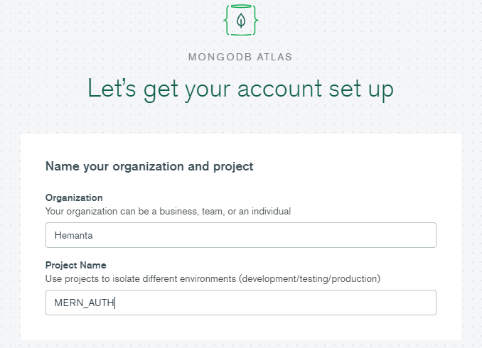

An organization can contain multiple projects. By having multiple projects within an organization, you can isolate different environments (for instance development/production) from each other.

#### Choose Shared Clusters - FREE TIER

By using the FREE TIER, the default setup is to deploy a MongoDB cluster with a replica set.

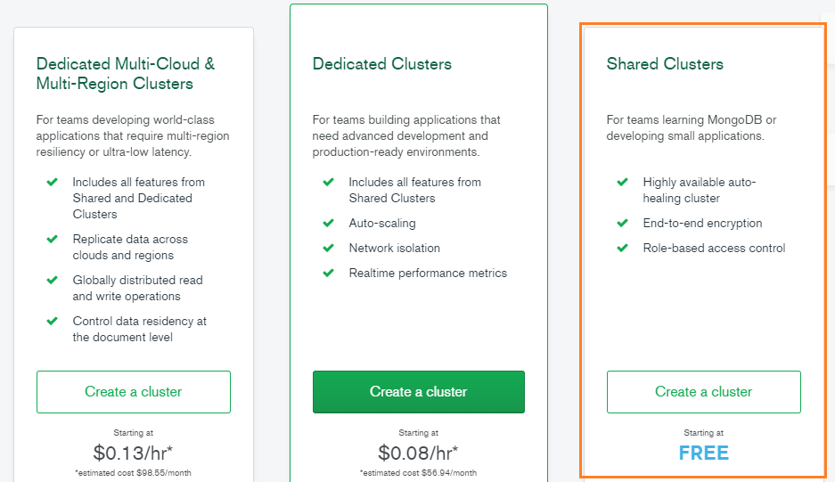

> **What are clusters in MongDB?** <br>
> In the context of MongoDB, the word **cluster** either refers to a replica set or a sharded cluster.<br>
> A **replica set** is the replication of a group of MongoDB servers that hold copies of the same data, thereby ensuring high availability and redundancy, which are crucial features to have in place in case of failovers and planned maintenance periods.<br>
> A **sharded cluster** is commonly known as horizontal scaling, where data is distributed across many servers.

> **What is MongoDB Atlas Cluster?**<br>
> MongoDB Atlas cluster is a NoSQL Database-as-a-service offering (_available in Microsoft Azure, Google Cloud Platform, Amazon Web Services_). You don’t need to install any software as you can connect to MongoDB directly from the web user interface.

#### Select your preferred cloud provider and region.

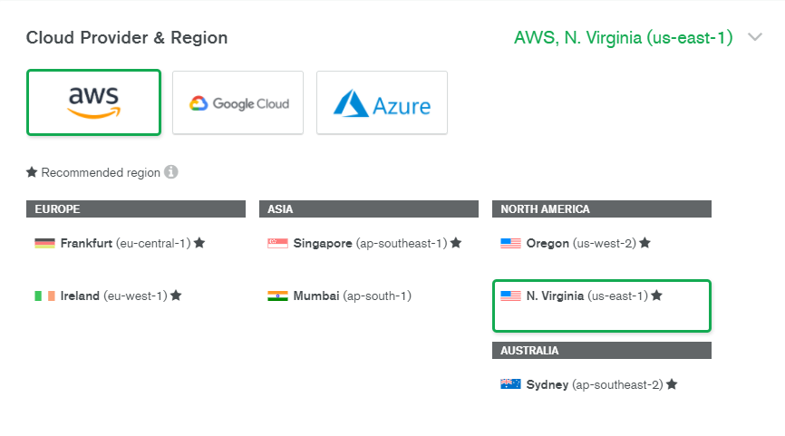

#### Select MO Sandbox for cluster tier.

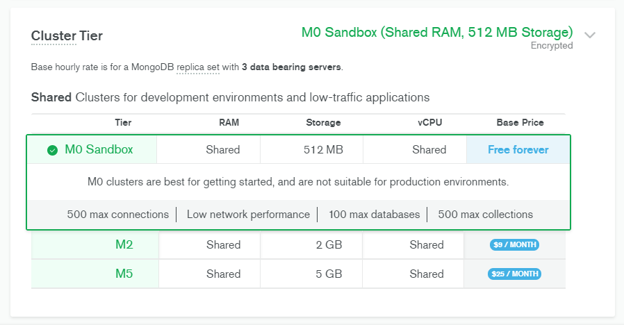

#### Enter a name for your cluster in the cluster name field.

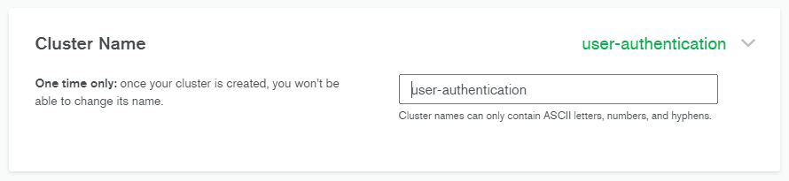

#### Click on Create Cluster to deploy the cluster.

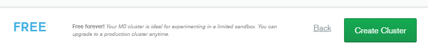

#### Click on CONNECT in the clusters view.

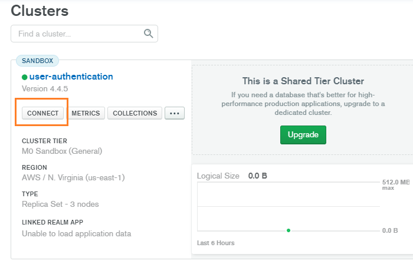

#### Click on Allow Access from Anywhere.

When you deploy your application, you would want everyone to access your application.

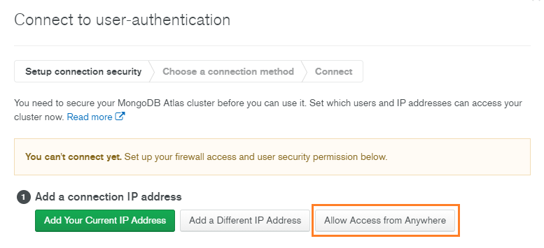

#### Click on Add IP Address.

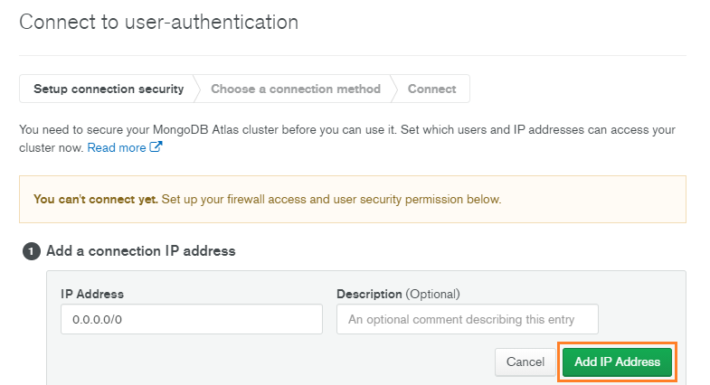

> **What is an IP address?**<br>
> Any computer linked to a network has a unique address that identifies it, called an IP (Internet Protocol) address. It’s an address made up of a series of four numbers separated by dots (for example ~~127.0.0.1~~) and represents a unique location on the web.

#### Create a Database User for your Cluster

You must create a database user to access your cluster. For security purposes, Atlas requires clients to authenticate as MongoDB database users to access clusters.

Database users are different from Atlas users:

- Database users can access databases hosted in Atlas.
- Atlas users can login to Atlas but don’t have access to MongoDB databases.

Set the Username & Password. You should store the password somewhere safe; we will need the password later.

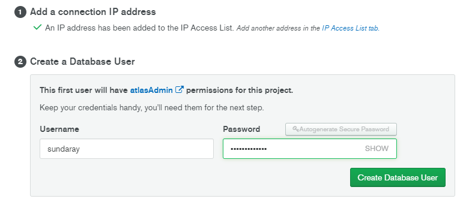

#### Add a Database

In the clusters view, click on ~~COLLECTIONS~~.

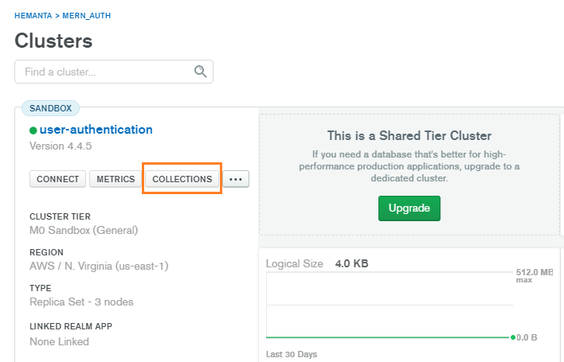

#### Click on Add My Own Data

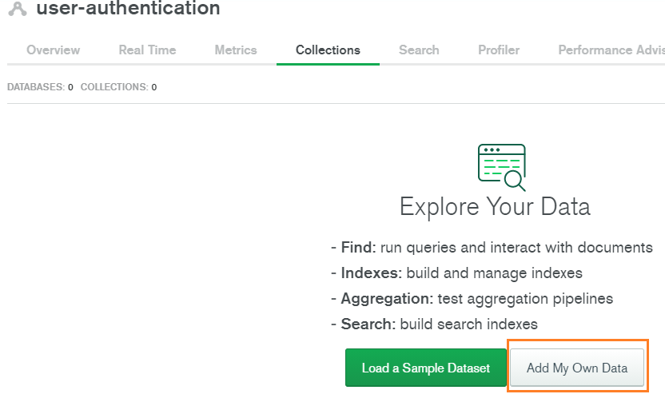

Give your database a name. You will also have to specify the name of your collection. Note that the name of the collection you specify here does not really matter. We will manage the names of collections from mongoose. Moreover, if you specify a name that you don’t plan to use, you can simply delete it from the dashboard.

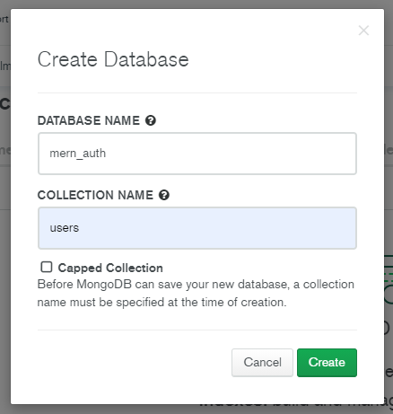

Click on ~~Create~~ and MongoDB will create our database. We will need the database name later.

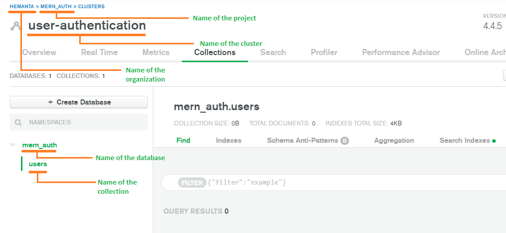

With this, our MongoDB Atlas configuration is complete.

Go to [part-7](https://hemanta.io/implement-jwt-based-user-authentication-in-a-mern-stack-app-part-7/)
