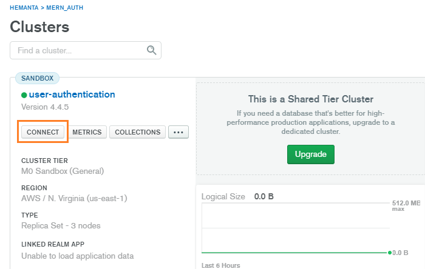
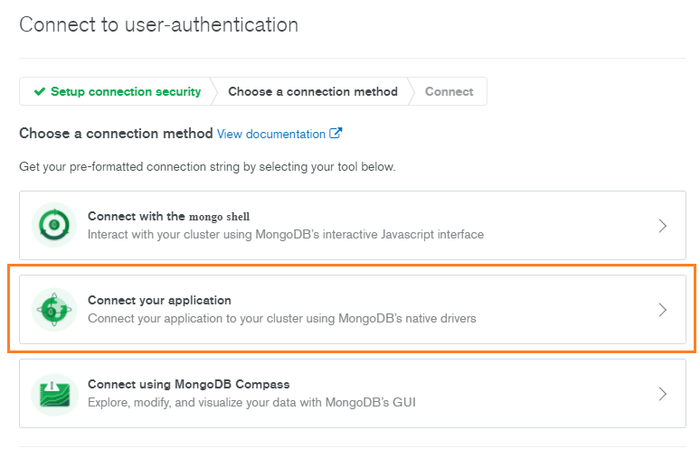
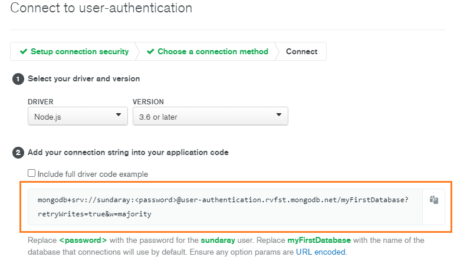

```toc

```

###### This blog post is part of a series. You must finish [part-1](https://hemanta.io/implement-jwt-based-user-authentication-in-a-mern-stack-app-part-1/), [part-2](https://hemanta.io/implement-jwt-based-user-authentication-in-a-mern-stack-app-part-2/), [part-3](https://hemanta.io/implement-jwt-based-user-authentication-in-a-mern-stack-app-part-3/), [part-4](https://hemanta.io/implement-jwt-based-user-authentication-in-a-mern-stack-app-part-4/), [part-5](https://hemanta.io/implement-jwt-based-user-authentication-in-a-mern-stack-app-part-5/) & [part-6](https://hemanta.io/implement-jwt-based-user-authentication-in-a-mern-stack-app-part-6/) before continuing here.

We will use mongoose to interact with our database. Mongoose will act as the frontend to our MongoDB database.

> **What is mongoose?** <br>
> Mongoose is what is known as an Object Data Model (ODM). An ODM represents the website’s data as JavaScript objects, which are then mapped to the underlying database.<br>
> ODMs are often slower because they often use translation code to map between objects and the database format. The benefit of using an ODM is that programmers can continue to think in terms of JavaScript objects rather than database semantics. Moreover, using an ODM often results in lower costs for development and maintenance.

Sign in to your MongoDB Atlas account. In the clusters view, click on ~~CONNECT~~.



Then, click on ~~Connect your application~~.



Copy the connection string.



Back to our application, create a ~~.env~~ file in the ~~mern-auth~~ folder.
In the ~~.env~~ file, paste the connection string that you copied from MongoDB Atlas as the value of the key ~~MONGO_URI~~. Don’t place the connection string within double quotes.

```sh:title=mern-auth/.env
MONGO_URI=mongodb+srv://sundaray:<password>@sandbox.y8blv.mongodb.net/myFirstDatabase?retryWrites=true&w=majority
```

Replace ~~\<password>~~ with the password that you have set for the database user. And replace ~~myFirstDatabase~~ with the name of your database.

### What is a .env file?

~~.env~~ is a simple configuration text file that is used to define environment variables that we want to pass into our application’s environment. By convention ~~.env~~ variable names are uppercase words separated by underscores. Variable names are directly followed by an ~~=~~, which in turn is directly followed by the value, for example: ~~VARIABLE_NAME=value~~.

The ~~.env~~ file will contain secret environment variables that we don’t want to expose to the outside world. If you are using git to push your code to a remote repository such as GitHub you wouldn’t want to push the ~~.env~~ file to GitHub and make it public. Therefore, add the ~~.env~~ file in the ~~.gitignore~~ file.

```sh:title=mern-auth/.gitignore {numberLines, 15}
# See https://help.github.com/articles/ignoring-files/ for more about ignoring files.

# dependencies
**/node_modules
/.pnp
.pnp.js

# testing
/coverage

# production
/build

# misc
.env
.DS_Store
.env.local
.env.development.local
.env.test.local
.env.production.local

npm-debug.log*
yarn-debug.log*
yarn-error.log*
```

We have stored the connection string in the ~~.env~~ file. Next, we will use mongoose to connect to our MongoDB database.

### Connecting to MongoDB

First, we need to install mongoose.

```sh
PS C:\Users\Delhivery\Desktop\mern-auth> npm i mongoose
```

Note that installing mongoose adds all its dependencies including the MongoDB database driver. The MongoDB Node.js driver allows Node.js applications to connect to MongoDB and work with data.

We also need to install a module called ~~dotenv~~ that will help us load the environment variables we have defined inside the ~~.env~~ file into ~~process.env~~.

```sh
 PS C:\Users\Delhivery\Desktop\mern-auth> npm i dotenv
```

> Note that you can install multiple npm packages with a single command. All we need to do is to use the npm install command followed by multiple package names separated by spaces, as shown below:

```sh
PS C:\Users\Delhivery\Desktop\mern-auth> npm i mongoose dotenv
```

Inside the ~~server~~ folder, create a folder named ~~config~~ and inside the ~~config~~ folder create a file named ~~db.js~~ and paste the following code snippet in that file.

```js:title=server/config/db.js {numberLines}
const mongoose = require("mongoose")
const dotenv = require("dotenv")

dotenv.config()

const connectDB = async () => {
  try {
    const conn = await mongoose.connect(process.env.MONGO_URI, {
      useNewUrlParser: true,
      useCreateIndex: true,
      useUnifiedTopology: true,
    })
    console.log(`MongoDB connected: ${conn.connection.host}`)
  } catch (error) {
    console.error(`Error: ${error.message}`)
    process.exit(1)
  }
}

module.exports = connectDB
```

Mongoose requires a connection to our MongoDB database. We connect to our MongoDB database using ~~mongoose.connect~~ method. The first argument to the connect method is our connection string.

The ~~dotenv~~ module loads the environment variables that we have defined inside the ~~.env~~ file as key-value pairs inside ~~process.env~~. Therefore, we can access our connection string using ~~process.env.MONGO_URI~~.

We can programmatically terminate a Node.js application by using the ~~exit~~ method of the ~~process~~ core module. When Node.js runs this line, the process is immediately forced to terminate. We can also pass an integer that signals the operating system the exit code.

Go to [part-8](https://hemanta.io/implement-jwt-based-user-authentication-in-a-mern-stack-app-part-8/)
