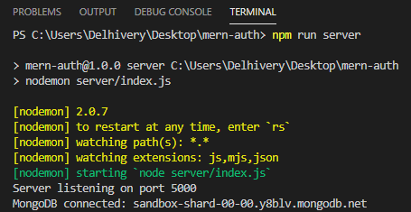

```toc

```

###### This blog post is part of a series. You must finish [part-1](https://hemanta.io/implement-jwt-based-user-authentication-in-a-mern-stack-app-part-1/), [part-2](https://hemanta.io/implement-jwt-based-user-authentication-in-a-mern-stack-app-part-2/), [part-3](https://hemanta.io/implement-jwt-based-user-authentication-in-a-mern-stack-app-part-3/), [part-4](https://hemanta.io/implement-jwt-based-user-authentication-in-a-mern-stack-app-part-4/), [part-5](https://hemanta.io/implement-jwt-based-user-authentication-in-a-mern-stack-app-part-5/), [part-6](https://hemanta.io/implement-jwt-based-user-authentication-in-a-mern-stack-app-part-6/) & [part-7](https://hemanta.io/implement-jwt-based-user-authentication-in-a-mern-stack-app-part-7/) before continuing here.

### Defining & creating the User model

We know that we need to store user details in the database when a user registers in our application. In order to make this happen, we need to define mongoose models to interact with the database.

We will start by creating a ~~models~~ folder inside the ~~server~~ folder. Then, we will create a file named ~~userModel.js~~ inside the ~~models~~ folder.

Copy the code below and paste it in the ~~userModel.js~~ file.

```js:title=server/models/userModel.js {numberLines}
const mongoose = require("mongoose")

const userSchema = new mongoose.Schema({
  firstName: {
    type: String,
    required: true,
  },
  lastName: {
    type: String,
    required: true,
  },
  email: {
    type: String,
    unique: true,
    required: true,
  },
  password: {
    type: String,
    required: true,
  },
})

const User = mongoose.model("User", userSchema)

module.exports = User
```

Above, we have used the ~~Schema~~ constructor to create a new schema instance, defining various fields inside it in the constructor’s object parameter. Note that the fields that we have defined (~~firstName~~, ~~lastName~~, ~~email~~, ~~password~~) are the fields that we ask a user to fill in the registration form.

Then, we have compiled the ~~userSchema~~ into a user model using the ~~mongoose.model()~~ method. Note that the first argument to the model method is the singular name of the collection that will be created for the ~~User~~ model (_Mongoose will create the database collection for the ~~User~~ model_), and the second argument is the schema that we want to use in creating the ~~User~~ model.

In the email field, we have set the ~~unique~~ option to true which tells mongoose that a user’s email must be unique.

#### Schema

The Schema allows you to define the fields stored in each document along with their validation requirements and default values. A schema can have an arbitrary number of fields - each one represents a field in the documents stored in MongoDB.

#### Model

Once you have created a schema, you can use it to create models. Schemas are compiled into models using the ~~mongoose.model()~~ method. A model maps to a collection of documents in the MongoDB database. The documents will contain the fields that you define in the model Schema.

In mongoose, a model is a class. The model represents a collection of documents in the database you can search while the model’s instances represent individual documents that you can save and retrieve.

### Setting up a web server using Express

Install Express in the ~~mern-auth~~ folder using the following command:

```sh
PS C:\Users\Delhivery\Desktop\mern-auth> npm i express
```

Create a file called ~~index.js~~ in the ~~server~~ folder and paste the following code snippet in the file.

```js:title=server/index.js {numberLines}
const express = require("express")
const dotenv = require("dotenv")
const connectDB = require("./config/db")

dotenv.config()

// connect to the database
connectDB()

const app = express()

app.use(express.json())

const PORT = process.env.PORT || 5000

app.listen(PORT, () => {
  console.log(`Server listening on port ${PORT}`)
})
```

We require and configure ~~dotenv~~ at the top of the application.

We use ~~express.json()~~, which is a built-in middleware function in Express to parse incoming requests with JSON payloads. A new body object containing the parsed data is populated on the request object (i.e. ~~req.body~~).

We also need to add the ~~PORT~~ environment variable in the ~~.env~~ file.

```sh:title=mern-auth/.env {numberLines, 1}
PORT=5000
MONGO_URI=mongodb+srv://sundaray:<password>@sandbox.y8blv.mongodb.net/myFirstDatabase?retryWrites=true&w=majority
```

Note that whenever you make any changes to the ~~.env~~ file, you will have to stop and restart the server.

### Enabling server restart on file change

Any changes we make to our server-side code will not be visible until we restart the server. It quickly becomes irritating to stop and restart the server every time we make a change. So, we will use a tool for this purpose called ~~nodemon~~ and install it as a development dependency.

```sh
PS C:\Users\Delhivery\Desktop\mern-auth> npm i --save-dev nodemon
```

Add the following highlighted code snippet in the ~~package.json~~ file in the ~~mern-auth~~ folder.

```sh:title=mern-autj/package.json {numberLines, 7}
{
  "name": "mern-auth",
  "version": "1.0.0",
  "description": "",
  "main": "index.js",
  "scripts": {
    "server": "nodemon server/index.js"
  },
  "author": "",
  "license": "ISC",
  "dependencies": {
    "dotenv": "^8.2.0",
    "express": "^4.17.1",
    "mongoose": "^5.12.4"
  },
  "devDependencies": {
    "nodemon": "^2.0.7"
  }
}
```

Start the Express server using the following command:

```sh
PS C:\Users\Delhivery\Desktop\mern-auth> npm run server
```

We will get the following output in the terminal.



Our server is successfully listening on port 5000 and our application is connected to the MongoDB database.

We have one minor issue to fix.

Currently, we have two servers. We have one server created by ~~create-react-app~~ listening on port 3000. We also have our Express server listening on port 5000. We can start both these servers on separate terminals, but it gets tiring soon. We will use a tool called ~~concurrently~~ which will help us run multiple npm scripts in parallel.

```sh
PS C:\Users\Delhivery\Desktop\mern-auth> npm i concurrently
```

Now update the ~~package.json~~ file.

```sh:title=mern-auth/server {numberLines, 7, 9}
{
  "name": "mern-auth",
  "version": "1.0.0",
  "description": "",
  "main": "index.js",
  "scripts": {
    "client": "npm run start --prefix client",
    "server": "nodemon index.js",
    "dev": "concurrently \"npm run client\" \"npm run server\""
  },
  "author": "",
  "license": "ISC",
  "dependencies": {
    "concurrently": "^6.0.2",
    "dotenv": "^8.2.0",
    "express": "^4.17.1",
    "mongoose": "^5.12.4"
  },
  "devDependencies": {
    "nodemon": "^2.0.7"
  }
}
```

Now, we can start the ~~create-react-app~~ server using the command ~~npm run client~~. We can start the Express server using the command ~~npm run server~~ and we can start both the servers in parallel using ~~npm run dev~~.

### Setting up routes & creating route handlers

Whenever a new user fills in the registration form and clicks on the ~~Register~~ button, we will make a ~~POST~~ request to the ~~/api/users/register~~ endpoint.

Inside the ~~server~~ folder, create a folder named ~~routes~~. And inside the ~~routes~~ folder, create a file named ~~userRoutes.js~~.

```js:title=mern-auth/routes/userRoutes.js {numberLines}
  "/register",
  asyncHandler(async (req, res, next) => {
    const { firstName, lastName, email, password } = req.body;

    const userExists = await User.findOne({ email });

    if (userExists) {
      const err = new Error("User already registered");
      err.status = 400;
      next(err);
    }

    const user = await User.create({
      firstName,
      lastName,
      email,
      password,
    });

    res.json({ message: "New user created" });
  })
);

module.exports = router;
```

> **Note:** In ~~userRoutes.js~~ file, we have defined route handler callbacks directly inside the router functions. You will often come across blog posts/courses, where the callbacks are defined separately inside a controller module. Either of the approach is fine.

Above, we use an npm package called ~~express-async-handler~~ to handle exceptions inside of async express routes and pass them to express error handlers.

The logic inside the route handler function is as follows:

Check whether we already have a user in the database with the provided email address. If yes, send an error message - User already registered - to the client. Otherwise, create a new document in the database and send a message - New user created - to the client.

Note that when a user exists, we create a custom error and pass it to the ~~next()~~ function. Any error passed to the ~~next()~~ function is handled by the built-in error handler in Express. However, we are going to define a custom error handler.

At the end of the ~~userRoutes.js~~ file, we export the ~~Router~~ object.

### Defining a custom error handler

Inside the ~~server~~ folder, create a folder named ~~middleware~~ and inside the ~~middleware~~ folder create a file named ~~errorMiddleware.js~~ and paste the following code snippet in the file.

```js:title=server/middleware/errorMiddleware.js {numberLines}
const globalErrorHandler = (err, req, res, next) => {
  err.status = err.status || 500
  res.status(err.status).json({
    message: err.message,
    stack: process.env.NODE_ENV === "production" ? null : err.stack,
  })
}

module.exports = globalErrorHandler
```

There is one issue that we need to fix though. In the ~~userRoutes.js~~ file, you will notice that we are saving the user’s password in the database as plain text. This poses security concerns. Therefore, we must hash the password before we save it to the database. In order to hash the password, we will use a package called ~~bcryptjs~~.

> **Hashing**: A secure way to store passwords is to transform them into data that can’t be converted back to original passwords. This one way security mechanism is known as hashing.

One more thing: we will not hash the password inside the route handler function. Instead, we will mongoose ~~pre~~ middleware function, which is specified on the schema level.

> **Mongoose middleware**: In Mongoose, middlewares let you attach your own custom logic to built-in mongoose functions. Middleware functions are sometimes called hooks. That’s because middlewares let you hook into existing functions.

First, install ~~bcryptjs~~.

```sh
  PS C:\Users\Delhivery\Desktop\mern-auth> npm i bcryptjs
```

Add the highlighted code snippets below in ~~userModel.js~~.

```js:title=server/models/userModel.js {numberLines, 2-2, 24-27}
const mongoose = require("mongoose")
const bcrypt = require("bcryptjs")

const userSchema = new mongoose.Schema({
  firstName: {
    type: String,
    required: true,
  },
  lastName: {
    type: String,
    required: true,
  },
  email: {
    type: String,
    unique: true,
    required: true,
  },
  password: {
    type: String,
    required: true,
  },
})

userSchema.pre("save", async function () {
  const salt = await bcrypt.genSalt(10)
  this.password = await bcrypt.hash(this.password, salt)
})

const User = mongoose.model("User", userSchema)

module.exports = User
```

Mongoose will call the ~~pre(‘save’)~~ function before sending the fields to the database. Hold on a sec. Where are we using the ~~save()~~ function? Notice that in the route handler function responsible for handling the ~~/api/users/register~~ endpoint, we are using the ~~create~~ function of the ~~User~~ model to create a new user. The ~~create()~~ function is actually a thin wrapper around the ~~save()~~ function.

The ~~genSalt()~~ method takes in a number known as salt rounds (aka cost), which is a measure of the no. of steps involved in creating the hash. The second argument to the ~~hash()~~ method is salt, which is a random string combined with the password to generate the hashed password.

### Server-side form validation

We have already discussed the point that we should never trust the data coming from the client. It is possible for a malicious user to by-pass client-side validation and send bad data to the server. So, it’s important that we do server side validation of the form data as a security best-practice.

We will use a package called ~~joi~~, which is a schema description language and data validator for JavaScript.

Install ~~joi~~.

```sh
PS C:\Users\Delhivery\Desktop\mern-auth> npm i joi
```

Inside the ~~server~~ folder, create a folder named ~~validation~~ and inside the ~~validation~~ folder create a file named ~~validate.js~~.

Inside the ~~validate.js~~ file, paste the following code snippet.

```js:title=server/validation/validate.js {numberLines}
const Joi = require("joi")

const registrationValidation = formData => {
  const schema = Joi.object({
    firstName: Joi.string().required().max(20),
    lastName: Joi.string().required().max(20),
    email: Joi.string().required().email(),
    password: Joi.string().required().min(5),
  })

  return schema.validate(formData)
}

module.exports = { registrationValidation }
```

Now, add the highlighted code snippets in ~~userRoutes.js~~ file.

```js:title=server/routes/userRoutes.js {numberLines, 4-4, 11-17}
onst express = require("express");
const asyncHandler = require("express-async-handler");
const User = require("../models/userModel");
const { registrationValidation } = require("../validation/validate");

const router = express.Router();

router.post(
  "/register",
  asyncHandler(async (req, res, next) => {
    const { error } = registrationValidation(req.body);

    if (error) {
      const err = new Error(error.details[0].message);
      err.status = 400;
      next(err);
    }

    const { firstName, lastName, email, password } = req.body;

    const userExists = await User.findOne({ email });

    if (userExists) {
      const err = new Error("User already registered");
      err.status = 400;
      next(err);
    }

    const user = await User.create({
      firstName,
      lastName,
      email,
      password,
    });

    res.json({ message: "New user created" });
  })
);

module.exports = router;
```

### Using the Router module

To use the ~~Router~~ module, we require the ~~userRoutes.js~~ module in ~~index.js~~ and then call ~~use()~~ on the Express application (~~app~~) to add the router in the middleware handling chain.

We also require the ~~errorHandler.js~~ module and define it after all the ~~app.use()~~ calls, because an error handler must be the last middleware in the request processing pipeline.

```js:title=server/index.js {numberLines, 3-4, 16-16, 18-18}
const express = require("express")
const dotenv = require("dotenv")
const globalErrorHandler = require("./middleware/errorMiddleware")
const userRoutes = require("./routes/userRoutes")

const connectDB = require("./config/db")

dotenv.config()

connectDB()

const app = express()

app.use(express.json())

app.use("/api/users", userRoutes)

app.use(globalErrorHandler)

const PORT = process.env.PORT || 5000

app.listen(PORT, () => {
  console.log(`Server listening on port ${PORT}`)
})
```

Go to [part-9](https://hemanta.io/implement-jwt-based-user-authentication-in-a-mern-stack-app-part-9/)
