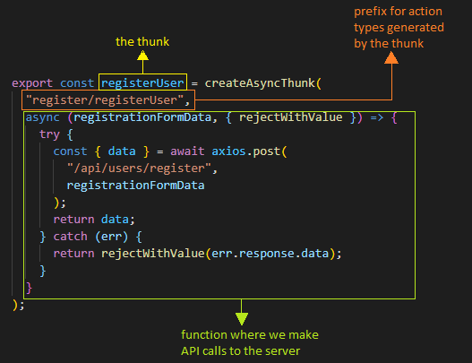
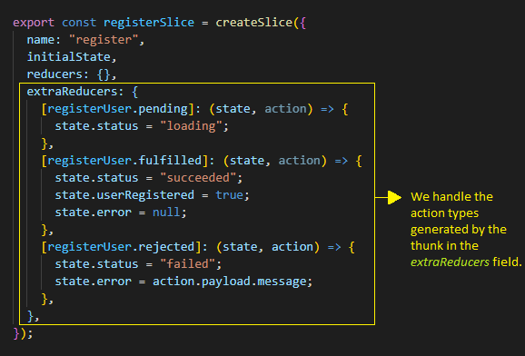

```toc

```

###### This blog post is part of a series. You must finish [part-1](https://hemanta.io/implement-jwt-based-user-authentication-in-a-mern-stack-app-part-1/), [part-2](https://hemanta.io/implement-jwt-based-user-authentication-in-a-mern-stack-app-part-2/), [part-3](https://hemanta.io/implement-jwt-based-user-authentication-in-a-mern-stack-app-part-3/), [part-4](https://hemanta.io/implement-jwt-based-user-authentication-in-a-mern-stack-app-part-4/), [part-5](https://hemanta.io/implement-jwt-based-user-authentication-in-a-mern-stack-app-part-5/), [part-6](https://hemanta.io/implement-jwt-based-user-authentication-in-a-mern-stack-app-part-6/), [part-7](https://hemanta.io/implement-jwt-based-user-authentication-in-a-mern-stack-app-part-7/) & [part-8](https://hemanta.io/implement-jwt-based-user-authentication-in-a-mern-stack-app-part-8/) before continuing here.

Using Redux as a state management library is a pain in the ass. I am sure you would agree with some of the major concerns of Redux users as mentioned below:

- Redux requires too much boilerplate code.
- Configuring a Redux store is too complicated.
- You have to add too many packages to do anything useful with Redux.
- You must do all the state updates immutably and writing immutable logic is hard. Accidentally mutating the state in reducers is the single most common mistake made by Redux users.

Redux Toolkit includes utilities that address all the above-mentioned concerns. It simplifies your Redux code and lets you focus on the core logic of your application, so you can do more work with less code. Redux Toolkit is the recommended approach for writing Redux logic.

I am a huge fan of Redux Toolkit. Ever since I started using Redux Toolkit, I find developing applications with large amounts of application state that require complex update logic an absolute breeze. At the end of the series, if I would have convinced you to use Redux Toolkit, I would have done my job.

## Must-know Redux Terms

Before I explain how Redux Toolkit works, you must have a basic understanding of the following terms:

### Action

You can think of an action as an event that describes something that happened in the application. For example, clicking on an “Add to Cart” button would be considered as an event.

An action is a plain JavaScript object that has a type field and a payload field. The type field, which should be a string, refers to the name of the action. And the payload field contains the information about the action.

### Action Creator

An action creator is a function that creates and returns an action object. We typically use these so we don’t have to write the action object by hand every time.

### Reducer

A reducer is a function that receives the current state and an action object, decides how to update the state if necessary, and returns the new state: (state, action) => newState. You can think of a reducer as an event listener which handles events based on the received action (event) type.

### Store

The current Redux application state lives in an object called the store.

### Dispatch

The only way to update the state is by passing an action object to the dispatch function. You can think of dispatching actions as “triggering an event” in the application. Reducers act like event listeners, and when they hear an action they are interested in, they update the state in response.

## Installation

Redux Toolkit is available as a package on npm.

```sh
npm i @reduxjs/toolkit
```

In addition, we need to install ~~react-redux~~, which lets React components read data from a Redux store and dispatch actions to the store to update state.

```sh
PS C:\Users\Delhivery\Desktop\mern-auth\client> npm i react-redux
```

> **Note:** Redux Toolkit only covers the Redux logic. We still use React-Redux to let our React components talk to the Redux store.

## Create a Redux Store

Create a file called ~~store.js~~ inside the ~~src~~ folder. We will start by creating and exporting an empty Redux store. We can create a Redux store by using the ~~configureStore~~ API from Redux Toolkit.

```js:title=client/src/store.js {numberLines}
import { configureStore } from "@reduxjs/toolkit"

export default configureStore({
  reducer: {},
})
```

The ~~configureStore~~ API automatically configures Redux DevTools Extension so that we can inspect the store while developing.

> **Redux DevTools Extension:** Redux DevTools provides a debugging platform for Redux apps. It shows a history of changes to the state in your Redux store over time. This allows you to debug your applications effectively. You can install Redux DevTools as a browser extension.

Then, we need to import the Redux store into our application’s entry point - ~~src/index.js~~ and wrap the root component - ~~App.js~~ - with the ~~Provider~~ component from ~~react-redux~~.

```jsx:title=client/src/index.js {numberLines, 7-7, 11-11, 15-15}
import React from "react"
import ReactDOM from "react-dom"
import "./index.css"
import App from "./App"
import "bootstrap/dist/css/bootstrap.css"
import { BrowserRouter as Router } from "react-router-dom"
import { Provider } from "react-redux"
import store from "./store"

ReactDOM.render(
  <Provider store={store}>
    <Router>
      <App />
    </Router>
  </Provider>,
  document.getElementById("root")
)
```

The ~~Provider~~ component makes the Redux store available to any nested components. And since we have rendered the ~~Provider~~ component at the top level, all of our React components can now access the global Redux store.

## Create a Redux state slice

Inside the ~~components~~ folder, create a folder named ~~stateSlices~~ and inside the ~~stateSlices~~ folder, create a file named ~~registerSlice.js~~.

```js:title=client/src/components/stateSlices/registerSlice.js {numberLines}
import { createSlice, createAsyncThunk } from "@reduxjs/toolkit"
import axios from "axios"

const initialState = {
  status: "idle",
  userRegistered: null,
  error: null,
}

export const registerUser = createAsyncThunk(
  "register/registerUser",
  async (registrationFormData, { rejectWithValue }) => {
    try {
      const { data } = await axios.post(
        "/api/users/register",
        registrationFormData
      )
      return data
    } catch (err) {
      return rejectWithValue(err.response.data)
    }
  }
)

export const registerSlice = createSlice({
  name: "register",
  initialState,
  reducers: {},
  extraReducers: {
    [registerUser.pending]: (state, action) => {
      state.status = "loading"
    },
    [registerUser.fulfilled]: (state, action) => {
      state.status = "succeeded"
      state.userRegistered = true
    },
    [registerUser.rejected]: (state, action) => {
      state.status = "failed"
      state.error = action.payload.message
    },
  },
})

export default registerSlice.reducer
```

We need to install ~~axios~~, which is an HTTP client used to send HTTP requests and retrieve their responses from a server.

```sh
PS C:\Users\Delhivery\Desktop\mern-auth\client> npm i axios
```

It is very likely that you don’t understand a single line of code that we have written inside the ~~registerSlice.js~~ file. You probably have a zillion questions swirling inside your head. Don’t worry though. We will unpack everything step-by-step. First, we must understand some important concepts.

## What the hell are slices?

A Redux store is typically organized into slices. You can think of a **slice** as a single feature of your application. User registration is a feature of our application and ~~registerSlice.js~~ is the file responsible for dealing with that feature.

We create a slice using the ~~createSlice~~ function from Redux Toolkit. The ~~createSlice~~ function needs a string name to identify the slice, an ~~initialState~~ and one or more reducer functions that define how the state can be updated. We use the status field of the ~~initialState~~ object to decide what to show in our UI.

One of the cool features of Redux Toolkit is that we can write mutating logic inside a reducer function because ~~createSlice~~ converts those mutations into safe immutable updates internally using the Immer library. We don’t have this luxury in Redux where we must write all state updates immutably, by making copies of data and then updating those copies. However, you must take precaution to not mutate any data outside createSlice.

In the ~~registerSlice.js~~ file, we have named our slice ~~register~~. You will also notice that we haven’t defined any functions(reducers) inside the reducers field. You will soon understand why. We will discuss the ~~extraReducers~~ field, which is meant to reference external actions, once we understand the concept of updating the Redux store with asynchronous logic.

## What is createAsyncThunk?

By itself a Redux store does not know anything about asynchronous logic. It only knows how to synchronously dispatch actions, update the state and notify the UI that something has changed.

In our case, when a user clicks on the ~~Register~~ button, we make a ~~POST~~ request to the ~~/api/users/register~~ endpoint. This network request is an asynchronous operation.

> **Asynchronous operation:** An asynchronous operation is an operation that we can wait on while moving on to other tasks. Making a network request, querying a database, etc. are examples of asynchronous operations, which return Promise objects that represent the eventual outcome of the operation.

How can we then write asynchronous code and let it interact with the store? We can write asynchronous code by using a middleware provided by Redux Toolkit called **redux-thunk**. Fortunately, Redux Toolkit’s ~~configureStore~~ function sets up this middleware by default.

We write any asynchronous logic inside a function known as a **thunk**. In ~~registerSlice.js~~ file, the ~~registerUser~~ function (the thunk) is where we make API calls to the server.

> **What is a thunk?**<br>
> Thunk is a functional programming technique used to delay computation. Instead of performing some work now, you produce a function or an unevaluated expression (_the **thunk**_), which can be used to perform the work later.

Also, note that ~~createSlice~~ does not have any special support for defining thunks. We write thunks as separate functions in the same slice file.

~~createAsyncThunk~~ accepts two arguments. The first argument is a string used as the prefix for generated action types. The second argument is a callback function that returns a ~~Promise~~ containing some data, or a rejected ~~Promise~~ with an error.



Thunks automatically dispatch ~~pending/fulfilled/rejected~~ action types for us. We respond to these actions by using the ~~extraReducers~~ field in the ~~createSlice~~ function.

In order to understand ~~pending/fulfilled/rejected~~ action types, we must understand the four possible states that an API call can be in.

When we make an API call, we can view its progress as follows:

**The request has not started yet.** This is represented by the value ~~idle~~ of the ~~status~~ field inside the ~~initialState~~ object.

**The request is in progress.** We change the ~~status~~ field inside the ~~initialState~~ object as ~~loading~~ and show a spinner in the UI.

**The request succeeds.** We change the value of the ~~status~~ field inside the ~~initialState~~ object as ~~fulfilled~~. The thunk dispatches a success action containing the data in the ~~payload~~ field of the ~~action~~ object.

**The request fails.** We change the value of the ~~status~~ field inside the ~~initialState~~ object as ~~rejected~~.The thunk dispatches a failure action containing the error details. We will catch the error using the ~~rejectWithValue~~ utility from Redux Toolkit. The error will be available as ~~action.payload.message~~.



On line 44 in the ~~registerSlice.js~~ file, we export ~~registerSlice.reducer~~, which is created automatically by ~~createSlice~~.

Now, you should have a pretty good understanding of the code inside ~~registerSlice.js~~ file.

## Add slice reducers to the store

```js:title=client/src/store.js {numberLines, 2-2, 6-6}
import { configureStore } from "@reduxjs/toolkit"
import registerReducer from "./components/stateSlices/registerSlice"

export default configureStore({
  reducer: {
    register: registerReducer,
  },
})
```

We import the reducer function exported from ~~registerSlice.js~~ file as ~~registerReducer~~ and add it to the store. The object ~~{register: registerReducer}~~ says that we want to have a ~~state.register~~ slice of the global Redux state object and we want the ~~registerReducer~~ function to be in charge of deciding if and how to update the ~~state.register~~ slice whenever an action is dispatched.

## Using Redux state & action in components

Update the ~~RegisterForm.js~~ file with the following highlighted code snippets.

```jsx:title=client/src/components/RegisterForm.js {numberLines, 4-5, 7-8, 10-10, 35-35, 39-41, 51-55, 120-124}
import React from "react"
import { useFormik } from "formik"
import * as Yup from "yup"
import { useDispatch, useSelector } from "react-redux"
import { registerUser } from "./stateSlices/registerSlice"

const RegisterForm = ({ history }) => {
  const dispatch = useDispatch()

  const { status, userRegistered, error } = useSelector(state => state.register)

  const formik = useFormik({
    initialValues: {
      firstName: "",
      lastName: "",
      email: "",
      password: "",
    },
    validationSchema: Yup.object({
      firstName: Yup.string()
        .max(20, "Must be 20 characters or less")
        .required("Please enter your first name"),
      lastName: Yup.string()
        .max(20, "Must be 20 characters or less")
        .required("Please enter your last name"),
      email: Yup.string()
        .email("Invalid email address")
        .required("Please enter your email address"),
      password: Yup.string()
        .min(5, "Must be 5 characters or more")
        .required("Please enter your password"),
    }),

    onSubmit: values => {
      dispatch(registerUser(values))
    },
  })

  if (userRegistered) {
    history.push("/login")
  }

  return (
    <div className="register-form-container">
      <div className="col-10 col-sm-8 col-md-5 mx-auto">
        <h1 className="font-weight-bold">Register</h1>
      </div>

      <form onSubmit={formik.handleSubmit}>
        <div className="form-group col-10 col-sm-8 col-md-5 mx-auto mt-5">
          {error && (
            <div className="alert alert-danger" role="alert">
              {error}
            </div>
          )}
          <label htmlFor="firstName">First Name</label>
          <input
            className="form-control form-control-lg"
            id="firstName"
            name="firstName"
            type="text"
            {...formik.getFieldProps("firstName")}
          />
          {formik.touched.firstName && formik.errors.firstName ? (
            <small className="form-text text-danger">
              {formik.errors.firstName}
            </small>
          ) : null}
        </div>
        <div className="form-group col-10 col-sm-8 col-md-5 mx-auto">
          <label htmlFor="lastName">Last Name</label>
          <input
            className="form-control form-control-lg"
            id="lastName"
            name="lastName"
            type="text"
            {...formik.getFieldProps("lastName")}
          />
          {formik.touched.lastName && formik.errors.lastName ? (
            <small className="form-text text-danger">
              {formik.errors.lastName}
            </small>
          ) : null}
        </div>
        <div className="form-group col-10 col-sm-8 col-md-5 mx-auto">
          <label htmlFor="email">Email</label>
          <input
            className="form-control form-control-lg"
            id="email"
            name="email"
            type="email"
            {...formik.getFieldProps("email")}
          />
          {formik.touched.email && formik.errors.email ? (
            <small className="form-text text-danger">
              {formik.errors.email}
            </small>
          ) : null}
        </div>
        <div className="form-group col-10 col-sm-8 col-md-5 mx-auto">
          <label htmlFor="password">Password</label>
          <input
            className="form-control form-control-lg"
            id="password"
            name="password"
            type="password"
            {...formik.getFieldProps("password")}
          />
          {formik.touched.password && formik.errors.password ? (
            <small className="form-text text-danger">
              {formik.errors.password}
            </small>
          ) : null}
        </div>
        <div className="col-10 col-sm-8 col-md-5 mx-auto">
          <button
            type="submit"
            className="btn btn-lg btn-primary btn-block register-button"
          >
            {status === "loading" ? (
              <div className="spinner-border text-light" role="status">
                <span className="sr-only">Loading...</span>
              </div>
            ) : null}{" "}
            Register
          </button>
        </div>
      </form>
    </div>
  )
}

export default RegisterForm
```

Let’s understand what’s going on in the file.

**Line 4:** We import ~~useDispatch~~ and ~~useSelector~~ hooks from ~~react-redux~~. We can read data from the store using ~~useSelector~~ and dispatch actions to the store using ~~useDispatch~~.

**Line 5:** We import the ~~registerUser~~ thunk from the ~~registerSlice.js~~ file.

**Line 7:** The ~~RegisterForm~~ component is wrapped by the ~~Route~~ component from ~~react-router-dom~~. Therefore, we have access to the ~~history~~ prop.

**Line 8:** We get access to the ~~dispatch~~ function of the Redux store using the ~~useDispatch~~ hook from ~~react-redux~~.

**Line 10:** We use the ~~useSelector~~ hook to access the ~~register~~ slice of the global Redux store. Note that the state passed as the first argument to the ~~useSelector~~ function refers to the global Redux store. We then extract the ~~status~~, ~~userRegistered~~ and the ~~error~~ fields of the ~~register~~ object.

**Line 35:** When a user fills in the registration form and clicks on the ~~Register~~ button, we send the ~~registerUser~~ thunk to the store. We pass in the ~~values~~ variable as an argument of the ~~dispatch~~ function. We know that the ~~values~~ variable refers to our form data.

> **Note:** We can only pass one argument to the thunk when we dispatch it. For multiple values, we need to pass them in a single object.

**Line [39-41]:** We check for the ~~userRegistered~~ value. Only when our API call succeeds (_meaning when a user is successfully registered_), we change the value of ~~userRegistered~~ from ~~null~~ to ~~true~~. And when the value of ~~userRegistered~~ is ~~true~~, we use the ~~history~~ prop to direct the user to the login form.

**Line [51:55]:** If the user registration process is unsuccessful, we show an error message at the top of the form. We use a Bootstrap alert component to show the error message.

**Line [120:124]:** We check the value of ~~status~~ and only when the value of ~~status~~ is ~~loading~~, we show a spinner (_using the Bootstrap Spinner component_) next to the ~~Register~~ text.

**What happens when a user clicks on the Register button?**

When a user clicks on the ~~Register~~ button, we send the ~~registerUser~~ thunk to the store. A thunk can be dispatched like a regular action. We dispatch the thunk as the first argument of the ~~dispatch~~ function. The ~~dispatch~~ function is able to accept a function as its argument thanks to the ~~react-redux~~ middleware.

Any value we dispatch to the Redux store passes through the ~~react-redux~~ middleware. If the action we send is a plain object, the middleware passes that action to the store. If the action is a function (_which is true in our case_), the middleware intercepts and invokes (executes) the function (the thunk).

When we call ~~dispatch(registerUser())~~, the ~~registerUser~~ thunk will first dispatch an action type of ~~register/registerUser/pending~~. We listen to the pending action inside the ~~extraReducers~~ field and mark the value of the status field as ~~loading~~. We then use this value to show a spinner inside the Register button.

When the ~~registerUser~~ thunk is executed, We make a HTTP ~~POST~~ request to the ~~/api/users/register~~ endpoint. The Promise resolves and the server responds with a json object - ~~{“message” : “New user created”}~~. This data is available as ~~action.payload~~. We mark the ~~status~~ as ~~fulfilled~~. We don’t do anything with ~~action.payload~~. Instead, we change the value of the ~~userRegistered~~ field inside the ~~initialState~~ object from ~~null~~ to ~~true~~. We then use this value in ~~RegisterForm~~ to direct the user to the login page.

Go to [part-10](https://hemanta.io/implement-jwt-based-user-authentication-in-a-mern-stack-app-part-10/)
