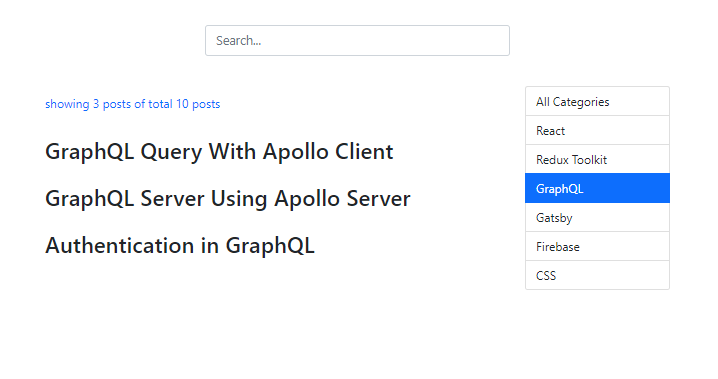

We will learn how to implement pagination, search and filter in a React application by building an app from scratch.

First, let’s take a tour of the application that we are going to build.

On the home page, we display a list of blog posts.


We can click on the ~~Previous~~ or ~~Next~~ links to go the previous or next page. We can also click on a page number to go to that specific page.


When we click on a category, blog posts that belong only to that category are displayed.



We can also search through the list of blog posts by their title. The search logic we will write will determine whether the titles of the blog posts contain the text that we type inside the search box and accordingly display the results.


### Prerequisite

In order to follow this tutorial, you must understand the fundamentals of Redux Toolkit - a library we will use to manage the global state of our application.

###### Learn the essential concepts of Redux Toolkit in my blog post [here](https://hemanta.io/redux-toolkit-concepts/).

### Techstack

For styling, we will primarily use Bootstrap classes and components. We will also use a few utility functions from a JavaScript library called ~~Lodash~~.

Ok, let’s get started.

Create a folder called ~~blog~~, open the folder in VS Code and create a React project inside the folder using the following command:

```sh
PS D:\blog> npx create-react-app .
```

We will install all the packages we need. Run the following command:

```sh
PS D:\blog> npm i @reduxjs/toolkit react-redux bootstrap lodash
```

Before we can use Bootstrap classes in our React components, we must import the Bootstrap minified CSS in our application’s entry point (~~index.js~~) above our ~~index.css~~ import.

```jsx:title=src/index.js {numberLines, 3}
import React from 'react';
import ReactDOM from 'react-dom';
import "bootstrap/dist/css/bootstrap.min.css";
import './index.css';
import App from './App';

ReactDOM.render(
  <React.StrictMode>
    <App />
  </React.StrictMode>,
  document.getElementById('root')
);
```

Next, we will set up our Redux store.

Inside the ~~src~~ folder, create a folder called ~~components~~, and inside the ~~components~~ folder, create a file called ~~blog-state.js~~ and add the following code snippet.

```jsx:title=src/components/blog-state.js {numberLines}
import { createSlice } from "@reduxjs/toolkit";

const initialState = {
  posts: [
    { id: 1, title: "An Introduction to React", category: "React" },
    {
      id: 2,
      title: "State Management With Redux Toolkit",
      category: "Redux Toolkit",
    },
    {
      id: 3,
      title: "The Complete Guide to React Hooks",
      category: "React",
    },
    {
      id: 4,
      title: "GraphQL Query With Apollo Client",
      category: "GraphQL",
    },
    {
      id: 5,
      title: "GraphQL Server Using Apollo Server",
      category: "GraphQL",
    },
    {
      id: 6,
      title: "Build a Coding Blog Using Gatsby",
      category: "Gatsby",
    },
    {
      id: 7,
      title: "Implement Algolia Search in a Gatsby Site",
      category: "Gatsby",
    },
    {
      id: 8,
      title: "An Introduction to Firestore Cloud Functions",
      category: "Firebase",
    },
    {
      id: 9,
      title: "Authentication in GraphQL",
      category: "GraphQL",
    },
    {
      id: 10,
      title: "A Complete Guide to Layout Using CSS Grid",
      category: "CSS",
    },
  ]
};

export const blogSlice = createSlice({
  name: "blog",
  initialState,
  reducers: {},
});

export default blogSlice.reducer;
```

> Above, we have hard-coded a list of blog posts. In the real world however, we would most likely fetch our blog posts by making HTTP requests to an API endpoint.

We will map through the list of blog posts and display them in our ~~Posts.js~~ component (_which we have not created yet_).

Next, we will import the blogSlice reducer in the ~~store.js~~ file.

In the ~~src~~ folder, create a file called ~~store.js~~ with the following code snippets.

```jsx:title=src/store.js {numberLines}
import { configureStore } from "@reduxjs/toolkit";
import blogSliceReducer from "../src/components/blog-state";

export const store = configureStore({
  reducer: {
    blog: blogSliceReducer,
  },
});
```

Here, we are essentially saying that ~~blogSliceReducer~~ will be responsible for managing the ~~blog~~ slice of our global state.

Next, we will make the Redux store available to all our React components by wrapping the root component (~~App.js~~) with the ~~Provider~~ component from ~~react-redux~~.

```jsx:title=src/index.js {numberLines, 6-7, 10-10, 12-12}
import React from 'react';
import ReactDOM from 'react-dom';
import "bootstrap/dist/css/bootstrap.min.css";
import './index.css';
import App from './App';
import { Provider } from "react-redux";
import { store } from "./store";

ReactDOM.render(
  <Provider store={store}>
    <App />
  </Provider>,
  document.getElementById('root')
);
```

Redux store set up is complete.

Now, we will create a ~~Posts.js~~ component, from where we will access the ~~posts~~ array in the Redux store by using the ~~useSelector~~ hook from ~~react-redux~~. Then, we will map through the posts array and display a list of blog post titles.

In the ~~components~~ folder, create a file called ~~Posts.js~~.

```jsx:title=src/components/Posts.js {numberLines}
import React from "react";
import { useSelector } from "react-redux";

const Posts = () => {

const { posts } = useSelector((state) => state.blog);

return (
    <>
        <p>
            showing {posts.length} posts of total {posts.length} posts
        </p>
        <div>
          {posts.map((post) => (
            <article key={post.id}>
              <h2> {post.title}</h2>
            </article>
          ))}
        </div>
    </>
  );
};

export default Posts;
```

Next, we will render the ~~Posts~~ component inside the ~~App~~ component.

Update the ~~App.js~~ file as follows:

```jsx:title=src/App.js {numberLines}
import React from 'react'
import Posts from './components/Posts'


const App = () => {
  return (
    <div className="container">
      <div className="row justify-content-center">
        <div className="title col-md-6">
          <Posts />
        </div>
      </div>
    </div>
  )
}

export default App
```

Before we start our application, we will add the following rules in our ~~index.css~~ file.

```css:title=src/index.css {numberLines}
* {
  padding: 0;
  margin: 0;
  box-sizing: border-box;
}

html {
  font-size: 62.5%;
  font-family: sans-serif;
}

.container {
  margin-top: 3rem;
}

.title {
  display: flex;
  flex-direction: column;
  justify-content: space-around;
  align-items: flex-start;
}

p {
  color: #0d6efd;
  font-size: 1.2rem;
}
```

Start the application using the command ~~npm start~~. We have the following result:


Every blog post belongs to a specific category. It would be great if we could filter through the blog posts that belong to a specific category by clicking on the category names.

To do this, we need to render a list of categories. So, we will create a ~~Categories~~ component where we will map through the ~~posts~~ array in the Redux store and display a list of categories. Note that every blog post has a key called ~~category~~.

Inside the ~~src~~ folder, create a file called ~~Categories.js~~.

```jsx:title=src/components/Categories.js {numberLines}
import React from "react";
import { useSelector } from "react-redux";

const Categories = () => {

const { posts } = useSelector((state) => state.blog);

  return (
    <ul className="list-group">
      {posts.map((post) => (
        <li
          key={post.id}
          className="list-group-item"
        >
          {post.category}
        </li>
      ))}
    </ul>
  );
};

export default Categories;
```

Let’s now render the ~~Categories~~ component in the ~~App~~ component.

Add the highlighted code snippets in ~~App.js~~.

```jsx:title=src/App.js {numberLines, 3-3, 12-14}
import React from 'react'
import Posts from './components/Posts'
import Categories from './components/Categories'

const App = () => {
  return (
    <div className="container">
      <div className="row justify-content-center">
        <div className="title col-md-6">
          <Posts />
        </div>
        <div className="category col-md-2">
          <Categories />
        </div>
      </div>
    </div>
  )
}

export default App
```

Add the following CSS rules in the ~~index.css~~ file.

```css:title=src/index.css {numberLines: 27}

/* Rest of the code */

.category ul li {
  font-size: 1.2rem;
  cursor: pointer;
}
```

We have successfully rendered our blog post categories.


But we have a problem: because multiple blog posts can belong to a single category, we have duplicates in the category list. We can remove the duplicates by using the ~~Set~~ object in JavaScript.

###### Learn how to remove duplicate values in an array using Set in JavaScript in my blog post [here](https://hemanta.io/remove-duplicate-values-in-an-array-using-set-in-javascript/).

Update the ~~Categories.js~~ file as follows:

```jsx:title=src/components/Categories.js {numberLines, 8-10, 14-21}
import React from "react";
import { useSelector } from "react-redux";

const Categories = () => {

const { posts } = useSelector((state) => state.blog);

const categories = [];
posts.map(post => categories.push(post.category))
const categoriesFinal = ["All Categories", ...new Set(categories)];

  return (
    <ul className="list-group">
      {categoriesFinal.map((category) => (
        <li
          key={category}
          className="list-group-item"
        >
          {category}
        </li>
      ))}
    </ul>
  );
};

export default Categories;
```

On line 10, I have manually added a category called ~~All Categories~~ in the ~~categoriesFinal~~ array. We have added this category so that when we click on it, we display our complete blog post list.

Now our category list only contains unique values.


Now that we have rendered our list of blog posts and the categories they belong to, we should be able to filter our blog posts by category names. Clicking on a category name should display only those blog posts that belong to that category.

We will implement the filter feature using the following logic:

- In the ~~Categories.js~~ file, we will attach ~~onClick~~ event listeners to our category list items. We will track the click state (_whether we have clicked on a category or not_) inside a variable called ~~filter~~, which we will store as a local state in the ~~App.js~~ component using the ~~useState~~ hook.

- When we click on any category name except the ~~All Categories~~ category, we will dispatch an action object to our Redux store. The action object will hold the category name as the value of its key called ~~payload~~. Then, we will create a reducer function named ~~filterPosts~~, which will filter the list of blog posts based on the category name we clicked and save the filtered list of posts as the value of the ~~filteredPosts~~ key in the ~~initialState~~ object. So, our Redux store will hold both the total list of blog posts and the filtered list of blog posts against two separate keys: ~~posts~~ and ~~filteredPosts~~ respectively.

- Next, in the ~~Posts.js~~ component, we will access the ~~filteredPosts~~ array. Whether we display the blog posts by mapping through the ~~posts~~ array or ~~filteredPosts~~ array will depend on the value of the ~~filter~~ variable.

- If ~~filter~~ is truthy (_meaning we have clicked on a category_), we will map through the ~~filteredPosts~~ array and display the list of posts that belong to the category we clicked. If ~~filter~~ is falsy (_which is its default value_), we will map through the ~~posts~~ array and display the list of all blog posts.

- The ~~filter~~ variable is where we are storing the state of the click event. So, we will pass the ~~filter~~ prop to the ~~Posts.js~~ component that we have rendered in the ~~App~~ component. Then, in the ~~Posts~~ component we will access the ~~filter~~ prop and use its value to conditionally render a list of blog posts.

- We will store reference to the category that we clicked on in a variable called ~~currentCategory~~, as local state in the ~~App.js~~ component. We will pass ~~currentCategory~~ as a prop to the ~~Categories~~ component rendered inside the ~~App~~ component. Then inside the ~~Categories~~ component, we will use the value of ~~currentCategory~~ prop to dynamically add class names to the category list items. When the value of ~~currentCategory~~ is equal to the category that we clicked on, we add a class named ~~active~~, which results in a blue background of the currently selected category.

Add the highlighted code snippets in the respective files.

```jsx:title=src/App.js {numberLines, 1-1, 4-5, 8-21, 27-27, 31-32}
import React, { useState } from "react";
import Posts from "./components/Posts";
import Categories from "./components/Categories";
import { useDispatch } from "react-redux";
import { filterPosts } from "./components/blog-state";

const App = () => {
  const [filter, setFilter] = useState(false);
  const [currentCategory, setCurrentCategory] = useState("");

  const dispatch = useDispatch();

  const categoryChangeHandler = (category) => {
    setCurrentCategory(category);
    if (category === "All Categories") {
      setFilter(false);
    } else {
      dispatch(filterPosts(category));
      setFilter(true);
    }
  };

  return (
    <div className="container">
      <div className="row justify-content-center">
        <div className="title col-md-6">
          <Posts filter={filter} />
        </div>
        <div className="category col-md-2">
          <Categories
            currentCategory={currentCategory}
            categoryChangeHandler={categoryChangeHandler}
          />
        </div>
      </div>
    </div>
  );
};

export default App;
```

```jsx:title=src/components/Posts.js {numberLines, 4-6, 10-13, 15-26}
import React from "react";
import { useSelector } from "react-redux";

const Posts = ({ filter }) => {
  const { posts } = useSelector((state) => state.blog);
  const { filteredPosts } = useSelector((state) => state.blog);

  return (
    <>
      <p>
        showing {filter ? filteredPosts.length : posts.length} posts of total{" "}
        {posts.length} posts
      </p>
      <div>
        {!filter &&
          posts.map((post) => (
            <article key={post.id}>
              <h2> {post.title}</h2>
            </article>
          ))}
        {filter &&
          filteredPosts.map((post) => (
            <article key={post.id}>
              <h2> {post.title}</h2>
            </article>
          ))}
      </div>
    </>
  );
};

export default Posts;
```

```jsx:title=src/components/Categories.js {numberLines, 4-4, 14-22}
import React from "react";
import { useSelector } from "react-redux";

const Categories = ({ currentCategory, categoryChangeHandler }) => {
  const { posts } = useSelector((state) => state.blog);

  const categories = [];
  posts.map((post) => categories.push(post.category));
  const categoriesFinal = ["All Categories", ...new Set(categories)];

  return (
    <ul className="list-group">
      {categoriesFinal.map((category) => (
        <li
          key={category}
          className={
            category === currentCategory
              ? "list-group-item active"
              : "list-group-item"
          }
          onClick={() => categoryChangeHandler(category)}
        >
          {category}
        </li>
      ))}
    </ul>
  );
};

export default Categories;

```

```jsx:title=src/components/blog-state.js {numberLines, 53-53, 60-64, 68-68}
import { createSlice } from "@reduxjs/toolkit";

const initialState = {
  posts: [
    { id: 1, title: "An Introduction to React", category: "React" },
    {
      id: 2,
      title: "State Management With Redux Toolkit",
      category: "Redux Toolkit",
    },
    {
      id: 3,
      title: "The Complete Guide to React Hooks",
      category: "React",
    },
    {
      id: 4,
      title: "GraphQL Query With Apollo Client",
      category: "GraphQL",
    },
    {
      id: 5,
      title: "GraphQL Server Using Apollo Server",
      category: "GraphQL",
    },
    {
      id: 6,
      title: "Build a Coding Blog Using Gatsby",
      category: "Gatsby",
    },
    {
      id: 7,
      title: "Implement Algolia Search in a Gatsby Site",
      category: "Gatsby",
    },
    {
      id: 8,
      title: "An Introduction to Firestore Cloud Functions",
      category: "Firebase",
    },
    {
      id: 9,
      title: "Authentication in GraphQL",
      category: "GraphQL",
    },
    {
      id: 10,
      title: "A Complete Guide to Layout Using CSS Grid",
      category: "CSS",
    },
  ],

  filteredPosts: [],
};

export const blogSlice = createSlice({
  name: "blog",
  initialState,
  reducers: {
    filterPosts(state, action) {
      state.filteredPosts = state.posts.filter(
        (post) => post.category === action.payload
      );
    },
  },
});

export const { filterPosts } = blogSlice.actions;

export default blogSlice.reducer;
```

Now, if we click on a category, we display only the blog posts that belong to that category. And when we click on ~~All Categories~~, we change the value of the ~~filter~~ variable to ~~false~~ and render a list of all blog posts.


Our implementation of the filter feature is complete.

In [part-2](https://hemanta.io/implement-pagination-search-and-filter-in-a-react-app-part-2/), we will implement the search functionality.
