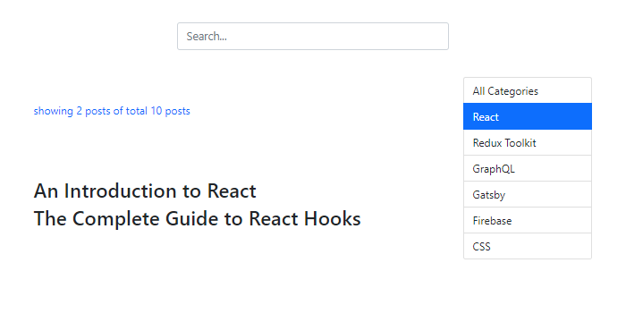
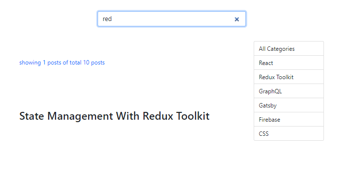
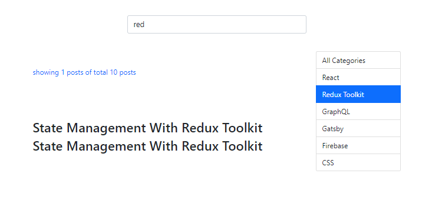

###### This blog post is part of a series. You must complete [part-1](https://hemanta.io/implement-pagination-search-and-filter-in-a-react-app-part-1/) before continuing here.

In part-1, we implemented a filter functionality in our application wherein we were able to filter through our list of blog posts and display the filtered posts by clicking on the names of blog post categories.

In this part, we will add search functionality. Before we work on the search logic, let’s first add a search bar.

In the ~~components~~ folder, create a file called ~~SearchBar.js~~ and add the following code snippets.

```jsx:title=src/components/SearchBar.js {numberLines}
import React from "react"

const SearchBar = () => {
  return (
    <div className="col-md-4">
      <input
        type="search"
        className="form-control form-control-lg"
        placeholder="Search..."
      />
    </div>
  )
}

export default SearchBar
```

Now render the ~~SearchBar~~ component inside the ~~App~~ component.

```jsx:title=src/App.js {numberLines, 6-6, 26-28}
import React, { useState } from "react";
import Posts from "./components/Posts";
import Categories from "./components/Categories";
import { useDispatch } from "react-redux";
import { filterPosts } from "./components/blog-state";
import SearchBar from "./components/SearchBar";

const App = () => {
  const [filter, setFilter] = useState(false);
  const [currentCategory, setCurrentCategory] = useState("");

  const dispatch = useDispatch();

  const categoryChangeHandler = (category) => {
    setCurrentCategory(category);
    if (category === "All Categories") {
      setFilter(false);
    } else {
      dispatch(filterPosts(category));
      setFilter(true);
    }
  };

  return (
    <div className="container">
      <div className="row row-one justify-content-center">
        <SearchBar />
      </div>
      <div className="row justify-content-center">
        <div className="title col-md-6">
          <Posts filter={filter} />
        </div>
        <div className="category col-md-2">
          <Categories
            currentCategory={currentCategory}
            categoryChangeHandler={categoryChangeHandler}
          />
        </div>
      </div>
    </div>
  );
};
export default App;
```

Add the following code snippets in ~~index.css~~.

```css:title=src/index.css {numberLines, 4-6}

/* rest of the code */

.row-one {
margin-bottom: 3rem;
}

/* rest of the code */

```

And we have the following result:



We have the search bar but without any functionality.

To add the search functionality, we will go through the following steps:

- In the ~~App~~ component, we will keep track of the search query inside a variable called ~~searchQuery~~, which we will create using the ~~useState()~~ hook.

- The default value of ~~searchQuery~~ will be an empty string. Whenever we will type something in the search bar, the ~~onChange~~ event handler called ~~searchChangeHandler~~ will be triggered and inside the ~~searchChangeHandler~~ function, we will use the ~~setSearchQuery~~ function to update the value of the ~~searchQuery~~ variable. We will also set the value of the ~~filter~~ variable to ~~false~~ and the value of the ~~currentCatgory~~ to an empty string.
- We will pass a ~~searchQuery~~ prop to the ~~Posts~~ component, which is responsible for displaying different lists of blog posts based on the value of the ~~filter~~ variable. In the ~~Posts~~ component, we will create another list of blog posts inside the ~~searchResult~~ array only when the ~~searchQuery~~ variable is truthy. The ~~searchResult~~ array will contain only those blog posts whose titles contain the characters of our search query.

- Then we will make slight adjustments to the conditional rendering logic of the ~~posts~~ array. Now, we will map through the ~~posts~~ array only when both the ~~filter~~ and the ~~searchQuery~~ variables are falsy.

Add the highlighted code snippets in the respective components.

```jsx:title=src/SearcBar.js {numberLines, 3-3, 8-8, 11-11}
import React from "react";

const SearchBar = ({ value, onChange }) => {
  return (
    <div className="col-md-4">
      <input
        type="search"
        value={value}
        className="form-control form-control-lg"
        placeholder="Search..."
        onChange={(e) => onChange(e.target.value)}
      />
    </div>
  );
};

export default SearchBar;
```

```jsx:title=src/App.js {numberLines, 11-11, 25-29, 34-34, 38-38}
import React, { useState } from "react";
import Posts from "./components/Posts";
import Categories from "./components/Categories";
import { useDispatch } from "react-redux";
import { filterPosts } from "./components/blog-state";
import SearchBar from "./components/SearchBar";

const App = () => {
  const [filter, setFilter] = useState(false);
  const [currentCategory, setCurrentCategory] = useState("");
  const [searchQuery, setSearchQuery] = useState("");

  const dispatch = useDispatch();

  const categoryChangeHandler = (category) => {
    setCurrentCategory(category);
    if (category === "All Categories") {
      setFilter(false);
    } else {
      dispatch(filterPosts(category));
      setFilter(true);
    }
  };

  const searchChangeHandler = (query) => {
    setCurrentCategory("");
    setFilter(false);
    setSearchQuery(query);
  };

  return (
    <div className="container">
      <div className="row row-one justify-content-center">
        <SearchBar value={searchQuery} onChange={searchChangeHandler} />
      </div>
      <div className="row justify-content-center">
        <div className="title col-md-6">
          <Posts filter={filter} searchQuery={searchQuery} />
        </div>
        <div className="category col-md-2">
          <Categories
            currentCategory={currentCategory}
            categoryChangeHandler={categoryChangeHandler}
          />
        </div>
      </div>
    </div>
  );
};

export default App;
```

```jsx:title=src/components/Posts.js {numberLines, 4-4, 8-14, 18-26, 28-34, 41-46}
import React from "react";
import { useSelector } from "react-redux";

const Posts = ({ filter, searchQuery }) => {
  const { posts } = useSelector((state) => state.blog);
  const { filteredPosts } = useSelector((state) => state.blog);

  let searchResult;

  if (searchQuery) {
    searchResult = posts.filter((post) =>
      post.title.toLowerCase().includes(searchQuery.toLowerCase())
    );
  }

  return (
    <>
      <p>
        showing{" "}
        {filter
          ? filteredPosts.length
          : searchQuery
          ? searchResult.length
          : posts.length}{" "}
        posts of total {posts.length} posts
      </p>
      <div>
        {!filter &&
          !searchQuery &&
          posts.map((post) => (
            <article key={post.id}>
              <h2> {post.title}</h2>
            </article>
          ))}
        {filter &&
          filteredPosts.map((post) => (
            <article key={post.id}>
              <h2> {post.title}</h2>
            </article>
          ))}
        {searchQuery &&
          searchResult.map((post) => (
            <article key={post.id}>
              <h2> {post.title}</h2>
            </article>
          ))}
      </div>
    </>
  );
};

export default Posts;
```

Now let’s type ~~red~~ in the search bar. We get the posts that are relevant to our query.



The search functionality is working. However, there is one minor issue we must fix.

Let's understand the issue that I am talking about.

Make sure that you have typed ~~red~~ in the search bar. Our search query returns one blog post, as shown above. Then click on the category named ~~Redux Toolkit~~. We now have two blog posts - one from our search query and the other from the category filter.



However, this is not the behaviour we want. We want only the result of our category filter. We can fix this issue by setting the value of the ~~searchQuery~~ variable to an empty string inside the ~~categoryChangeHandler~~ function inside the ~~App~~ component.

Add the highlighted code snippet in the ~~App.js~~ file.

```jsx:title=src/App.js {numberLines, 20}
import React, { useState } from "react";
import Posts from "./components/Posts";
import Categories from "./components/Categories";
import { useDispatch } from "react-redux";
import { filterPosts } from "./components/blog-state";
import SearchBar from "./components/SearchBar";

const App = () => {
  const [filter, setFilter] = useState(false);
  const [currentCategory, setCurrentCategory] = useState("");
  const [searchQuery, setSearchQuery] = useState("");

  const dispatch = useDispatch();

  const categoryChangeHandler = (category) => {
    setCurrentCategory(category);
    if (category === "All Categories") {
      setFilter(false);
    } else {
      setSearchQuery(" ");
      dispatch(filterPosts(category));
      setFilter(true);
    }
  };

  const searchChangeHandler = (query) => {
    setCurrentCategory("");
    setFilter(false);
    setSearchQuery(query);
  };

  return (
    <div className="container">
      <div className="row row-one justify-content-center">
        <SearchBar value={searchQuery} onChange={searchChangeHandler} />
      </div>
      <div className="row justify-content-center">
        <div className="title col-md-6">
          <Posts filter={filter} searchQuery={searchQuery} />
        </div>
        <div className="category col-md-2">
          <Categories
            currentCategory={currentCategory}
            categoryChangeHandler={categoryChangeHandler}
          />
        </div>
      </div>
    </div>
  );
};

export default App;
```

We have fixed the issue and the implementation of our search feature is complete.

In [part-3](https://hemanta.io/implement-pagination-search-and-filter-in-a-react-app-part-3/), we will add pagination.
