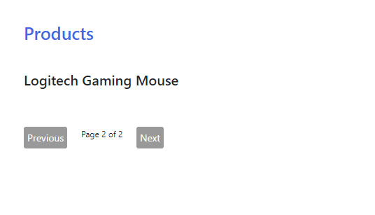
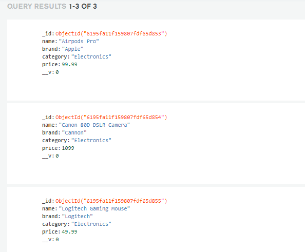

```toc

```

###### Learn to implement search, filter and client-side pagination in a React application in my blog post [here](https://hemanta.io/implement-pagination-search-and-filter-in-a-react-app-part-1/).

In client-side pagination, we fetch all the records from a database and use JavaScript on the client to paginate the data. The time the for initial page load might be longer (depending on the size of the data), but subsequent page navigation is instantaneous.

In server-side pagination, on the other hand, we set a limit to the number of records that we fetch from the database on the initial page load. This means that the initial page load is faster, but every time we navigate to a different page, we make a new HTTP request to the server. There are solutions available to overcome this problem. There are some state management libraries (React Query for example) that handle caching out-of-the-box with zero configuration.

###### Learn how to fetch data using React Query in my blog post [here](https://hemanta.io/react-query-a-guide-to-fetching-data/).

So, the question of whether you should use client-side or server-side pagination really depends on the size of the dataset and the type of application that you are building. The research that I did on the internet reveals that server-side pagination is more scalable. In my opinion, the best way to find out is by stumbling into issues while building increasingly complex applications on your own.

Below, I have provided the code snippets that you can copy and paste to build the following application:






> Note that I have only three records in my database

Before you copy and paste the code snippets, you need to have the following two requirements already fulfilled.

- First, you should have a full-stack application structure ready as described in my blog post [here](https://hemanta.io/implement-user-authentication-and-authorization-in-a-mern-stack-application-part-2/).

- And second, you should have a free-tier MongoDB Atlas cloud database seeded with some sample data. You can learn how to register for a MongoDB Atlas account in my blog post [here](https://hemanta.io/implement-jwt-based-user-authentication-in-a-mern-stack-app-part-6/). You can learn how to seed a database with some sample data using a seeder script in my blog post [here](https://hemanta.io/import-sample-data-to-a-mongodb-database/).

Once you have taken care of the aforementioned requirements, you should have no problem copying and pasting the following code snippets in their respective files.

### server/index.js

```js:title=server/index.js {numberLines}
const express = require("express");
const dotenv = require("dotenv");
const connectDB = require("./config/db");
const colors = require("colors");
const productRoutes = require("./routes/productRoutes");

dotenv.config();

connectDB();

const app = express();

app.use(express.json());

app.use(productRoutes);

const PORT = 5000;

app.listen(PORT, () => {
  console.log(`Server listening on port ${PORT}`.bgBrightBlue.black);
});
```

### server/routes/productRoutes.js

```js:title=server/routes/productRoutes.js {numberLines}
const express = require("express");
const Product = require("../models/productModel");

const router = express.Router();

router.post("/products", async (req, res) => {
  const { pageNumber } = req.body;
  const pageSize = 2;
  const productCount = await Product.countDocuments({});
  const pageCount = Math.ceil(productCount / pageSize);

  const products = await Product.find({})
    .limit(2)
    .skip(pageSize * (pageNumber - 1));

  res.json({ products, pageCount });
});

module.exports = router;
```

###### Learn about the ~~countDocuments()~~ function in my blog post [here](https://hemanta.io/mongodb-countdocuments/).

###### Learn about limiting and skipping documents in MongoDB in my blog post [here](https://hemanta.io/limiting-and-skipping-documents-in-mongodb/).

**LINE-7**: ~~pageNumber~~ is sent from the client side. Let’s say a user is on page 1. The user then clicks on the ~~Next~~ button to go to page 2. The route handler responsible for the ~~/products~~ route needs to know the page number, so that it can calculate the no. of records to skip (line 14) while sending the response to the client.

**LINE-8**: ~~pageSize~~ is the number of products that we want to display on a single page and is configurable.

**LINE-10**: Notice that we have used ~~Math.ceil()~~ to calculate the total number of pages. In order to understand why we need to use ~~Math.ceil()~~, consider the following example:

Let’s say we have 3 products in the database and we have decided to display 2 products per page. So, the total number of pages we are going to have is 1.5 (3 / 2), which is not a whole number. Because we can’t have a page number in fractional value, we must round up the number to the next largest integer using ~~Math.ceil()~~.

### server/models/productModel.js

```js:title=server/models/productModel.js {numberLines}
const mongoose = require("mongoose");

const productSchema = new mongoose.Schema({
  name: {
    type: String,
    required: true,
  },
  brand: {
    type: String,
    required: true,
  },
  category: {
    type: String,
    required: true,
  },
  price: {
    type: Number,
    required: true,
  },
});

const Product = mongoose.model("Product", productSchema);

module.exports = Product;
```

### server/config/db.js

```js:title=server/config/db.js {numberLines}
const mongoose = require("mongoose");
const dotenv = require("dotenv");

dotenv.config();

const connectDB = async () => {
  try {
    const conn = await mongoose.connect(process.env.MONGO_URI, {
      useNewUrlParser: true,
      useUnifiedTopology: true,
    });

    console.log(`MongoDB connected: ${conn.connection.host}}`);
  } catch (error) {
    console.error(`Error: ${error.message}`);
    process.exit(1);
  }
};

module.exports = connectDB;
```

### pagination/.env

```sh:title=pagination/.env {numberLines}
PORT = 5000
MONGO_URI = mongodb+srv://hemanta:<password>@dataseeder.711fy.mongodb.net/<Database>?retryWrites=true&w=majority
```

### client/src/index.js

```js:title=client/src/index.js {numberLines}
import React from "react";
import ReactDOM from "react-dom";
import "bootstrap/dist/css/bootstrap.min.css";
import "./index.css";
import App from "./App";
import { Provider } from "react-redux";
import store from "./store";
import reportWebVitals from "./reportWebVitals";

ReactDOM.render(
  <Provider store={store}>
    <App />
  </Provider>,
  document.getElementById("root")
);

reportWebVitals();
```

### client/src/App.js

```js:title=client/src/App.js {numberLines, 10-11}
import React, { useState, useEffect } from "react";
import { useSelector, useDispatch } from "react-redux";
import { fetchProducts } from "./stateSlices/productsSlice";

const App = () => {
  const [pageNumber, setPageNumber] = useState(1);
  const dispatch = useDispatch();

  useEffect(() => {
    dispatch(fetchProducts({ pageNumber }));
  }, [dispatch, pageNumber]);

  const { status, error, products, pageCount } = useSelector(
    (state) => state.products
  );

  const previousPageHandler = () => {
    setPageNumber((pageNumber) => pageNumber - 1);
  };

  const nextPageHandler = () => {
    setPageNumber((pageNumber) => pageNumber + 1);
  };

  return (
    <div className="parent">
      <h1>Products</h1>
      {status === "loading" ? (
        "Loading..."
      ) : error ? (
        <h2>{error}</h2>
      ) : (
        products.map((product) => <h2 key={product.name}>{product.name}</h2>)
      )}

      <div className="btn-container">
        <button onClick={previousPageHandler} disabled={pageNumber === 1}>
          Previous
        </button>
        <p>
          Page {pageNumber} of {pageCount}
        </p>

        <button onClick={nextPageHandler} disabled={pageNumber === pageCount}>
          Next
        </button>
      </div>
    </div>
  );
};
export default App;
```

Whenever, the page number changes, we make a POST request to the ~~/products~~ route to fetch the products for that specific page.

### client.src/stateLices/productsSlice.js

```js:title=client/src/stateSlices/productsSlice.js {numberLines, 13-13, 15-15}
import { createSlice, createAsyncThunk } from "@reduxjs/toolkit";
import axios from "axios";

const initialState = {
  status: "idle",
  products: [],
  pageCount: null,
  error: null,
};

export const fetchProducts = createAsyncThunk(
  "products/fetchProducts",
  async ({ pageNumber }, { rejectWithValue }) => {
    try {
      const { data } = await axios.post("/products", { pageNumber });
      return data;
    } catch (error) {
      rejectWithValue(error.repsonse.data);
    }
  }
);
const productsSlice = createSlice({
  name: "products",
  initialState,
  reducers: {},
  extraReducers: {
    [fetchProducts.pending]: (state, action) => {
      state.status = "loading";
    },
    [fetchProducts.fulfilled]: (state, action) => {
      state.status = "succeeded";
      const { products, pageCount } = action.payload;
      state.products = [...products];
      state.pageCount = pageCount;
    },
    [fetchProducts.rejected]: (state, action) => {
      state.status = "failed";
      state.error = action.payload.message;
    },
  },
});
export default productsSlice.reducer;
```

We send the ~~pageNumber~~ in the request body while making a POST request to the ~~/products~~ route.

### client/src/store.js

```js:title=client/src/store.js {numberLines}
import { configureStore } from "@reduxjs/toolkit";
import productsReducer from "./stateSlices/productsSlice";

export default configureStore({
  reducer: {
    products: productsReducer,
  },
});
```

### client/src/setupProxy.js

```js:title=client/src/setupProxy.js {numberLines}
const { createProxyMiddleware } = require("http-proxy-middleware");

module.exports = function (app) {
  app.use(
    ["/products"],
    createProxyMiddleware({
      target: "http://localhost:5000",
    })
  );
};
```

### client/src/index.css

```css:title=client/src/index.css {numberLines}
* {
  padding: 0;
  margin: 0;
  box-sizing: border-box;
}

html {
  font-size: 10px;
  font-family: sans-serif;
}

.parent {
  margin: 4rem;
}

h1 {
  margin-bottom: 4rem;
  color: royalblue;
}

p {
  font-size: 1.2rem;
}

.btn-container {
  width: 20rem;
  height: 6rem;
  margin-top: 4rem;
  display: flex;
  justify-content: space-between;
  align-items: center;
}

button {
  background-color: #999;
  border: none;
  border-radius: 0.3rem;
  padding: 0.5rem;
  color: white;
  font-size: 1.4rem;
  cursor: pointer;
}
```
