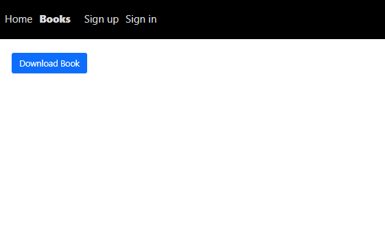
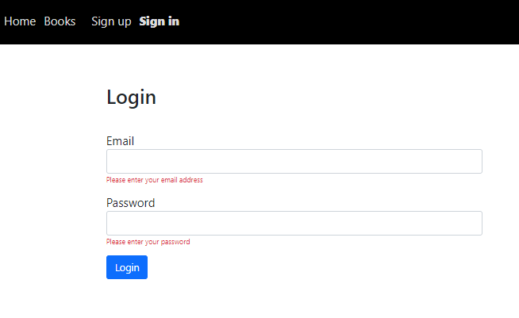
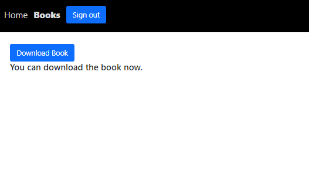
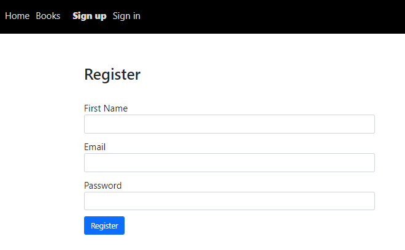
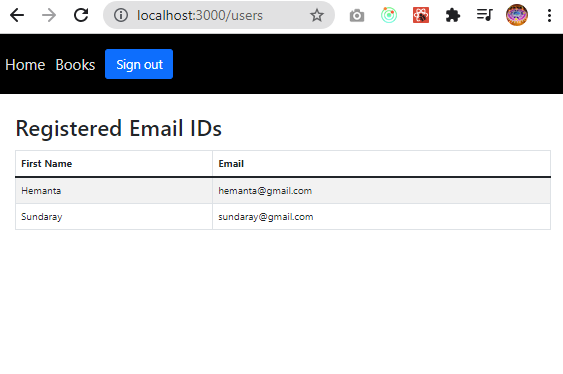
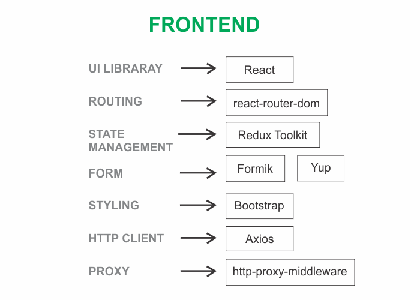
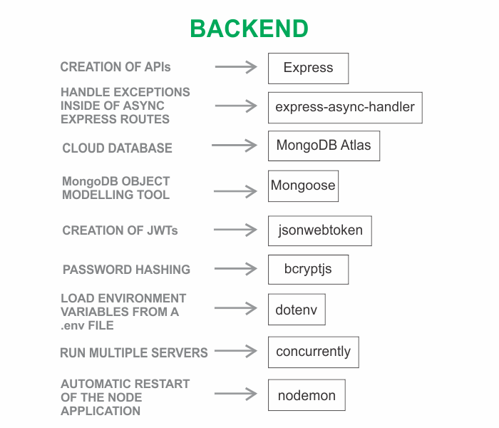

```toc

```

### Application preview

We will learn how to implement user authentication and authorization by building a MERN stack application from scratch.

Here is the preview of the application that we are going to build.

The ~~Books~~ page displays a ~~Download Book~~ button.



If you are not logged in, clicking on the button will redirect you to the ~~Signin~~ page.



After you sign in, clicking on the ~~Download Book~~ button will display the text ~~You can download the book now.~~



A first-time user of the application can sign up using the Sign up form.



Also, a logged in user having ~~admin~~ privileges can access the ~~/users~~ route, which displays a list of registered users.



Finally, you can sign out of the application by clicking on the ~~Sign out~~ button.

### Tech stack

We will build the application using the following tech stack:





Continue to [part-2](https://hemanta.io/implement-user-authentication-and-authorization-in-a-mern-stack-application-part-2/)
