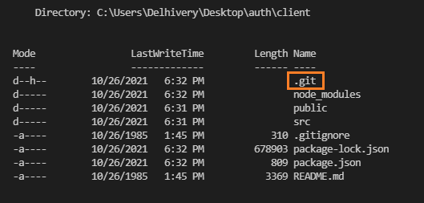
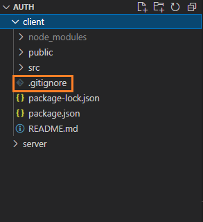
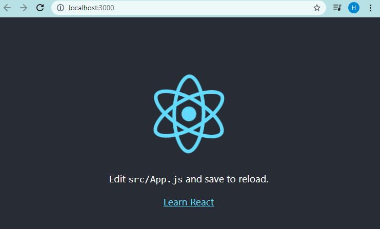
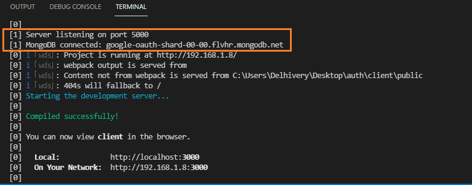

```toc

```

###### This blog post is part of a series. You must complete [part-1](https://hemanta.io/implement-user-authentication-and-authorization-in-a-mern-stack-application-part-1/) before continuing here.

Create a folder named ~~auth~~ and open it in Visual Studio Code.

Inside ~~auth~~, create a React project called ~~client~~.

```sh
PS C:\Users\Delhivery\Desktop\auth> npx create-react-app client
```

Next, inside ~~auth~~, create a folder named ~~server~~.

```sh
PS C:\Users\Delhivery\Desktop\auth> mkdir server
```

Currently, we have two folders - ~~client~~ and ~~server~~ - inside ~~auth~~. What’s more, ~~create-react-app~~ has already initialized the ~~client~~ folder as a Git repository by default.

~~cd~~ into the ~~client~~ folder and you can see the ~~.git~~ sub-folder (_hidden_) using the following command:

```sh
PS C:\Users\Delhivery\Desktop\auth\client> ls -Fo
```



Notice that we have a ~~.gitignore~~ file inside the ~~client~~ folder.



We are building a full-stack application, so we will initialize the ~~auth~~ folder as a Git repository, not the ~~client~~ folder. Uninitialize the ~~client~~ folder by removing the ~~.git~~ sub-folder using the following command:

```sh
PS C:\Users\Delhivery\Desktop\auth\client> rm ./.git -Force
```

After executing the command above, you will receive the following prompt:

```sh
Confirm
The item at C:\Users\Delhivery\Desktop\auth\client\.git has children and the Recurse parameter was not specified. If you continue, all
children will be removed with the item. Are you sure you want to continue?
[Y] Yes  [A] Yes to All  [N] No  [L] No to All  [S] Suspend  [?] Help (default is "Y"): Y
```

Type ~~Y~~ and hit ~~enter~~. This will remove the ~~.git~~ sub-directory.

Next, move the ~~.gitignore~~ file from the ~~client~~ folder to the ~~auth~~ folder.

Inside the ~~.gitignore~~ file, change ~~/node_modules~~ to ~~\*\*/node_modules~~. This will ensure that the ~~node_modules~~ folder in the current folder and all the sub-folders will be ignored.

```sh:title=auth/.gitignore {numberLines, 4-4}
# See https://help.github.com/articles/ignoring-files/ for more about ignoring files.

# dependencies
**/node_modules
/.pnp
.pnp.js

# testing
/coverage

# production
/build

# misc
.DS_Store
.env.local
.env.development.local
.env.test.local
.env.production.local

npm-debug.log*
yarn-debug.log*
yarn-error.log*
```

Now, we will generate a ~~package.json~~ file inside the ~~auth~~ folder using the following command:

```sh
PS C:\Users\Delhivery\Desktop\auth> npm init -y
```

We will also initialize the ~~auth~~ folder as a Git repository.

```sh {numberLines}
PS C:\Users\Delhivery\Desktop\auth> git init
Initialized empty Git repository in C:/Users/Delhivery/Desktop/auth/.git/
```

Our application structure is now ready.

Next, we will install all the libraries that we need for our application.

~~cd~~ into the ~~client~~ folder and install the following libraries:

```sh
PS C:\Users\Delhivery\Desktop\auth\client> npm i react-router-dom @reduxjs/toolkit react-redux axios formik yup bootstrap http-proxy-middleware
```

Next, ~~cd~~ into the ~~auth~~ folder and install the following libraries:

```sh
PS C:\Users\Delhivery\Desktop\auth> npm i express mongoose concurrently jsonwebtoken bcryptjs dotenv express-async-handler
```

Now, we will install the ~~nodemon~~ library as a development dependency.

```sh
PS C:\Users\Delhivery\Desktop\auth> npm i nodemon --save-dev
```

Next, update the ~~package.json~~ file as shown below:

```sh:title=auth/package.json {numberLines, 7-9}
{
  "name": "auth",
  "version": "1.0.0",
  "description": "",
  "main": "index.js",
  "scripts": {
    "client": "npm run start --prefix client",
   "server": "nodemon server/index.js",
   "dev": "concurrently \"npm run client\" \"npm run server\""
  },
  "keywords": [],
  "author": "",
  "license": "ISC",
  "dependencies": {
    "bcryptjs": "^2.4.3",
    "concurrently": "^6.3.0",
    "dotenv": "^10.0.0",
    "express": "^4.17.1",
    "express-async-handler": "^1.2.0",
    "jsonwebtoken": "^8.5.1",
    "mongoose": "^6.0.12"
  },
  "devDependencies": {
    "nodemon": "^2.0.14"
  }
}
```

### Setting up a web server using Express

Inside the ~~server~~ folder, create a file named ~~index.js~~ and paste the following code snippet:

```js:title=server/index.js {numberLines}
const express = require("express");
const connectDB = require("./config/db");
const dotenv = require("dotenv");

dotenv.config();

connectDB();

const app = express();

app.use(express.json());

const PORT = process.env.PORT || 5000;

app.listen(PORT, () => {
  console.log(`Server listening on port ${PORT}`);
});
```

Create a ~~.env~~ file in the ~~auth~~ folder. In the ~~.env~~ file, paste the connection string that you copied from MongoDB Atlas as the value of the key ~~MONGO_URI~~.

```sh
MONGO_URI=mongodb+srv://sundaray:<password>@sandbox.y8blv.mongodb.net/myFirstDatabase?retryWrites=true&w=majority
```

Replace \<password> with the password that you have set for the database user and replace ~~myFirstDatabase~~ with the name of your database.

###### Learn how to create a free MongoDB Atlas account and find the connection string in my blog post [here](https://hemanta.io/implement-jwt-based-user-authentication-in-a-mern-stack-app-part-6/) and [here](https://hemanta.io/implement-jwt-based-user-authentication-in-a-mern-stack-app-part-7/) respectively.

Also, add the ~~PORT~~ environment variable in the ~~.env~~ file.

```sh:title=auth/.env {numberLines, 1-1}
PORT=5000
MONGO_URI=mongodb+srv://sundaray:<password>@sandbox.y8blv.mongodb.net/myFirstDatabase?retryWrites=true&w=majority
```

We don’t want to expose the secret environment variables contained inside the ~~.env~~ file to the outside world. So, we will add the ~~.env~~ file in the ~~.gitignore~~ file.

```sh:title=auth/.gitignore {numberLines, 15-15}
# See https://help.github.com/articles/ignoring-files/ for more about ignoring files.

# dependencies
**/node_modules
/.pnp
.pnp.js

# testing
/coverage

# production
/build

# misc
.env
.DS_Store
.env.local
.env.development.local
.env.test.local
.env.production.local

npm-debug.log*
yarn-debug.log*
yarn-error.log*
```

### Connecting to MongoDB

Inside the ~~server~~ folder, create a folder named ~~config~~ and inside the ~~config~~ folder, create a file named ~~db.js~~.

```js:title=server/config/db.js {numberLines}
const mongoose = require("mongoose");
const dotenv = require("dotenv");

dotenv.config();

const connectDB = async () => {
  try {
    const conn = await mongoose.connect(process.env.MONGO_URI, {
      useNewUrlParser: true,
      useUnifiedTopology: true,
    });
    console.log(`MongoDB connected: ${conn.connection.host}`);
  } catch (error) {
    console.error(`Error: ${error.message}`);
    process.exit(1);
  }
};

module.exports = connectDB;
```

Now, let’s start both of our servers (the server created by ~~create-react-app~~ and the Express server) using the following command:

```sh
PS C:\Users\Delhivery\Desktop\auth> npm run dev
```





Continue to [part-3](https://hemanta.io/implement-user-authentication-and-authorization-in-a-mern-stack-application-part-3/)
