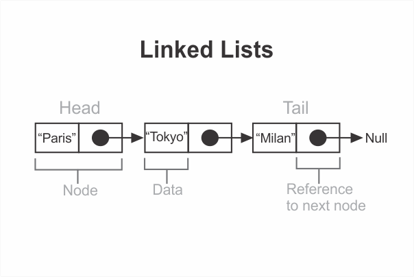

```toc

```

Like an array, a linked list is a data structure that represents a list of items.



### Node

In a linked list, each node represents one item in the list.

Each node consists of two cells: the first cell holds the actual data while the second cell serves as a reference to the next node.

### Head & Tail

A linked list’s first node can be referred to as its **head** and the final node as its **tail**. A **tail** node doesn’t have reference to any other node.

### Creating a Node class

#### Direction

Create a ~~Node~~ class that represents a node. The node should have two properties: ~~data~~ & ~~next~~. The default value of ~~next~~ should be ~~null~~.

```js {numberLines}
class Node {
  // next sets up the next node along the chain
  constructor(data, next = null) {
    this.data = data
    this.next = next
  }
}
const node = new Node("hemanta")

console.log(node)
// Node { data: 'hemanta', next: null }
```

The node that we created in the code example above can be represented in the form a diagram as shown below:


### Creating a LinkedList class

#### Direction

Create a class to represent a linked list. When created, a linked list should have no heads associated with it. By default, ~~head~~ should be null. The linked list instance will have the property ~~head~~, which is a reference to the first node of the linked list.

```js {numberLines}
class LinkedList {
  constructor() {
    this.head = null
  }
}
```

```js {numberLines}
const list = new LinkedList()

console.log(list)
// LinkedList { head: null }
```

Our linked list is empty. We will insert our first node to the list using the ~~insertFirstNode~~ method.

### insertFirstNode

#### Direction

Create a new node from argument ~~data~~ and assign the resulting node to the ~~head~~ property. Make sure to handle the case in which the linked list already has a node assigned to the ~~head~~ property.

```js {numberLines, 6-9}
class LinkedList {
  constructor() {
    this.head = null
  }

  insertFirstNode(data) {
    // Create a node using the Node class & assign it to the head property
    const node = new Node(data, this.head)
    this.head = node
  }
}
```

The ~~insertFirstNode()~~ method creates a new _Node_ from the argument ~~data~~ and assigns the resulting node to the ~~head~~ property.

We can shorten the function body inside the ~~insertFirstNode()~~ method to just one line as shown below:

```js {numberLines}
class LinkedList {
  constructor() {
    this.head = null
  }

  insertFirstNode(data) {
    this.head = new Node(data, this.head)
  }
}
```

```js {numberLines}
const list = new LinkedList()

list.insertFirstNode("Paris")

console.log(list)
// LinkedList { head: Node { data: 'Paris', next: null } }
```

In a future blog post, we will learn how to implement some of the most common linked list methods.
