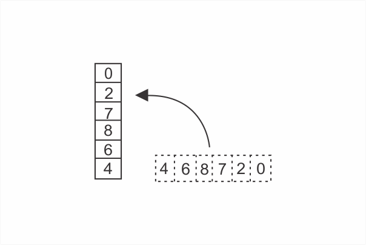
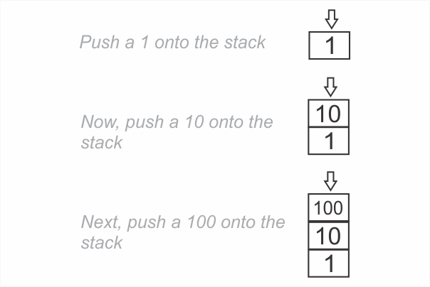
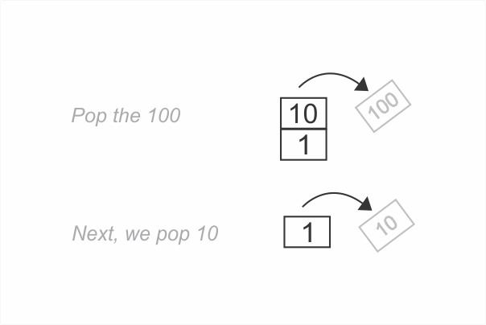

```toc

```

### Stack

A stack is a vertical array with the following 3 constraints:

- Data can be inserted only at the end of a stack.
- Data can be deleted only from the end of a stack
- Only the last element of a stack can be read

You can think of a stack as a stack of dishes, one on top of the other.



As you can see, the first item in the array becomes the bottom of the stack, while the last item becomes the stack’s top.

### Push & pop

- Inserting a new value into a stack is called _pushing_ on to the stack.
- Removing elements from the top of the stack is called _popping_ from the stack.

We will push a 1 onto the stack. Next, we will push a 10 and finally a 100.



As you can see, we always add data to the top (that is, the end) of the stack.

Now, let’s pop some items. Because of a stack’s restrictions, we can only pop data from the top. First we pop the 100, next we pop the 10 and our stack contains only the number 1.



### LIFO

A term that is used to describe the operations we can perform on a stack is **LIFO** (Last In First Out). All this means is that the last item pushed onto a stack is always the first item popped from it.

### Implement a stack

A stack is an abstract data type - it is built on top of other built-in data structures. In our case, we will use arrays, which are built-in data structures in JavaScript.

We will implement a stack data structure using JavaScript classes.

###### Learn about JavaScript classes in my blog post [here](https://hemanta.netlify.app/understanding-classes-in-javascript/).

```js {numberLines}
class Stack {
  constructor() {
    this.data = []
  }

  add(element) {
    return this.data.push(element)
  }

  remove() {
    return this.data.pop()
  }

  peek() {
    return this.data[this.data.length - 1]
  }
}

const stackOne = new Stack()

stackOne.add(1)
stackOne.add(10)
stackOne.add(100)

console.log(stackOne)

// Stack { data: [ 1, 10, 100 ] }

stackOne.remove()

console.log(stackOne)
// Stack { data: [ 1, 10 ] }

console.log(stackOne.peek())
// 10
```

Whenever we create a new instance of the ~~Stack~~ class, JavaScript will invoke the constructor method to build an empty array, where we store our data.

The ~~Stack~~ class contains 3 methods that _push_ new elements to the ~~data~~ array, _pop_ elements from the ~~data~~ array and _read_ elements from the ~~data~~ array.

###### A stack data structure is very similar to a queue data structure. Learn how to implement a queue data structure in my blog post [here](https://hemanta.netlify.app/implementing-the-queue-data-structure-in-javascript/).
