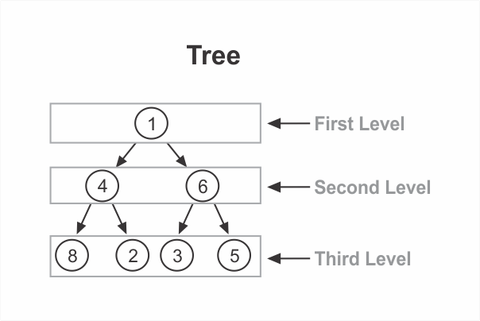

```toc

```

A _tree_ is a node-based data structure. A node holds data and a reference to all of its children.

Unlike a [linked list](https://hemanta.io/implementing-a-linked-list-in-javascript/) (_which is also a node-based data structure_), within a tree, each node can have links to _multiple_ nodes.

Here is a visualization of a simple tree:


### Root

The uppermost node (in our example, ~~1~~) is called the root.

### Parent & Children


In our example, we’d say that the ~~1~~ is a parent to ~~4~~ and ~~6.~~ Conversely, ~~4~~ and ~~6~~ are children of ~~1.~~ Similarly, ~~6~~ is a parent of ~~3~~ and ~~5,~~ and ~~3~~ and ~~5~~ are children of ~~6.~~

### Levels

Trees are said to have levels. Each level is a row within the tree. Our example tree has three levels:



### Sibling

Nodes that are at the same level and share a common parent are siblings of each other.


### Creating a Node class

#### Directions

Create a ~~Node~~ class. The constructor should accept an argument that gets assigned to the ~~data~~ property and initialize an empty array for storing children. The ~~Node~~ class should have two methods: ~~add~~ & ~~remove~~.

Given some data, the ~~add()~~ method should create a new node and add it to the current node’s ~~children~~ array.

Given some data, the ~~remove()~~ method should look at each child of the current node and remove any node with ~~data === data~~.

```js {numberLines}
class Node {
  constructor(data) {
    this.data = data
    this.children = []
  }

  add(data) {
    this.children.push(new Node(data))
  }

  remove(data) {
    this.children = this.children.filter(node => node.data !== data)
  }
}

const node = new Node(10)

console.log(node)
// { data: 10, children: [] }

node.add(20)

node.add(30)

console.log(node)
// {data: 10, children: [ { data: 20, children: [] }, { data: 30, children: [] } ]}

node.remove(30)

console.log(node)
// { data: 10, children: [ { data: 20, children: [] } ] }
```

### Creating a Tree class

### Directions

Create a ~~Tree~~ class. The constructor should initialize a ~~root~~ property to ~~null~~.

```js {numberLines}
class Tree {
  constructor() {
    this.root = null
  }
}
const tree = new Tree()

tree.root = node

console.log(tree)
// Tree { root: { data: 10, children: [ { data: 20, children: [] } ] } }
```

<hr>

**You might be interested in the following blog posts:**

###### Learn how to implement a binary search tree in my blog post [here](https://hemanta.io/implementing-binary-search-tree-in-javascript/).

###### Learn breadth-first & depth-first traversal of a tree data structure in my blog posts [here](https://hemanta.io/breadth-first-traversal-of-a-tree-data-structure/) & [here](https://hemanta.io/depth-first-traversal-of-a-tree-data-structure/).
