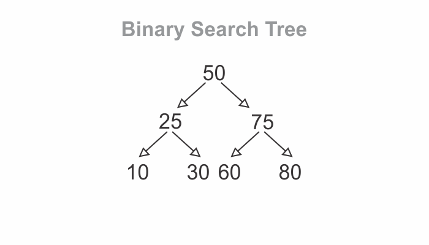

###### This blog post assumes that you understand the tree data structure. If not, then read [this](https://hemanta.io/implementing-a-tree-data-structure-in-javascript/) blog post first and come back.

A tree is a node based data structure.

A binary tree is a tree in which each node has zero, one, or two children.

A binary search tree is a tree-based data structure that confirms to the following rules:

- Each node can have at most one “left” child and one “right” child.
- A node’s “left” descendants can only contain values that are less than the node itself. Likewise, a node’s “right” descendants can only contain values that are greater than the node itself.

Here’s an example of a binary search tree, in which the values are numbers:



Note that each node has one child with a lesser value than itself, which is depicted using a left arrow, and one child with a greater value than itself, which is depicted using a right arrow.

Additionally, notice that all of the 50’s left descendants are less than it. At the same time, all of the 50’s right descendants are greater than it. The same pattern goes for each and every node.

### Implementing the Node class

#### Directions

Implement the ~~Node~~ class to create a binary search tree. The constructor should initialize values: ~~data~~, ~~left~~ & ~~right~~.

```js {numberLines}
class Node {
  constructor(data) {
    this.data = data
    this.left = null
    this.right = null
  }
}

const node = new Node(50)

console.log(node)
// Node { data: 50, left: null, right: null }
```

### Implementing the insert method

#### Directions

Implement the ~~insert~~ method for the ~~Node~~ class. The ~~insert~~ method should accept an argument called ~~data~~, then create and insert a new node at the appropriate location in the tree.

We will implement the ~~insert~~ method using recursion.

###### Learn to write elegant code using recursion in my blog post [here](https://hemanta.io/an-introduction-to-recursion/).

```js {numberLines, 8-18}
class Node {
  constructor(data) {
    this.data = data
    this.left = null
    this.right = null
  }

  insert(data) {
    if (data < this.data && this.left) {
      this.left.insert(data)
    } else if (data < this.data) {
      this.left = new Node(data)
    } else if (data > this.data && this.right) {
      this.right.insert(data)
    } else {
      this.right = new Node(data)
    }
  }
}

const node = new Node(50)

node.insert(20)

console.log(node)
// Node {
// data: 50,
// left: Node { data: 20, left: null, right: null },
// right: null
// }
```
