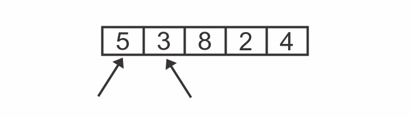

Bubble Sort is a sorting algorithm that sorts an array of unsorted values so that they end up in ascending order.

Let’s walk through a complete example of Bubble Sort in action.

Let’s say we want to sort the array [5, 3, 8, 2, 4] and produce an array that contains the same values in ascending order.

This is our starting array. We will begin the first pass-through.


**STEP-1**:
First, we compare the 5 & the 3:



**STEP-2**:
They are out of order, so we swap them:


**STEP-3**:
Next we comapre the 5 & the 8:


They are in correct order. So we don't need to perform a swap.

**STEP-4**:
Next we comapre the 8 & the 2:


**STEP-5**:
They are out of order, so we swap them:


**STEP-6**:
Next we comapre the 8 & the 4:


**STEP-7**:
They are out of order, so we swap them:


We now know for a fact that the 8 is in its correct position within the array, because we kept moving it along to the right until it reached its proper place. The diagram above has blue border lines surrounding the 8 to indicate that the 8 is officially in its correct position.

This is actually the reason why this algorithm is called Bubble Sort: in each pass-through, the highest unsorted value "bubbles" up to its correct position.

Because we made at least one swap during the second pass-through, we need to conduct another pass-through.

We begin the second pass-through:

**STEP-8**:
We compare the 3 & the 5:


They are in the correct order, so we move on.

**STEP-9**:
Next, we compare the 5 & the 2:


**STEP-10**:
They are out of order, so we swap them:


**STEP-11**:
We compare the 5 & the 4:


**STEP-12**:
They are out of order, so we swap them:


We don’t have to compare the 5 and the 8 because we know that the 8 is already in its correct position from the previous pass-through. And now we also know that the 5 has bubbled up to its correct position as well. This concludes our second pass-through.

Because we made at least one swap during this pass-through, we need to conduct another pass-through.

We begin the third pass-through:

**STEP-13**:
We compare the 3 & the 2:


**STEP-14**:
They are out of order, so we swap them:


**STEP-15**:
Next, we compare the 3 & the 4:


They are in the correct order, so we don't need to swap them.

We now know that 4 has bubbled up to its correct position.


Since we made at least one swap during this pass-through, we need to perform another one.

And so begins the fourth pass-through:

**STEP-16**:

Step 16: We compare the 2 and the 3:


Because they’re in order, we don’t need to swap. We can end this pass-through, since all the remaining values are already correctly sorted.

Now that we’ve made a pass-through that didn’t require any swaps, we know that our array is completely sorted:


### Code implementation

The following is an implementation of Bubble Sort in JavaScript:

```js {numberLines}
function bubblesort(arr) {
  for (let i = 0; i < arr.length; i++) {
    for (j = 0; j < arr.length - i - 1; j++) {
      if (arr[j] > arr[j + 1]) {
        const lesser = arr[j + 1]
        arr[j + 1] = arr[j]
        arr[j] = lesser
      }
    }
  }

  return arr
}

console.log(bubblesort([5, 3, 8, 2, 4]))
// [ 2, 3, 4, 5, 8 ]
```
