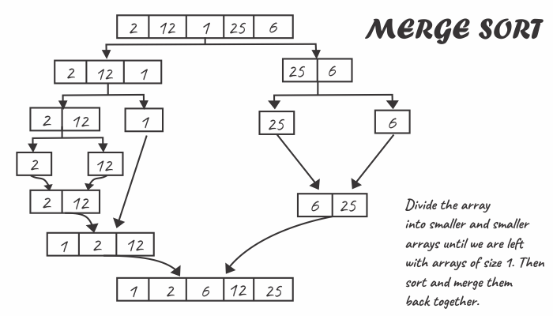
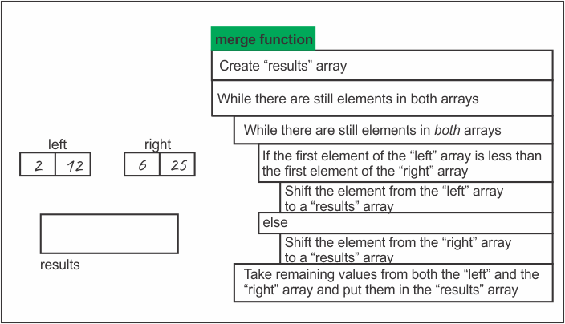
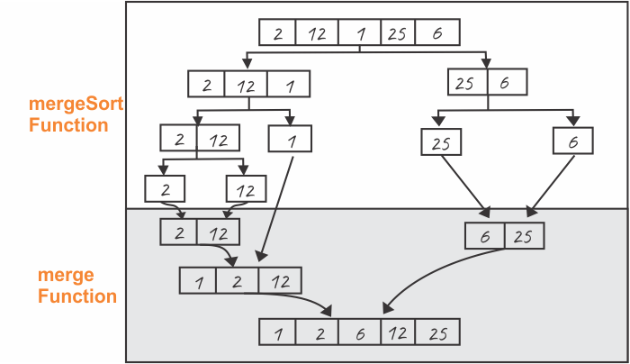

The merge sort algorithm splits the input array in the middle and creates two subarrays
(the algorithm keeps on dividing the array into smaller subarrays recursively, until the size of the subarray is 1), recursively sorts each subarray separately and then merges the sorted subarrays together into one larger sorted array.

With an odd number of elements, the algorithm creates two subarrays such that one has one more element than the other.



> A recursive program is one that calls itself. However, a recursive program can’t call itself always or it would never stop. So, a second essential ingredient of a recursive program is that there must be a termination condition when a program can cease to call itself. Get an introduction to recusrsion in my blog post [here](https://hemanta.io/an-introduction-to-recursion/).

The base case for the merge sort recursive technique is an array that contains only one item. (An array containing only one item is already sorted.)

We implement the merge sort algorithm using two functions: ~~merge~~ & ~~mergeSort~~.

The purpose of the merge function is to merge two separate _sorted_ arrays into one _sorted_ array.



The purpose of the ~~mergeSort~~ function is to recursively subdivide the input array into smaller subarrays until we are left with subarrays of size 1. (we can’t further divide an array containing just one element.)

We can diagrammatically represent the merge sort algorithm as shown below:



Let's implement the merge sort algorithm in JavaScript.

```js {numberLines}
function mergeSort(arr) {
  if (arr.length === 1) {
    return arr;
  }
  const center = Math.floor(arr.length / 2);

  const left = arr.slice(0, center);
  const right = arr.slice(center);

  return merge(mergeSort(left), mergeSort(right));
}

function merge(left, right) {
  let results = [];

  while (left.length && right.length) {
    if (left[0] < right[0]) {
      results.push(left.shift());
    } else {
      results.push(right.shift());
    }
  }

  return [...results, ...left, ...right];
}

console.log(mergeSort([2, 12, 1, 25, 6]));
// [ 1, 2, 6, 12, 25 ]
}
```

###### Learn about array and object destructuring in JavaScript in my blog post [here](https://hemanta.io/how-to-use-destructuring-with-arrays-and-objects-in-javascript/).
