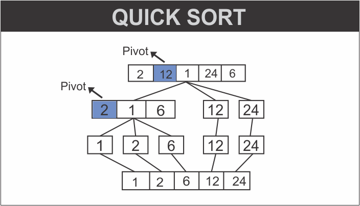

Quick sort is a sorting algorithm in which we select an element (known as the pivot) according to some strategy (sometimes randomly, sometimes the leftmost, sometimes the middle one or the rightmost) to partition an array into subarrays.

The array is partitioned around the pivot value, creating a left subarray that contains elements lesser than the pivot and a right subarray that contains elements greater than the pivot. Each of these subarrays is then recursively sorted.

###### Get an introduction to recursion in my blog post [here](https://hemanta.io/an-introduction-to-recursion/).

We can represent quick sort in the form of a diagram as shown below:



**Coding quick sort in JavaScript**

```js {numberLines}
function quickSort(array) {
  if (array.length < 2) return array
  let pivotIndex = Math.floor(array.length / 2)
  let pivot = array[pivotIndex]

  let leftSubarray = []
  let rightSubarray = []

  array.forEach((element, index) => {
    if (index !== pivotIndex) {
      element > pivot ? rightSubarray.push(element) : leftSubarray.push(element)
    }
  })

  return [...quickSort(leftSubarray), pivot, ...quickSort(rightSubarray)]
}

console.log(quickSort([2, 12, 1, 24, 6]))
// [ 1, 2, 6, 12, 24 ]
```

###### Learn about different for loops in JavaScript in my blog post [here](https://hemanta.io/for-loops-in-javascript/).

Note that there are several methods of choosing a pivot element:

- Always pick the first element
- Always pick the last element
- Pick a random element
- Pick the median element

In the code example above, we have used the formula ~~array.floor(array.length / 2)~~ to choose the index of the pivot element.
