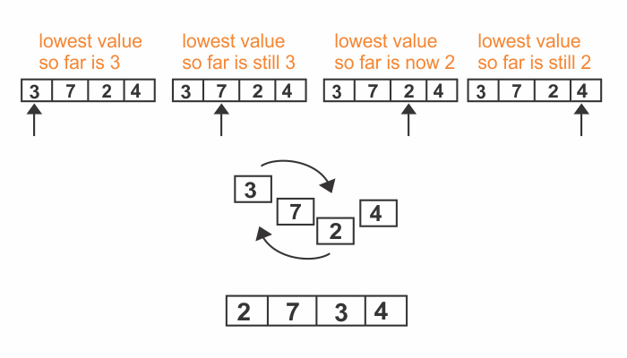
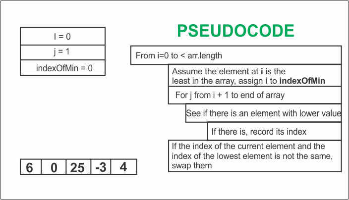

###### Learn how to implement Bubble Sort in JavaScript in my blog post [here](https://hemanta.io/implementing-bubble-sort-in-javascript/).

Like, Bubble Sort, Selection Sort is a sorting algorithm.

The steps of Selection Sort are as follows:

- We check each cell of the array from left to right to determine which value is least. As we move from cell to cell, we keep track of the lowest value we’ve encountered so far. (We do this by storing its index in a variable.) If we encounter a cell that contains a value that is even lower than the one in our variable, we replace it so that the variable now points to the new index. See the following diagram:



- Once we’ve determined which index contains the lowest value, we swap its value with the value we began the pass-through with. This would be index 0 in the first pass-through, index 1 in the second pass-through, and so on. The diagram above illustrates making the swap of the first pass-through.

- Each pass-through consists of Steps 1 and 2. We repeat the pass-throughs until we reach a pass-through that would start at the end of the array. By this point, the array will have been fully sorted.

Here is an implementation of selection sort in JavaScript:



```js {numberLines}
function selectionsort(arr) {
  for (let i = 0; i < arr.length; i++) {
    let indexOfMin = i

    for (j = i + 1; j < arr.length; j++) {
      if (arr[j] < arr[indexOfMin]) {
        indexOfMin = j
      }
    }

    if (indexOfMin !== i) {
      let lesser = arr[indexOfMin]
      arr[indexOfMin] = arr[i]
      arr[i] = lesser
    }
  }

  return arr
}

console.log(selectionsort([6, 0, 25, -3, 4]))
// [ -3, 0, 4, 6, 25 ]
```
