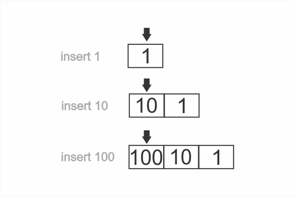
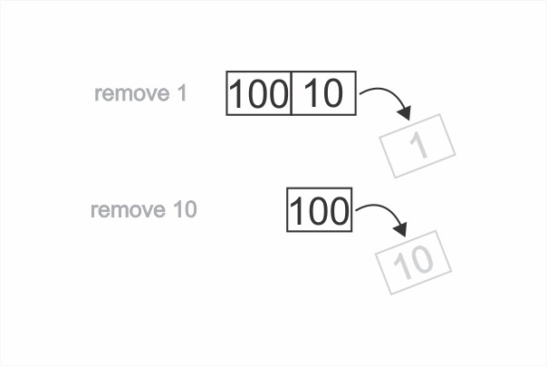

```toc

```

### Queue

Queue is a data structure that consists of a list of records such that records are added at one end and removed from the other.

The queue data structure is exactly like a queue in real life. Think of a group of people standing in a line at an ATM kiosk to withdraw cash.

### FIFO

With queues, the first record added to the queue is the first record to be removed. This is known as the FIFO (First In, First Out) principle.

Usually, we refer to the beginning of the queue as its ~~front~~ and the end of the queue as its ~~back~~.

### Enqueue & Dequeue

The common terms for inserting a record in a queue is known as enqueuing and removing a record from a queue is known as dequeuing.

### Restrictions

With queues, we have 3 restrictions:

- Data can only be inserted at the end of the queue.
- Data can be deleted only at the front of the queue.
- Only the element at the front of the queue can be read.

Let’s see a queue in action beginning with an empty array:

First we insert 1, then we insert 10, then we insert 100:



Now, we will remove data. This will happen in **reverse**.

First we will remove 1, as it is at the front of the queue. Then, we remove 10:



Finally, we are left with only the number 100 in the array.

### Abstract data type

Queue is not a built-in data type in JavaScript. To implement a queue, we use another built-in data structure to hold the data. In our case, we will use arrays, which are built-in data structures in JavaScript. This is why a queue is known as an abstract data type.

### Implementing a queue

We can implement a queue using JavaScript classes.

###### Learn about JavaScript classes in my blog post [here](https://hemanta.io/understanding-classes-in-javascript/)

```js {numberLines}
class Queue {
  constructor() {
    this.data = []
  }

  add(element) {
    return this.data.unshift(element)
  }

  remove() {
    return this.data.pop()
  }

  peek() {
    return this.data[this.data.length - 1]
  }
}

const atmQueue = new Queue()

console.log(atmQueue.add(1))
console.log(atmQueue.add(10))
console.log(atmQueue.add(100))

console.log(atmQueue)

// Queue { data: [ 100, 10, 1 ] }

console.log(atmQueue.remove())

console.log(atmQueue)
// Queue { data: [ 100, 10 ] }

console.log(atmQueue.peek())
// 10
```

As you can see, our queue implementation stores data in an array called ~~data~~. The ~~add()~~ method inserts an item at the front of the array. The ~~remove()~~ method removes an item from the back of the array. And the ~~peek()~~ method reads the last item of the array.

By implementing a ~~Queue~~ class, what we have done in essence, is we have built an interface around the array data structure such that we are allowed to interact with our data in limited ways.
