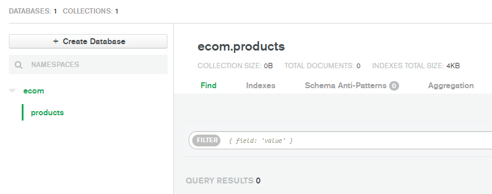
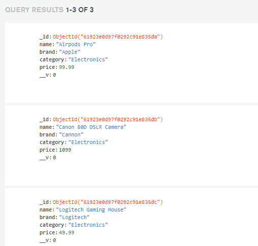
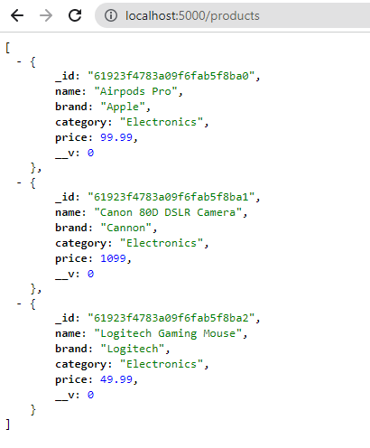

```toc

```

In this blog post, we will learn how to import sample data to a MongoDB database.

First, create a folder named ~~store~~ on your desktop and open it in Visual Studio Code.

Inside the ~~store~~ folder, create a folder named ~~server~~.

```sh {numberLines}
PS C:\Users\Delhivery\Desktop\store> mkdir server
```

Next, create a _package.json_ file using the following command:

```sh {numberLines}
PS C:\Users\Delhivery\Desktop\store> npm init -y
```

Now, install the following libraries:

```sh
PS C:\Users\Delhivery\Desktop\store> npm i express mongoose dotenv nodemon
```

Inside the ~~server~~ folder, create a folder named ~~data~~, and inside the ~~data~~ folder, create a file named ~~products.js~~.

### server/data/products.js

```js:title=server/data/products.js {numberLines}
const products = [
  {
    name: "Airpods Pro",
    brand: "Apple",
    category: "Electronics",
    price: 99.99,
  },

  {
    name: "Canon 80D DSLR Camera",
    brand: "Cannon",
    category: "Electronics",
    price: 1099.0,
  },

  {
    name: "Logitech Gaming Mouse",
    brand: "Logitech",
    category: "Electronics",
    price: 49.99,
  },
];

module.exports = products;
```

This is the data that we would import to the MongoDB database.

Next, inside the ~~server~~ folder, create a file named ~~index.js~~.

### server/index.js

```js:title=server/index.js {numberLines}
const express = require("express");
const connectDB = require("./config/db");
const dotenv = require("dotenv");
const Product = require("./models/productModel");

dotenv.config();

connectDB();

const app = express();

app.use(express.json());

app.get("/products", async (req, res) => {
  const products = await Product.find({});
  res.json(products);
});

const PORT = process.env.PORT || 5000;

app.listen(PORT, () => {
  console.log(`Server listening on port ${PORT}`);
});
```

Inside the ~~server~~ folder, create a folder named ~~models~~, and inside the ~~models~~ folder, create a file named ~~productModel.js~~.

### server/models/productModel.js

```js:title=server/models/productModel.js {numberLines}
const mongoose = require("mongoose");

const productSchema = new mongoose.Schema({
  name: {
    type: String,
    required: true,
  },
  brand: {
    type: String,
    required: true,
  },
  category: {
    type: String,
    required: true,
  },
  price: {
    type: Number,
    required: true,
  },
});

const Product = mongoose.model("Product", productSchema);

module.exports = Product;
```

Next, inside the ~~server~~ folder, create a folder named ~~config~~ and inside the ~~config~~ folder, create a file named ~~db.js~~.

### server/config/db.js

```js:title=server/config/db.js {numberLines}
const mongoose = require("mongoose");
const dotenv = require("dotenv");

dotenv.config();

const connectDB = async () => {
  try {
    const conn = await mongoose.connect(process.env.MONGO_URI, {
      useNewUrlParser: true,
      useUnifiedTopology: true,
    });

    console.log(`MongoDB connected: ${conn.connection.host}}`);
  } catch (error) {
    console.error(`Error: ${error.message}`);
    process.exit(1);
  }
};

module.exports = connectDB;
```

Now, create a file named ~~.env~~ inside the ~~store~~ folder.

### store/.env

```sh {numberLines}
PORT=5000
MONGO_URI=mongodb+srv://sundaray:<password>@sandbox.y8blv.mongodb.net/myFirstDatabase?retryWrites=true&w=majority
```

Replace \<password> with the password that you have set for the database user and replace ~~myFirstDatabase~~ with the name of your database.

###### Learn how to create a free MongoDB Atlas account and find the connection string in my blog post [here](https://hemanta.io/implement-jwt-based-user-authentication-in-a-mern-stack-app-part-6/) and [here](https://hemanta.io/implement-jwt-based-user-authentication-in-a-mern-stack-app-part-7/) respectively.

Inside the ~~server~~ folder, create a file named ~~seeder.js~~.

### server/seeder.js

```js:title=server/seeder.js {numberLines}
const dotenv = require("dotenv");
const connectDB = require("./config/db");
const Product = require("./models/productModel");
const products = require("./data/products");

dotenv.config();

connectDB();

const importData = async () => {
  try {
    await Product.deleteMany();
    await Product.insertMany(products);

    console.log("Data Imported");
    process.exit();
  } catch (error) {
    console.error(error);
    process.exit(1);
  }
};

const destroyData = async () => {
  try {
    await Product.deleteMany();

    console.log("Data Destroyed");
    process.exit();
  } catch (error) {
    console.error(error);
    process.exit(1);
  }
};

if (process.argv[2] === "-d") {
  destroyData();
} else {
  importData();
}

```

Add the following scripts in the ~~package.json~~ file.

### store/package.json

```json:title=store/package.json {numberLines, 7-9}
{
  "name": "store",
  "version": "1.0.0",
  "description": "",
  "main": "index.js",
  "scripts": {
    "server": "nodemon server/index.js",
    "data:import": "node server/seeder.js",
    "data:destroy": "node server/seeder.js -d"
  },
  "keywords": [],
  "author": "",
  "license": "ISC",
  "dependencies": {
    "dotenv": "^10.0.0",
    "express": "^4.17.1",
    "mongoose": "^6.0.12",
    "nodemon": "^2.0.15"
  }
}
```

Start the server using the following command:

```sh {numberLines}
PS C:\Users\Delhivery\Desktop\store> npm run server
```

You can see that the ~~products~~ collection in the ~~ecom~~ database is empty.



Create a new terminal and run the following command:

```sh {numberLines}
PS C:\Users\Delhivery\Desktop\store> npm run data:import
```

Refresh the ~~ecom~~ database and you will see that the data in the ~~products.js~~ file has been imported.



If you want to delete the data, run the following command:

```sh {numberLines}
PS C:\Users\Delhivery\Desktop\store> npm run data:destroy
```

Refresh the ~~ecom~~ database and you will see an empty ~~products~~ collection.

We have already configured a ~~/products~~ route in the ~~index.js~~ file.

Ensure that the data is imported into the ~~ecom~~ database. Next, in a browser tab, visit ~~localhost:5000/products~~ and you will see the product list as shown below:


