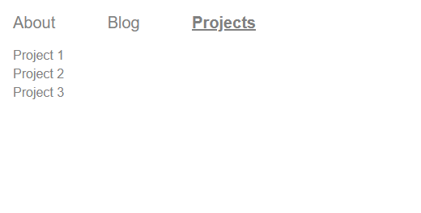
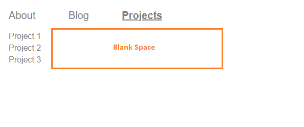
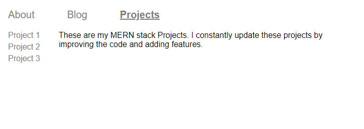
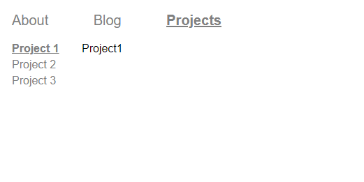

To understand the concept of index routes and why we need them, let’s consider the user interface, as shown below:



```js {numberLines, 22-26}
import React from "react"
import { Routes, Route } from "react-router-dom"
import About from "./components/About"
import Blog from "./components/Blog"
import Projects from "./components/Projects"
import Project1 from "./components/Project1"
import Project2 from "./components/Project2"
import Project3 from "./components/Project3"
import Header from "./components/Header"
import ProjectDesc from "./components/ProjectDesc"

const App = () => {
  return (
    <>
      <header>
        <Header />
      </header>
      <main>
        <Routes>
          <Route path="/about" element={<About />} />
          <Route path="/blog" element={<Blog />} />
          <Route path="/projects" element={<Projects />}>
            <Route path="project1" element={<Project1 />}></Route>
            <Route path="project2" element={<Project2 />}></Route>
            <Route path="project3" element={<Project3 />}></Route>
          </Route>
        </Routes>
      </main>
    </>
  )
}

export default App
```

~~project 1~~, ~~project 2~~ & ~~project 3~~ routes are nested inside the ~~projects~~ route.

Then, we render an ~~Outlet~~ in the parent ~~projects~~ route. The ~~Outlet~~ swaps between the child routes (~~Project1~~, ~~Project2~~ & ~~Project3~~).

```js {numberLines, 18-18}
import React from "react"
import { NavLink, Outlet } from "react-router-dom"

const Projects = () => {
  return (
    <>
      <ul className="secondary-navigation">
        <NavLink to="project1">
          <li>Project 1</li>
        </NavLink>
        <NavLink to="project2">
          <li>Project 2</li>
        </NavLink>
        <NavLink to="project3">
          <li>Project 3</li>
        </NavLink>
      </ul>
      <Outlet />
    </>
  )
}

export default Projects
```

Do you notice any problems in our UI?

The problem is: when we click on the ~~Projects~~ link in the primary navigation, **the main content area is blank**.



We can fix this issue with an ~~index~~ route.

```js {numberLines, 23-23}
import React from "react"
import { Routes, Route } from "react-router-dom"
import About from "./components/About"
import Blog from "./components/Blog"
import Projects from "./components/Projects"
import Project1 from "./components/Project1"
import Project2 from "./components/Project2"
import Project3 from "./components/Project3"
import Header from "./components/Header"
import ProjectDesc from "./components/ProjectDesc"

const App = () => {
  return (
    <>
      <header>
        <Header />
      </header>
      <main>
        <Routes>
          <Route path="/about" element={<About />} />
          <Route path="/blog" element={<Blog />} />
          <Route path="/projects" element={<Projects />}>
            <Route index element={<ProjectDesc />}></Route>
            <Route path="project1" element={<Project1 />}></Route>
            <Route path="project2" element={<Project2 />}></Route>
            <Route path="project3" element={<Project3 />}></Route>
          </Route>
        </Routes>
      </main>
    </>
  )
}

export default App
```

Notice that the ~~index~~ route has an ~~index~~ prop instead of a ~~path~~ prop.
And it will render in the parent route's (~~projects~~) ~~Outlet~~ at the parent route's path (~~/projects~~).



The index route will render when we have not clicked on any one of the links (~~Project 1~~, ~~Project 2~~ or ~~Project 3~~) in the secondary navigation inside the ~~/projects~~ route.

However, when we click on any one of the links in the secondary navigation, the index route will _NOT_ render.



###### Learn what layout routes are in React Router V6 in my blog post [here](https://hemanta.io/what-is-a-layout-route-in-react-router-v6/).
