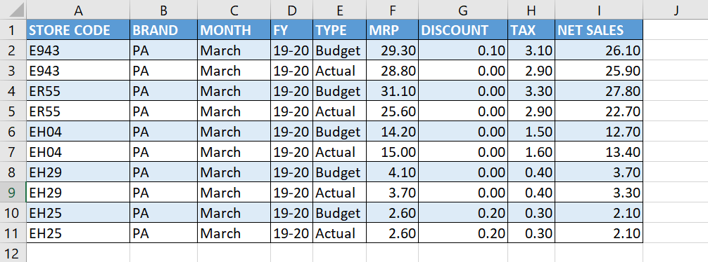
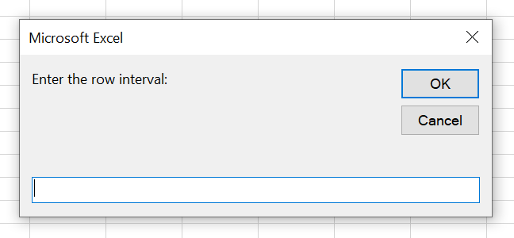
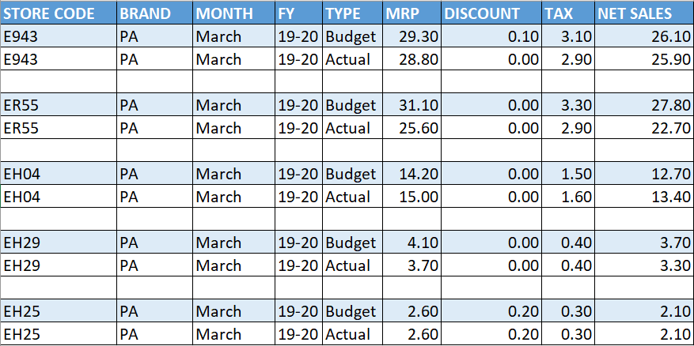

In Excel, you can use the following code snippet to insert a blank row at fixed intervals.

```vb {numberLines}
Sub Insert_Row_Interval()

On Error Resume Next

Dim rowInterval As String

Dim finalRowInterval As Long

rowInterval = InputBox("Enter the row interval:")

finalRowInterval = rowInterval + 2

For Each Cell In Range(Range("A1"), Range("A1").End(xlDown))
    Range("A" & finalRowInterval).EntireRow.Insert Shift:=xlDown
    finalRowInterval = finalRowInterval + (rowInterval + 1)
Next Cell

End Sub
```

In the following dataset, let’s say we want to insert an empty row after every two rows (_starting from the second row_).



When we execute the ~~Insert_Row_Interval~~ Sub procedure, a dialog box is dispalyed with a prompt, asking us to enter the row interval at which we want to insert an empty row.



After we enter the row interval number and click on OK, we get the desired result.


