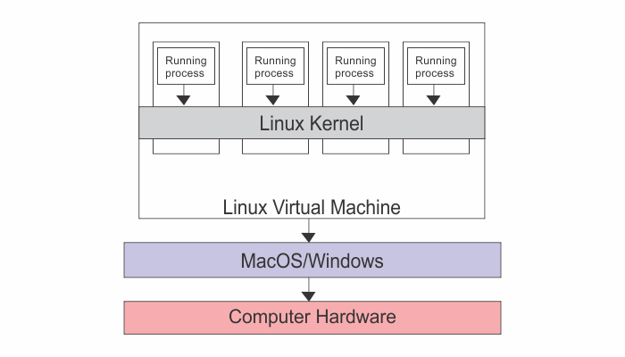

Docker Desktop is an application for MacOS and windows machines for the building and sharing of containerized applications and microservices. It includes Docker Engine, Docker CLI client, Docker Compose, Docker Content Trust, Kubernetes & Credential Helper.

Docker Desktop has a single installer that sets up everything you need to use Docker in seconds making it seamless to develop on your local machine.

Docker Desktop includes a lightweight LinuxKit VM (_that runs Linux tools and containers_) and seamlessly plumbs into the host OS giving containers access to the file system & networking. Some key features of Docker Desktop include:

- Gives you access to a vast library of certifies images and templates in Docker Hub
- Ability to containerize and share any application on any cloud platform, in multiple languages and frameworks
- Includes the latest version of Kubernetes.

### Installation

You can download the installer at [this](https://www.docker.com/products/docker-desktop/) link and follow step-by-step instructions.

Note that **Docker Desktop on Mac doesn’t give you the docker engine running natively on the MacOS Darwin Kernel. Behind the scenes the Docker daemon is running inside a lightweight Linux VM that seamlessly exposes the daemon and the API to your Mac environment. This means that you can open a terminal on your Mac and use regular Docker commands**.

> In multitasking computer operating systems, a daemon is a computer program that runs as background process, rather than being under the direct control of an interactive user.

After the installation is complete, open a terminal window and try the Docker command ~~docker version~~.

Notice that the ~~OS/Arch~~ for the server component is showing as ~~linux/amd64~~. This is because the daemon is running inside the Linux VM. On the other hand, the client component is a native Mac application and directly on the Mac OS Darwin kernel (~~OS/Arch: darwin/amd64~~).
