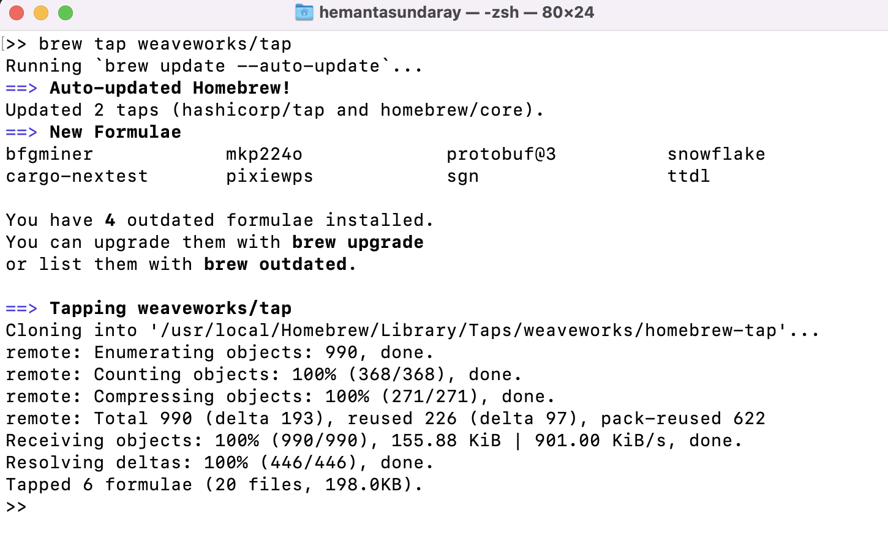
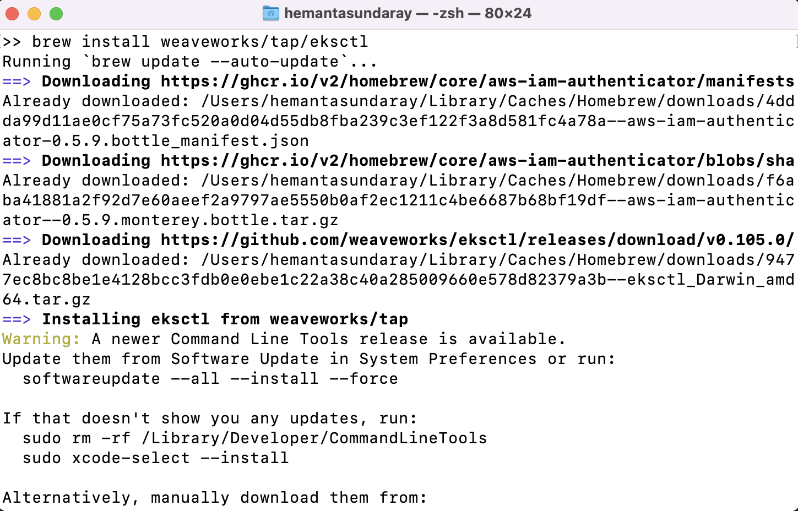
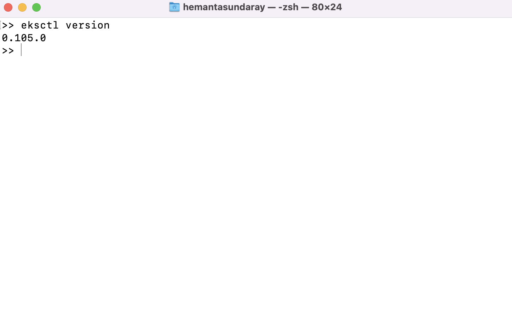

~~eksctl~~ is a command line tool for working with EKS clusters that automates many individual tasks.

### Install the Weaveworks Homebrew tap

```sh {numberLines}
brew tap weaveworks/tap
```



### Install eksctl

```sh {numberLines}
brew install weaveworks/tap/eksctl
```



If ~~eksctl~~ is already installed, run the following command to upgrade:

```sh {numberLines}
brew upgrade eksctl && brew link –overwrite eksctl
```

### Check ekctl version

```sh {numberLines}
ekctl version
```


