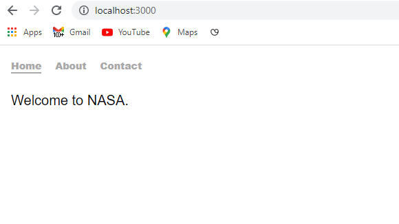
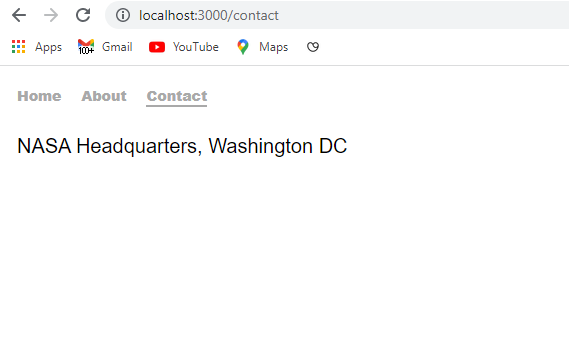
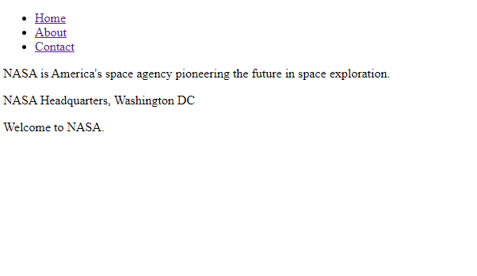
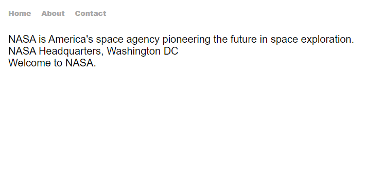
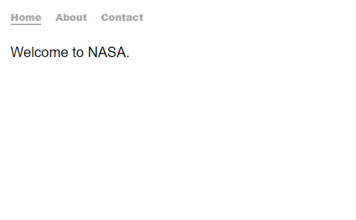

```toc

```

In a single page application created using React, we can implement client side routing using React Router, which will render a certain component based on the route in the URL.

We will understand the fundamentals of React Router by creating an application with basic navigation between 3 pages and in the process learn the usage of the 5 most common components:

- BrowserRouter
- Route
- Switch
- Link
- NavLink





### Creating a React project

Create a folder called ~~react-router~~, open the folder in Visual Studio Code and create a React project using ~~create-react-app~~.

```sh
PS C:\Users\Delhivery\Desktop\react-router> npx create-react-app .
```

The name of the package used to implement React Router in a web application is called ~~react-router-dom~~. Let’s install it.

```sh
PS C:\Users\Delhivery\Desktop\react-router> npm i react-router-dom
```

### BrowserRouter

The ~~\<BrowserRouter/>~~ component is a router that uses the HTML5 history API (_mainly the ~~pushState~~ method that allows changing the URL of the page without triggering a browser refresh_).

The ~~\<BrowserRouter/>~~ keeps the user interface in sync with the URL, which means that the URL will always reflect the current route being rendered.

For ~~\<BrowserRouter/>~~ to work, we have to wrap our entire application (the ~~\<App/>~~ component) with the ~~\<BrowserRouter/>~~ component.

```jsx:title=src/index.js {numberLines, 5-5, 8-8, 10-10}
import React from "react"
import ReactDOM from "react-dom"
import "./index.css"
import App from "./App"
import { BrowserRouter as Router } from "react-router-dom"

ReactDOM.render(
  <Router>
    <App />
  </Router>,
  document.getElementById("root")
)
```

Next, in the ~~src~~ folder, create a folder called ~~components~~ and inside the ~~components~~ folder, create 4 components: ~~Header.js~~, ~~Home.js~~, ~~About.js~~ & ~~Contact.js~~.

```jsx:title=src/components/Home.js {numberLines}
import React from "react"

const Home = () => {
  return <p>Welcome to NASA.</p>
}

export default Home
```

```jsx:title=src/components/About.js {numberLines}
import React from "react"

const About = () => {
  return (
    <p>
      NASA is America's space agency pioneering the future in space exploration.
    </p>
  )
}

export default About
```

```jsx:title=src/components/Contact.js {numberLines}
import React from "react"

const Contact = () => {
  return <p>NASA Headquarters, Washington DC</p>
}

export default Contact
```

```jsx:title=src/components/Header.js {numberLines}
import React from "react"

const Header = () => {
  return (
    <nav>
      <ul>
        <li>
          <a href="#">Home</a>
        </li>
        <li>
          <a href="#">About</a>
        </li>
        <li>
          <a href="#">Contact</a>
        </li>
      </ul>
    </nav>
  )
}

export default Header
```

We will import these 4 components inside the ~~App~~ component.

```jsx:title=src/App.js {numberLines}
import React from "react"
import About from "./components/About"
import Contact from "./components/Contact"
import Home from "./components/Home"
import Header from "./components/Header"

const App = () => {
  return (
    <>
      <Header />
      <main>
        <About />
        <Contact />
        <Home />
      </main>
    </>
  )
}

export default App
```

Start the development server using ~~npm start~~.

```sh
PS C:\Users\Delhivery\Desktop\react-router> npm start
```

Our application looks like the following:



Next, we will improve the styling. Copy and paste the following style rules in ~~index.css~~.

```css:title=src/index.css {numberLines}
* {
  margin: 0;
  padding: 0;
  box-sizing: border-box;
}

html {
  font-family: sans-serif;
  font-size: 62.5%;
}

nav {
  width: 40rem;
  margin: 2rem;
  margin-bottom: 3rem;
}

nav ul {
  width: 100%;
  display: flex;
  justify-content: flex-start;
  list-style: none;
}

nav li {
  font-size: 1.4rem;
  margin-right: 2rem;
}

nav a {
  font-weight: 900;
  text-decoration: none;
}

nav a:link,
a:visited {
  color: darkgray;
}

nav a:hover {
  color: black;
}

main {
  margin: 2rem;
  font-size: 2rem;
}
```

Now, our application looks better:



### Link

When we link to a new page using the anchor tag, for example, ~~\<a href="/about">About Us\</a>~~, the link ends up performing a page navigation, which means the React application restarts. This is because the browser thinks we are navigating to a completely new page, so it makes a HTTP request to ~~/about~~, and then the browser has to parse the HTML and the script etc.

With React Router however, we can have instant navigation by replacing the ~~\<a>~~ link with the ~~\<Link />~~ component.

The ~~\<Link/>~~ component takes a ~~to~~ prop. When the user clicks on the link, React Router will navigate to the path provided by the ~~to~~ prop.

The ~~\<Link/>~~ element will render an ~~\<a>~~ element, but with some event handlers that will instruct React Router to do an instant redirect instead of a page navigation. React Router performs an ~~event.preventDefault()~~ to prevent the page from navigating to a new page.

Note that the ~~\<link/>~~ element is accessible by default. This is because it ends up rendering an anchor tag ~~\<a>~~. This allows users that make use of a screen reader to know that this is a link and they will be able to click on it as if it were a normal link.

### NavLink

~~\<NavLink />~~ is a special version of the ~~\<Link/>~~ component that adds styling elements to the rendered element when it matches the current URL.

Let’s import the ~~\<NavLink/>~~ component inside the ~~Header~~ component and replace the ~~\<a>~~ tags with the ~~\<NavLink/>~~ component.

```jsx:title=src/components/Header.js {numberLines, 2-2, 9-9, 12-12, 15-15}
import React from "react"
import { NavLink } from "react-router-dom"

const Header = () => {
  return (
    <nav>
      <ul>
        <li>
          <NavLink to="/">Home</NavLink>
        </li>
        <li>
          <NavLink to="/about">About</NavLink>
        </li>
        <li>
          <NavLink to="/contact">Contact</NavLink>
        </li>
      </ul>
    </nav>
  )
}

export default Header
```

### Switch

The ~~\<Switch />~~ component will wrap several ~~\<Route />~~ components and will render only the first ~~\<Route />~~ that matches the current browser URL.

Note that ~~\<Route />~~ has to be a direct descendant of the ~~\<Switch />~~. This means that we shouldn’t have a ~~\<div>~~ or other elements in between the ~~\<Switch>~~ and the ~~\<Route />~~.

### Route

The ~~\<Route />~~ component will conditionally render a component when the ~~path~~ prop matches the current URL in the browser.

Update the ~~App.js~~ file as follows:

```jsx:title=src/App.js {numberLines, 6-6, 13-14, 16-17, 19-20, 22-23}
import React from "react"
import About from "./components/About"
import Contact from "./components/Contact"
import Home from "./components/Home"
import Header from "./components/Header"
import { Switch, Route } from "react-router-dom"

const App = () => {
  return (
    <>
      <Header />
      <main>
        <Switch>
          <Route path="/about" exact>
            <About />
          </Route>
          <Route path="/contact" exact>
            <Contact />
          </Route>
          <Route path="/" exact>
            <Home />
          </Route>
        </Switch>
      </main>
    </>
  )
}

export default App
```

The routing works as expected. We have one issue: we can’t tell which link is active. We can fix this issue by using the ~~activeClassName~~ prop in the ~~\<NavLink/>~~ component.

Make the following changes in the ~~Header~~ component:

```jsx:title=src/components/Header.js {numberLines, 9-9, 14-14, 19-19}
import React from "react"
import { NavLink } from "react-router-dom"

const Header = () => {
  return (
    <nav>
      <ul>
        <li>
          <NavLink to="/" exact activeClassName="selected">
            Home
          </NavLink>
        </li>
        <li>
          <NavLink to="/about" activeClassName="selected">
            About
          </NavLink>
        </li>
        <li>
          <NavLink to="/contact" activeClassName="selected">
            Contact
          </NavLink>
        </li>
      </ul>
    </nav>
  )
}

export default Header
```

> Notice that we have added the ~~exact~~ prop in the ~~\<NavLink/>~~ component wrapping the ~~Home~~ link. Can you tell why?

Next, add the highlighted style rules in the ~~index.css~~ file.

```css:title=src/index.css {numberLines, 44-46}
* {
  margin: 0;
  padding: 0;
  box-sizing: border-box;
}

html {
  font-family: sans-serif;
  font-size: 62.5%;
}

nav {
  width: 40rem;
  margin: 2rem;
  margin-bottom: 3rem;
}

nav ul {
  width: 100%;
  display: flex;
  justify-content: flex-start;
  list-style: none;
}

nav li {
  font-size: 1.4rem;
  margin-right: 2rem;
}

nav a {
  font-weight: 900;
  text-decoration: none;
}

nav a:link,
a:visited {
  color: darkgray;
}

nav a:hover {
  color: black;
}

.selected {
  border-bottom: 0.2rem solid darkgray;
}

main {
  margin: 2rem;
  font-size: 2rem;
}
```



Our app is ready and the routing is working as expected.
