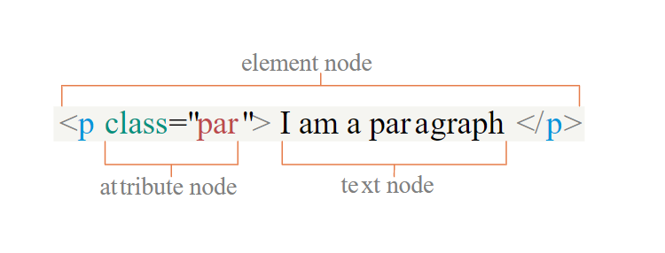

```toc

```

### Node types



### getElementById()

```html {numberLines}
<ul id="list">
  <li>About</li>
  <li>Blog</li>
</ul>
```

```js
const list = document.getElementById("list")
```

- Returns the element that has the ~~id~~ attribute with the specified value.
- If there are more than one element having the same ~~id~~, then ~~getElementById()~~ returns the first found element in the HTML document.
- If the specified ~~id~~ does not exist, the returned value is null.

### textContent

```html {numberLines}
<ul id="list">
  <li>About</li>
  <li>Blog</li>
</ul>
```

```js {numberLines}
const list = document.getElementById("list")

console.log(list.textContent)
```

```js
list.textContent = "We are the list items."
```

- Sets or returns the text content of the specified node and all its descendants.
- Setting the ~~textContent~~ property removes and replaces any child nodes by a single text node containing the specified string.

### innerHTML

- Sets or returns the HTML (inner HTML) content of an element.

```js
list.innerHTML = "<h2>We are the list items.</h2>"
```

### querySelector

- Returns the first element in the document that matches specified css selector(s).
- The argument of ~~querySelector()~~ method must follow the CSS syntax.

### querySelector(‘tagname’)

```html {numberLines}
<ul id="list">
  <li>About</li>
  <li>Blog</li>
</ul>
```

```JS
const list = document.querySelector('ul');
```

### querySelector('#id')

```js
const list = document.querySelector("#list")
```

### querySelector( ‘.class’);

```html {numberLines}
<ul class="list">
  <li>About</li>
  <li>Blog</li>
</ul>
```

```js
const list = document.querySelector(".list")
```

We can use ~~querySelector~~ not only with document but also with other elements.

### querySelectorAll()

```html {numberLines}
<ul class="list">
  <li class="list-item">About</li>
  <li class="list-item">Blog</li>
</ul>
```

```js
const list = document.querySelectorAll(".list-item")
```

- Returns all elements in the document that matches a specified CSS selector.
- Returns a NodeList, which is an array-like object.
- NodeList collection has a length property and a zero-based index.
- NodeList allows us to use the array ~~forEach()~~ method without converting the NodeList into an array. But we can’t use other built-in array methods.
- In order to use array methods except ~~forEach()~~, we need to convert the NodeList into an array.
- We can convert NodeList into an array using ~~Array.from()~~ method.

We can select multiple elements with multiple selectors separated by commas.

```js
const list = document.querySelectorAll("ul, li")
```

### getElementsByClassName(‘class’)

```html {numberLines}
<ul class="list">
  <li class="list-item">About</li>
  <li class="list-item">Blog</li>
</ul>
```

```js
const list = document.getElementsByClassName("list-item")
```

- Returns an HTML collection of all elements in the document with the specified class name.
- The HTML collection is not an array.
- The HTML collection has length property and has a zero-based index.
- We can use for loop with HTML collection.
- We can’t use array built-in methods with HTML collection.

### getElementsByTagName(“tag”)

```html {numberLines}
<ul class="list">
  <li class="list-item">About</li>
  <li class="list-item">Blog</li>
</ul>
```

```js
const list = document.getElementsByTagName("li")
```

- Returns an HTML collection of all the elements in the document with the specified tag name.

### className

```html {numberLines}
<ul class="list">
  <li class="list-item">About</li>
  <li class="list-item">Blog</li>
</ul>
```

```js {numberLines}
const name = document.querySelector("ul").className
console.log(typeof name) // string
```

- The ~~className~~ property sets or returns the class name of an element (_the value of an element’s class attribute_).
- ~~className~~ returns string value.

### classList

```html {numberLines}
<ul class="list">
  <li class="list-item">About</li>
  <li class="list-item">Blog</li>
</ul>
```

```js
const name = document.querySelector("ul").classList
```

- The ~~classList~~ property returns the class name(s) of an element as a DOMTokenList object.
- DOMTokenList has length property and has zero-based index numbers.
- The property is used to add, remove and toggle CSS classes on an element.
- ~~classList~~ property is read only.
- ~~classList.add()~~, ~~classList.remove()~~ and ~~classList.toggle()~~ take argument as string values.

### setAttribute(‘attr’, “value”)

```html {numberLines}
<ul class="list">
  <li class="list-item">About</li>
  <li class="list-item">Blog</li>
</ul>
```

```js {numberLines}
const name = document.querySelector("ul")
name.setAttribute("id", "main-list")
```

- The ~~setAttribute()~~ method adds the specified attribute to an element, and gives it the specified value.
- If the attribute already exists, the value is updated.

```js {numberLines}
const name = document.querySelector("ul")
name.setAttribute("class", "main-list")

console.log(name.className) // main-list
```

### getAttribute()

```html {numberLines}
<ul class="list">
  <li class="list-item">About</li>
  <li class="list-item">Blog</li>
</ul>
```

```js {numberLines}
const name = document.querySelector("ul")
name.setAttribute("id", "main-list")

console.log(name.getAttribute("id")) // main-list
```

- The ~~getAttribute()~~ method returns the value of the attribute (as a string) with the specified name of an element.
- Returns the value as string.

### removeAttribute()

```html {numberLines}
<ul class="list">
  <li class="list-item">About</li>
  <li class="list-item">Blog</li>
</ul>
```

```js {numberLines}
const name = document.querySelector("ul")
name.setAttribute("id", "main-list")

console.log(name.hasAttribute("id")) // true
```

- ~~hasAttribute()~~ returns a boolean value.

### childNodes/children

~~childNodes~~ returns a collection of a node's child nodes as a NodeList object. It considers whitespace inside elements and comments as nodes.

```html {numberLines}
<ul class="list">
  <li class="list-item">About</li>
  <li class="list-item">Blog</li>
</ul>
```

```js {numberLines}
const nodes = document.querySelector("ul").childNodes

console.log(nodes)
```

- ~~children~~ returns a collection of a node's element nodes (_excluding text and comment nodes_) as an HTML collection object.
- It only returns element nodes.

```js {numberLines}
const nodes = document.querySelector("ul").children

console.log(nodes)
```

### firstChild/firstElementChild

~~firstChild~~ returns the first child node of the specified node as a node object. It recognises white spaces as text nodes.

```html {numberLines}
<ul class="list">
  <li class="list-item">About</li>
  <li class="list-item">Blog</li>
</ul>
```

```js {numberLines}
const node = document.querySelector("ul").firstChild

console.log(node)
```

- ~~firstElementChild~~ returns the first child element of the specified element as an element node.

```js {numberLines}
const node = document.querySelector("ul").firstElementChild

console.log(node)
```

### lastChild/lastElementChild

The ~~lastChild~~ property returns the last child node of the specified node, as a Node object.

```html {numberLines}
<ul class="list">
  <li class="list-item">About</li>
  <li class="list-item">Blog</li>
</ul>
```

```js {numberLines}
const last = document.querySelector("ul").lastChild

console.log(last)
```

- ~~lastElementChild~~ returns the last child node as an element node (_ignores text and comment nodes_).

```js {numberLines}
const last = document.querySelector("ul").lastElementChild

console.log(last)
```

### parentNode/parentElement

~~parentNode~~ returns the parent node of the specified node, as a Node object.

```html {numberLines}
<ul class="list">
  <li class="list-item">About</li>
  <li class="list-item">Blog</li>
</ul>
```

```js {numberLines}
const name = document.querySelector("li")

console.log(name.parentNode)
```

- ~~parentElement~~ returns the parent element of the specified element. It returns null if the parent node is not an element node.

```js {numberLines}
console.log(name.parentElement)
```

### previousSibling/previousElementSibling

```html {numberLines}
<ul class="list">
  <button>Submit</button>
  <li class="list-item">About</li>
  <li class="list-item">Blog</li>
  <p>Hello World!</p>
</ul>
```

- ~~previousSibling~~ returns the previous node of the specified node at the same tree level as a Node object.
- The returned node could be an element node, a text node or a comment node.

```js {numberLines}
const listItem = document.querySelectorAll(".list-item")[0]

console.log(listItem.previousSibling)
```

- ~~previousElementSibling~~ returns the previous sibling node as an element node (ignores text and comment nodes).

```js {numberLines}
const listItem = document.querySelectorAll(".list-item")[0]

console.log(listItem.previousElementSibling)
```

### nextSibling/nextElementSibling

```html {numberLines}
<ul class="list">
  <button>Submit</button>
  <li class="list-item">About</li>
  <li class="list-item">Blog</li>
  <p>Hello World!</p>
</ul>
```

- ~~nextSibling~~ property returns the node (as a Node object) immediately following the specified node, at the same tree level.
- ~~nextSibling~~ returns the next sibling node as an element node, a text node or a comment node.

```js {numberLines}
const listItem = document.querySelectorAll("li")[1]

console.log(listItem.nextSibling)
```

- Returns the element immediately following the specified element, at the same tree level.

```js {numberLines}
const listItem = document.querySelectorAll("li")[1]

console.log(listItem.nextElementSibling)
```

### createElement() & appendChild()

- ~~createElement()~~ creates an element node with the specified name.
- ~~appendChild()~~ appends a node as the last child of a node.

```html {numberLines}
<ul class="list">
  <button>Submit</button>
  <li class="list-item">About</li>
  <li class="list-item">Blog</li>
  <p>Hello World!</p>
</ul>
```

```js {numberLines}
const button = document.createElement("button")
button.textContent = "click"

const ul = document.querySelector("ul")

ul.appendChild(button)
```

### insertBefore()

- Inserts a node as a child, right before an existing child, which you specify.

```html {numberLines}
<ul class="list">
  <button>Submit</button>
  <li class="list-item">About</li>
  <li class="list-item">Blog</li>
  <p>Hello World!</p>
</ul>
```

```js {numberLines}
const button = document.createElement("button")
button.textContent = "click"

const ul = document.querySelector("ul")

const lastListItem = document.querySelectorAll("li")[1]

ul.insertBefore(button, lastListItem)
```

### removeChild()

- Removes a specified child node of the specified element.

```html {numberLines}
<ul class="list">
  <button>Submit</button>
  <li class="list-item">About</li>
  <li class="list-item">Blog</li>
  <p>Hello World!</p>
</ul>
```

```js {numberLines}
const par = document.querySelector("p")

const parParent = par.parentNode

parParent.removeChild(par)
```
